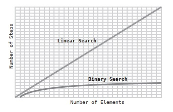

# Chapter 02: Why Algorithms Matter

There is another major factor that can affect the efficiency of our code: The proper selection of which algorithm to use.

An algorithm is simply a particular process for solving a problem. In computer science, an algorithm is a process for going a particular operation: there are multiple algorithms than can achieve a particular operation.

## A New Data Structure: the Ordered Array

(There is more than one algorithm for searching an ordered array.)

The ordered array is like any array except the values are always kept in order; every time a value is added, it gets placed in the proper cell so that the values of the array remain sorted. (In a standard array, values are just inserted at the end)

While insertion is less efficient in an ordered array than in a regular array, the ordered array has a secret superpower when it comes to the search operation

## Searching an Ordered Array

When we check each cell one at a time until we find the value we are looking for is a process called linear search. This is the only search process available for an unordered array

With an ordered array, we can stop a search early even if the value is not contained within the array (If we don't find the value where it should be)

Here's a Ruby implementation of linear search on an ordered array:

```ruby
def linear_search(array, value)
  # We iterate through every element in the array:
  array.each do |element|
    # If we find the value we're looking for, we return it:
    if element == value
      return value
    # If we reach an element that is greater than the value
    # we're looking for, we can exit the loop early:
    elsif element > value
      break
    end
  end
  # We return nil if we do not find the value within the array:
  return nil
end
```

In this light linear search will take fewer steps in an ordered array versus a standard array _in most situations_. But if the value we are looking for is the last value or is greater than the last value, we still end up searching every cell.

But the big advantage of an ordered array over a regular array is that an ordered array allows for an alternative searching algorithm: _binary search_. This algorithm is much, much faster than linear search.

## Binary Search

This algorithm is only possible in an ordered array, and it consists in dividing the total number of cells in which to look for in half successively.  

Here is an implementation of binary search in Ruby:

```ruby
def binary_search(array, value)
  # First, we establish the lower and upper bounds of where the value
  # we're searching for can be. To start, the lower bound is the first
  # value in the array, while the upper bound is the last value:

  lower_bound = 0
  upper_bound = array.length - 1

  # We begin a loop in which we keep inspecting the middlemost value
  # between the upper and lower bounds:
  while lower_bound <= upper_bound do
  # We find the midpoint between the upper and lower bounds:
  # (We don't have to worry about the result being a non-integer
  # since in Ruby, the result of division of integers will always
  # be rounded down to the nearest integer.)
    midpoint = (upper_bound + lower_bound) / 2
    # We inspect the value at the midpoint:
    value_at_midpoint = array[midpoint]

    # If the value at the midpoint is the one we're looking for, we're done.
    # If not, we change the lower or upper bound based on whether we need
    # to guess higher or lower:

    if value < value_at_midpoint
      upper_bound = midpoint -1
    elsif value > value_atmidpoint
      lower_bound = midpoint + 1
    elsif value == value_at_midpoint
      return midpoint
    end
  end

  # If we've narrowed the bounds until they've reached each other, that
  # means that the value we're searching for is not contained within
  # this array:
  return nil
end
```

## Binary Search vs. Linear Search

With ordered arrays of a small size, the algorithm of binary search doesn’t have much of an advantage over the algorithm of linear search. But let’s see what happens with larger arrays. 

With an array containing 100 values, the maximum number of steps it takes for search:
- Linear Search: 100 steps.
- Binary Search: 7 steps.

With linear search, if the value we’re searching for is in the final cell, or is greater than the value in the final cell, we have to inspect each and every element. For an array which is the size of 100, this would take 100 steps. 

When we use binary search, however, each guess we make eliminates half of the possible cells we’d have to search. In our very first guess, we get to eliminate a whopping 50 cells.

The pattern is unusually efficient: for every time we double the data, the binary search algorithm adds a maximum of just one more step.  For binary search, every time we double the number of elements in the array, we only need to add one more step.

We can visualize the difference in performance between linear and binary search with this graph:



But here's the tradeoff: by using an ordered array, you have somewhat slower insertion, but much faster search. Again, you must analyze your application to see what is a better fit.

## Wrapping Up

There usually isn’t a single data structure or algorithm that is perfect for every situation. For example, just because ordered arrays allow for binary search doesn’t mean you should always use ordered arrays. In situations where you don’t anticipate searching the data much, but only adding data, standard arrays may be a better choice because their insertion is faster.