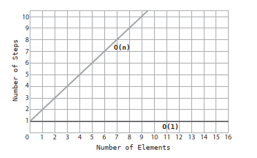
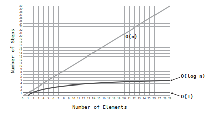
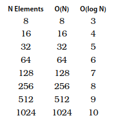

# Chapter 03 : Big O Notation

In order to help ease communication regarding time complexity, computer scientist have borrowed a concept from the world of mathematics to describe a concise and consistent language around the efficiency of data structures and algorithms. Known as _Big O Notation_, this formalized expression around these concepts allows us to easily categorize the efficiency of a given algorithm and convey it to others. 

## Big 0: Count the Steps

Big O achieves consistency by focusing only on the number of steps that an algorithm takes.

When an operation takes just one step, no matter how large the data structure is, the way to express this in Big O notation is 

$$ \mathcal{O}(1) $$

This simply means that the algorithm takes the same number of steps no matter how much data there is.

Other operations that fall under this category are the insertion and deletion of a value at the end of an array.

For N elements in the array, linear search can take up to a maximum of N steps. The appropiate way to express this in Big O notation is:

$$ \mathcal{O}(N) $$

This is the way to say that for N elements inside an array, the algorithm would take N steps to complete.

Mathematically, one way of describing Big O is that it describes the upper bound of the growth rate of a function, or that if a function _g(x)_ grows no faster than a function _f(x)_, then _g_ is said to be a member of _O(f)_.

## Constant Time vs. Linear Time

Big O Notation does more than simply describe the number of steps than an algorithm takes. Rather, it describes **how many steps an algorithm takes based on the number of data elements that the algorithm is acting upon**. Or, in another way, _How does the number of steps change as the data increases?_.

An algorithm that is O(N) will take as many steps as there are elements of data. So when an array increases in size by one element, an O(N) algorithm will increase by one step. An algorithm that is O(1) will take the same number
of steps no matter how large the array gets.

Let's look at how these two types of algorithms are plotted on a graph:

O(N) makes a perfect diagonal line. This is because for every additional piece of data, the algorithm takes one additonal step.

Contrast this with O(1), which is a perfect horizontal line, since the number of steps in the algorithm remains constant no matter how much data there is. Because of this, O(1) is also referred to as _constant time_.

As Big O is primarily concerned about how an algorithm performs across varying amounts of data, an important point emerges: An algorithm can be described as O(1) even if it takes more than one step. The number of steps remains constant no matter how much data there is. O(1) is the way to describe any algorithm that does not change its number of steps even when the data increases.

## Same Algorithm, Different Scenarios

While Big O effectively describes both the best and worst case scenarios of a given algorithm, Big O notation generally refers to worst case scenario unless specified otherwise.

The reason for this is that this pessimistic approach can be a useful tool: this prepares us for the worst and may have a strong impact on our choices.

## An Algorithm of the Third Kind

The way to describe binary search in terms of Big O Notation is by saying that it has a time complexity of 

$$ \mathcal{O}(\log{N}) $$

This is the way of describing an algorithm that increases one step each time the data is doubled.

Logarithms are the inverse of exponents.

$$ 2^3$$ 

is the equivalent of 

$$ 2 * 2 * 2 $$

which happens to be 8. Now, $$\log_2{8}$$ is the converse of the above. It means: How many times do you have to multiply 2 by itself to get a result of 8?

## 0(log N) Explained

O(log N) is the shorthand for saying $$\log_2$$. We just omit the 2 for convenience. 

O(log N) means that for N data elements, the algorithm would take log2 N steps. If there are 8 elements, the algorithm would take 3 steps, since log2 8 = 3. Said another way, if we keep dividing the 8 elements in half, it would take us 3 steps until we end up with one element. This is exactly what happens with binary search. As we search for a particular item, we keep dividing the array’s cells in half until we narrow it down to the correct number.

The following table demonstrates a striking difference between the efficiencies
of O(N) and O(log N):

## Wrapping Up

We have a consistent system that allows us to compare any two algorithms. With it, we will be able to examine real-life scenarios and choose between competing data structures and algorithms to make our code faster and able to handle heavier loads.

