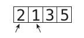

# Chapter 04: Speeding Up Your Code with Big O

Big O Notation is a great tool for comparing competing algorithms, as it gives
an objective way to measure them.

## Bubble Sort

Sorting algorithms have been the subject of extensive research in computer science, and tens of such algorithms have been developed over the years. They all solve the following problem: _Given an array of unsorted numbers, how can we sort them so that they end up in ascending order?_.

Bubble Sort is a very basic sorting algorithm, and not very efficient. It follows these steps:

1. Point to two consecutive items in the array. (Initially, we start at the very
beginning of the array and point to its first two items.) Compare the first item
with the second one:



2. If the two items are out of order (i.e. the left value is greater than the right value), swap them: (If they already happen to be in the correct order, do nothing)


3. Move the pointers one cell to the right:


Repeat steps 1 and 2 until we reach the end of the array or any items that have already been sorted.

4. Repeat steps 1 through 3 until we have a round in which we didn’t have to make any swaps. This means that the array is in order.

Each time we repeat steps 1 through 3 is known as a _passthrough_. That is, we “passed through” the primary steps of the algorithm, and will repeat the same process until the array is fully sorted.

## Bubble Sort Implemented

Here's an implementation of the Bubble Sort in Ruby:

```ruby
def bubble_sort(array)
  unsorted_until_index = array.length - 1
  sorted = false

  while !sorted 
    sorted = true

    unsorted_until_index.times do |i|
      if array[i] > array[i + 1]
        sorted = false
        array[i], array[i+1] = array[i+1], array[i]
      end
    end

    unsorted_until_index -= 1
  end

  array
end

list = [65, 55, 45, 35, 25, 15, 10]
bubble_sort(list)
print(list) ## => [10, 15, 25, 35, 45, 55, 65]
```

## The Efficiency of Bubble Sort

The Bubble Sort contains two kinds of steps:

1. Comparisons - in which two numbers are compared with one another to determine which is greater.

2. Swaps - two numbers are swapped with one another.

For N elements, we make $$ (N - 1) + (N - 2) + (N - 3) … + 1 $$ comparisons.

In a worst case scenario, where the array is not just randomly shuffled, but sorted in descending order, we'd actually need a swap for each comparison, which adds up to the already high number of comparisons.

And, as the number of elements increase, the number of total steps grows exponentially or almost exponentially (N<sup>2</sup>)


Therefore, in Big O notation, we say that Bubble Sort has an efficiency of $$ \mathcal{O}(N^2) $$

This makes of this algorithm not a very efficient one, since as the data increases, the steps increase dramatically:


_O(N<sup>2</sup>)_ is also referred to as _quadratic time_.

## A Quadratic Problem

Let’s say you’re writing a JavaScript application that requires you to check whether an array contains any duplicate values:

```js
function hasDuplicateValue(array) {
  for(let i = 0; i < array.length; i++) {
    for(let j = 0; j < array.length; j++) {
      if(i !== j && array[i] == array[j]) {
        return true;
      }
    }
  }

  return false;
}
```

Remember that Big O is a measure of how many steps our algorithm would take relative to how much data there is.

Based on this, we can conclude that for N elements in the array, our function would perform N<sup>2</sup> comparisons. This is because we perform an outer loop that must iterate N times to get through the entire array, and for each iteration, we must iterate another N times with our inner loop. That’s N steps * N steps, which is otherwise known as N<sup>2</sup>steps, leaving us with an algorithm of _O(N<sup>2</sup>)_.

_O(N<sup>2</sup>)_ is the efficiency of algorithms in which nested loops are used.

_O(N<sup>2</sup>)_ is considered a relatively slow algorithm. Whenever encountering a slow algorithm, it’s worth spending some time to think about whether there may be any faster alternatives. This is especially true if you anticipate that your function may need to handle large amounts of data, and your application may come to a screeching halt if not optimized properly. There may not be any better alternatives.

## A Linear Solution

This is another implementation of the `hasDuplicateValue` function that does not rely upon nested loops:

```js
function hasDuplicateValue(array) {
  let existingNumbers = [];
  for(let i = 0; i < array.length; i++) {
    if(existingNumbers[array[i]] === undefined) {
      existingNumbers[array[i]] = 1;
    } else {
      return true;
    }
  }
  return false;
}
```

This implementation uses a single loop, and keeps track of which numbers it has already encountered using an array called `existingNumbers`. It uses this array in an interesting way: Every time the code encounters a new number, it stores the value `1` inside the index of the `existingNumbers` corresponding to
that number.

Once again, the worst case scenario is when the array contains no duplicates, in which case our function must complete the entire loop. This new algorithm appears to make N comparisons for N data elements. This
is because there’s only one loop, and it simply iterates for as many elements as there are in the array. 

We know that O(N) is much faster than O(N2), so by using this second approach, we’ve optimized our `hasDuplicateValue` significantly. If our program handles lots of data, this will make a big difference. 

(There is actually one disadvantage with this new implementation, which is that we will need more physical memory to store the extra array needed for visited numbers.)

## Wrapping Up

It’s clear that having a solid understanding of Big O Notation can allow us to identify slow code and select the faster of two competing algorithms. However, there are situations in which Big O Notation will have us believe that two algorithms have the same speed, while one is actually faster. In the next
chapter, we’re going to learn how to evaluate the efficiencies of various algorithms even when Big O isn’t nuanced enough to do so.