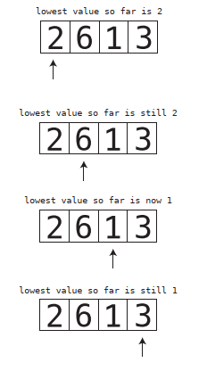
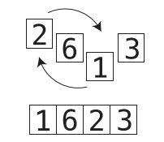
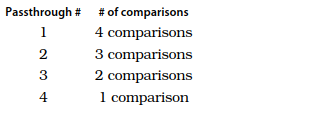
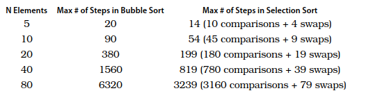
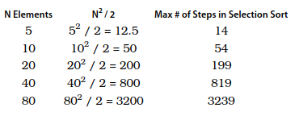
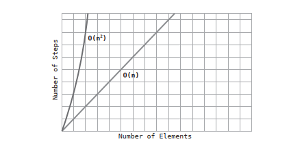
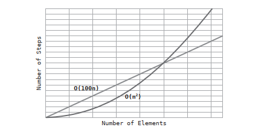

# Chapter 05: Optimizing Code With and Without Big O

There are times when two competing algorithms may be described in exactly the same way using Big O, yet one algorithm is significantly faster than the other.

## Selection Sort

In the last chapter, we explored an algorithm for sorting data known as Bubble Sort, which had an efficiency of _O(N<sup>2</sup>)_. We’re now going to dig into another sorting algorithm called Selection Sort, and see how it measures up to Bubble Sort.

The steps of Selection Sort are as follows:

1. We check each cell of the array from left to right to determine which value is least. As we move from cell to cell, we keep in a variable the lowest value we've encountered so far. (Really, we keep track of its index, but for the purposes of the diagrams below, we’ll just focus on the actual value.) If we encounter a cell that contains a value that is even less than the one in our variable, we replace it so that the variable now points to the new index. See the following diagram:



2. Once we've determined which index contains the lowest value, we swap that index with the value we began the passthrough with. This would be the index 0 in the first passthrough, index 1 in the second passthrough, and so on and so forth. In the next diagram, we make the swap of the first passthrough:



3. Repeat steps 1 and 2 until all the data is sorted.

## Selection Sort Implemented

Here's a JavaScript implementation of Selection Sort:

```js
function selectionSort(array) {
  for (let i = 0; i < array.length; i += 1) {
    let lowestNumberIndex = i;

    for (let j = i + 1; j < array.length; j += 1) {
      if (array[j] < array[lowestNumberIndex]) {
        lowestNumberIndex = j;
      }
    }

    if (lowestNumberIndex === i) continue;

    [array[i], array[lowestNumberIndex]] = [array[lowestNumberIndex], array[i]]
  }

  return array;
}
```

## Alternative Version

### Algorithm

1. The algorithm divides the array into two parts: the sorted part and the unsorted part.
2. Initially, the sorted part is empty, and the unsorted part contains the entire array.
3. In each pass, the algorithm scans the unsorted part of the array to find the smallest element.
4. Once the smallest element is identified, it is swapped with the leftmost element of the unsorted part (the element at the boundary of the sorted and unsorted parts).
5. After the swap, the boundary between the sorted and unsorted parts is shifted one position to the right.
6. The selected element is now considered part of the sorted part, and the unsorted part is reduced by one element.
7. Steps 3 to 6 are repeated until the unsorted part contains just one element, which means it must be sorted. Consequently, the entire array is sorted.

### Implementation

```js
function selectionSort(array) {
  const len = array.length;

  for (let i = 0; i < len - 1; i++) {
    let minIndex = i;

    for (let j = i + 1; j < len; j++) {
      if (array[j] < array[minIndex]) {
        minIndex = j;
      }
    }

    if (minIndex !== i) {
      [array[i], array[minIndex]] = [array[minIndex], array[i]];
    }
  }

  return array;
}
```

## The Efficiency of Selection Sort

Selection Sort contains two types of steps: Comparisons and Swaps. With an array `[4, 2, 7, 1, 3 ]` of 5 elements, these are the comparisons that we would have to do:



This means that for N elements, we make:
$$ (N - 1) + (N - 2) + (N - 3) ... + 1 $$
comparisons.

As for swaps, we only need to make a maximum of one swap per passthrough. This is because in each passthrough, we make either one or zero swaps, depending on whether the lowest number of that passthrough is already in the correct position. Contrast this with Bubble Sort, where in a worst case scenario - an array in descending order - we had to make a swap for each and every comparison.

Here is the side-by-side comparison between Bubble Sort and Selection Sort:



It's clear that Selection Sort is twice as fast.

## Ignoring Constants

But in the world of Big O notation, Selection Sort and Bubble Sort are described in exactly the same way.

Again, Big O notation describes how many steps are required relative to the number of data elements. So, at first glance_ we should describe the number of steps of Selection sort as roughly the half of N<sup>2</sup>: _O(N<sup>2</sup> / 2)_. See this table:



But, in reality, Selection Sort is described as having a time complexity of  _O(N<sup>2</sup>)_. Why? Because of a major rule in Big O notation: 

_Big O notation ignores constants_

This is simply a mathematical way of saying that Big O never includes regular numbers that are not an exponent. So, what technically should be  _O(N<sup>2</sup> / 2)_ becomes  _O(N<sup>2</sup>)_. Similarly _O(2N)_ would become _O(N)_, and  _O(N / 2)_ would also become _O(N)_ too. Even  _O(100N)_ would also become _O(N)_. 

Offhand, it would seem that this rule would render Big O Notation entirely useless, as you can have two algorithms that are described in the same exact way with Big O, and yet one can be 100 times faster than the other. And that’s exactly what we’re seeing here with Selection Sort and Bubble Sort. Both are described Big O as _O(N2)_, but Selection Sort is actually twice as fast as Bubble Sort. And indeed - between if given the choice between those two options, Selection Sort is the better choice. Remember, _Big O describes a growth rate relative to the amount of data_.

## The Role of Big O

This notation serves a great way to classify the _long term growth rate_ of algorithms. That, for _some amount of data_, _O(N)_ will always be faster than _O(N<sup>2</sup>)_. And this is true no matter whether the  _O(N)_ is really  _O(2N)_ or  _O(100N)_ under the hood. It is a fact that, at some point, with some amount of data _O(100N)_ will become faster than _O(N<sup>2</sup>)_.

Take a look at the following graph, in which we compare  _O(N)_ with _O(N<sup>2</sup>)_:



We've seen this graph in the previous chapter. It depicts how _O(N)_ is faster than _O(N<sup>2</sup>)_ for _all_ amounts of data.

Now take a look at this second graph, where we compare _O(100N)_ with _O(N<sup>2</sup>)_:



In this second graph, we see that _O(N<sup>2</sup>)_ is faster than _O(100N)_ for certain amounts of data, but, after some point, even _O(100N)_ becomes faster, and remains faster for all increasing amounts of data from that point forward.

It is for this reason that Big O ignores constants. The purpose of Big O is that for different classifications, _there will always be a point at which one classification supersedes the other in speed, and will remain faster forever. When the point occurs exactly, however, is not the concern of Big O. 

Similary, with large amounts of data, _O(log N)_ will always by faster than _O(N)_, even if the given _O(log N)_ altorithm is actually _O(2 * log N)_ under the hood.

So Big O is an extremely useful tool, because if two algorithms fall under different classifications of Big O, you'll generally know which algorithm to use since with large amounts of data, one algorithm is guaranteed to be faster than the other at a certain point.

However, the main takeaway of this chapter is that when two algorithms fall under the same classification of Big O, it doesn't necessarily mean that both algorithms process at the same speed. After all, Buble Sort is twice as slow as Selection Sort even though both are _O(N<sup>2</sup>)_. So while Big O is perfect for contrasting algorithms that fall under different classifications of Big O, when two algorithms fall under the _same_ classification, further analysis is required to determine which algorithm is faster.

## A Practical Example

Let’s say you’re tasked with writing a Ruby application that takes an array and creates a new array out of every other element from the original array. It might be tempting to use the each_with_index method available to arrays to loop through the original array as follows:

```ruby
def every_other(array)
  new_array = []
  array.each_with_index do |element, index|
    new_array << element if index.even?
  end
  return new_array
end
```
We perform N array lookups, since we loop through each and every element of the array. We only perform N / 2 insertions, though, since we only insert every other element into the new array. Since we have N lookups, and N / 2 insertions, we’d say that our algorithm technically has an efficiency of _O(N + (N / 2))_, which we can also rephrase as _O(1.5N)_. But since Big O Notation
throws out the constants, we’d say that our algorithm is simply _O(N)_.

Instead of iterating through each element of the array and checking whether the index is an even number, we can instead simply look up every other element of the array in the first place:

```ruby
def every_other(array)
  new_array = []
  index = 0
  while index < array.length
    new_array << array[index]
    index += 2
  end
  return new_array
end
```
In this second implementation we use a while loop to skip over each element, rather than check each one. It turns out that for N elements, there are N / 2 lookups and N / 2 insertions into the new array. Like the first implemetation, we’d say that the algorithm is _O(N)_. However, our first implementation truly takes 1.5N steps, while our second implementation only takes N steps, making our second implementation significantly faster. While the first implementation is more idiomatic in the way Ruby programmers write their code, if we’re dealing with large amounts of data, it’s worth considering using the second implementation to get a significant  performance boost.

## Wrapping Up

We now have some very powerful analysis tools at our disposal. We can use Big O to determine broadly how efficient an algorithm is, and we can also compare two algorithms that fall within one classification of Big O. However, there is another important factor to take into account when comparing the efficiencies of two algorithms. Until now, we’ve focused on how slow an algorithm is in a worst case scenario. Now, worst case scenarios, by definition, don’t happen all the time. On average, the scenarios that occur are -
well - average case scenarios. In the next chapter, we’ll learn how to take all scenarios into account.