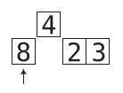
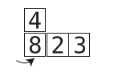
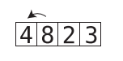
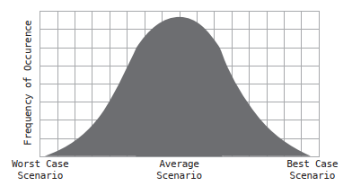
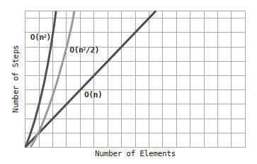

# Chapter 06: Optimizing for Optimistic Scenarios

The worst case scenario is not the only situation worth considering. Being able to consider _all_ scenarios is an important skill that can help you choose the appropriate algorithm for every situation.

## Insertion Sort

We've encountered two different sorting algorithms: Bubble Sort and Selection Sort. Both have efficiencies of _O(N<sup>2</sup>)_, but Selection Sort is actually twice as fast. The next sorting algorithm, Insertion Sort, will reveal the power of analyzing scenarios beyond the worst case.

Insertion Sort consists of the following steps:

1. In the first passthrough, we temporally remove the value at index 1 (the second cell in the array), and store it in a temporary variable. this will leave a gap at that index, since it contains no value:


In subsequent passthroughs, we remove the values at the subsequent indexes. 

2. We then begin a shifting phase, where we take each value to the left of the gap, and compare it to the value in the temporary variable:



If the value to the left of the gap is greater than the temporary variable, we shift that value to the right:



As we shift values to the right, inherently, the gap moves leftwards. As soon as we encounter a value that is lower that the temporarily removed value, or we reach the left end of the array, this shifting phase is over.

3. We then insert the temporarily removed value into the current gap:



4. We repeat steps 1 to 3 until the array is fully sorted.

## Insertion Sort Implemented

Here is a Python implementation of this algorithm

```python
def insertion_sort(array):
  for index in range(1, len(array)):
    position = index
    temp_value = array[index]
    while position > 0 and array[position - 1] > temp_value:
      array[position] = array[position - 1]
      position = position - 1
    array[position] = temp_value
```

## The Efficiency of Insertion Sort

There are four types of steps that occur in Insertion Sort: Removals, comparisons, shifts, and insertions. 

A comparison takes place each time we compare a value to the left of the gap with the temp_value. We can, therefore, formulate the total number of comparisons as:

$$ 1 + 2 + 3 + … + N - 1 $$

It emerges that for an array containing N elements, there are approximately _N<sup>2</sup> / 2_ comparisons. 

Shifts occur each time we move a value one cell to the right. When an array is sorted in reverse order, there will be as many shifts as there are comparisons since every comparison will force us to shift a value to the right.

Removing and inserting the temp_value from the array happen once per passthrough. Since there are always _N - 1_ passthroughs, we can conclude that there are _N - 1_ removals and _N - 1_ insertions.

Combined, we've got _N<sup>2</sup> + 2N - 2_ steps

We've already learned that Big O ignores constants. With this rule in mind, we'd simplify this to _O (N<sup>2</sup> + N)_. However, there is another major rule of Big O that we'll reveal now:

_Big O notation only takes into account the highest order of N_. That is, if we have some algorithm that takes N<sup>4</sup> + N<sup>3</sup> + N<sup>2</sup> + N steps, we only consider N<sup>4</sup> to be significant - and just call it _O (N<sup>4</sup>)_.

In this case, _O (N<sup>2</sup> + N)_ simply becomes _O (N<sup>2</sup>)_. It emerges that in a worst case scenario, Insertion Sort has the same time complexity as Bubble Sort and Selection Sort. They’re all _O (N<sup>2</sup>)_.

We noted in the previous chapter that although Bubble Sort and Selection Sort are both _O (N<sup>2</sup>)_., Selection Sort is faster since Selection Sort has N<sup>2</sup> / 2 steps compared with Bubble Sort’s N<sup>2</sup> steps. At first glance, then, we’d say that Insertion Sort is as slow as Bubble Sort, since it too has N<sup>2</sup> steps. (It’s really N<sup>2</sup> + 2N - 2 steps.)

## The Average Case

In a worst case scenario, Selection Sort is faster than Insertion Sort. However, it's critical that we also take into account the average case scenario. Why?

By definition, the cases that occur most frequently are average scenarios. The worst and vest case scenarios happen only rarely. Let's look at this simple bell curve:



Best and worst cases scenarios happen relatively infrequently. In the real world, however, average scenarios are what occur most of the time.

The performance of Insertion Sort varies _greatly_ based on the scenario: While in the worst case scenario, we compare and shift all the data, and in the best case scenario, we shift none of the data (and just make one comparison per passthrough), for the average scenario - we can say that in the aggregate, we probably compare and shift about _half_ of the data.

So if Insertion Sort takes N<sup>2</sup> steps for the worst case scenario, we’d say that it takes about N<sup>2</sup> / 2 steps for the average scenario. (In terms of Big O, however, both scenarios are  _O (N<sup>2</sup>)_):



If we compare this with Selection Sort, we will find out that Selection Sort takes  _N<sup>2</sup>/ in all cases, because it does not have any mechanism to for ending a passthrough early at any point.

So, which is better, Selection Sort or Insertion Sort? It depends. In an average case -when the array is randomly sorted - they perform similarly. If you have reason to assume that you'll be dealing with data that is _mostly_ sorted, Insertion Sort will be a better choice. If you have reason to assume that you'll be dealing with data that is mostly sorted in reverse order, Selection Sort will be faster. If you have no idea what the data will be like, that's essentially an average case, and both will be equal.

## A Practical Case

When we have to perform a nested iteration ( _O (N<sup>2</sup>)_ by definition), for example, to create an array from common elements from two arrays, if we include a mechanism to avoid having to iterate through the rest of the elements of one of the arrays the moment one common element is found, we can improve the speed on average cases (when some elements are common and others are not). This can be achieved by having a `break` type condition within the inner loop:

```js
function intersection(first_array, second_array){
  let result = [];
  for (let i = 0; i < first_array.length; i += 1) {
    for (let j = 0; j < second_array.length; j += 1) {
      if (first_array[i] === second_array[j]) {
        result.push(first_array[i]);
        break; // this is the trick
      }
    }
  }
  return result;
}
```

## Wrapping Up

Having the ability to discern between best, average and worst case scenarios is a key skill in choosing the best algorithm for your needs, as well as taking existing algorithms and optimizing them further to make them significantly faster. Remember, while it's good to be prepared for the worst case, average cases are what happen most of the time.

