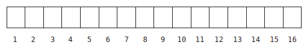
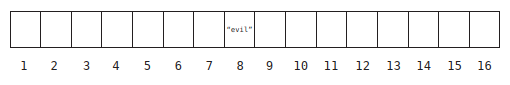
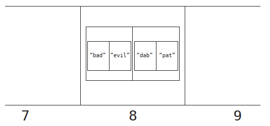

# Chapter 07: Blazing Fast Lookup With Hash Tables

## Enter the Hash Table

Most programming languages include a data structure called a hash table, and it has an amazing superpower: Fast reading. Hash tables are
called by different names in various programming languages. Other names include hashes, maps, hash maps, dictionaries, and associative arrays. Reading from a hash table has an efficiency of _O (1)_, as it takes just one step.

## Hashing with Hashing Functions

_Hashing_ means the translation of certain data into other data, and the code that is used to translate that data is called a _hashing function_. An example of hashing would be the mapping of some letters into numbers using a cipher, for instance:

If 

| Letter | Value |
| --- | --- |
| A | 1 |
| B | 2 |
| C | 3 |
| D | 4 |
| E | 5 |

ACE converts to 135, CAB converts to 312, DAB converts to 412, and BAD converts to 214.

There are many other models of hash functions besides this one. Another example of a hash function would be taking each letter's corresponding number and return the sum of all the numbers, or its product; that way, BAD would become 7 (2 + 1 + 4), or 8 (2 * 1 * 4).

Of course, real-world hash functions are much more complex than this.

The truth is that a hash function needs to meet only one criterion to be valid: A hash function must convert the same data input to the same output each time it's applied. If the hash function returns inconsistent values, it is not valid. Examples of invalid hash functions include functions that use random numbers or the current time as part of its calculation.

## How Hash Tables Work

Under the hood, a hash table stores its data in a bunch of cells in a row, similar to an array. Each cell has a corresponding value associated with it. 




To store data in a hash like this

```ruby
hash['BAD'] => 'evil'
```

the computer first applies the hash function to the key (`'BAD'`), for example using the multiplication hash function (2 * 1 * 4 = 8). Since the key (`'BAD'`) hashes to 8, the computer places the value (`'evil'`) into the cell 8:



To look up or read a value from a hash, the computer executes two simple steps:

1. The computer hashes (process the data via the hash function) the key we are looking up (BAD = 2 * 1 * 4 = 8).
2. Since the result is 8, the computer looks inside cell 8 and returns the value that is stored there. In this case, that would be the string `'evil'`.

That's why looking up a value in a hash table is typically _O (1)_: it's a process that takes a constant amount of steps. 

In an unordered array, this would take _O (N)_ steps; in a sorted array, looking up a value would take up to _O (log N)_, but in a hash table, looking up a value is much faster.

## Dealing with Collisions

What happens when two pieces of data hashes to the same output, like in the case of BAD (2 * 1 * 4 = 8) and DAB (4 * 1 * 2 = 8)?

Trying to add data to a cell that is already filled is known as a _collision_. There are various ways around it. 

One classic approach for handling collision is known as _separate chaining_. When a collision occurs, instead of placing _a single value_ in the cell, it places in it a reference to an array. In the case of a thesaurus (a dictionary of synonyms), for example, this array would contain subarrays, each one containing the word itself, and the synonyms. 

In our example, the computer wants to add PAT (synonym of DAB), to the cell 8 in the thesaurus (remember that DAB also hashed to 8), but it already contains the string `'evil'`. So it replaces the contents of cell 8 with an array:



To look up a value in this sceneario, the computer takes the following steps:

1. It hashes the key (DAB => 4 * 1 * 2 = 8).
2. It looks up cell 8. The computer takes note that cell 8 contains an array of arrays rather than a single value.
3. It searches through the array linearly, looking at index 0 of each subarray until it finds the word we're looking up (`'pat'`). It then returns the value at index 1 of the correct subarray.

In a scenario where the computer hits upon a cell that references an array, its search can take some extra steps, as it needs to conduct a linear search within an array of multiple values. If somehow all of our data ended up within a single cell of our hash table, our hash table would be no better than an array. So it actually turns out that the worst case performance for a hash table lookup is _O (N)_.

Because of this, it is critical that a hash table be designed in a way that it will have few collisions.

## The Great Balancing Act

How hash tables are implemented in the real world to avoid frequent collisions?

Ultimately, a hash table efficiency depends on three factors:

1. How much data we're storing in the hash table.
2. How many cells are available in the hash table.
3. Which hash function we're using.

It makes sense why the first two factors are important. If you have a lot of data to store in only a few cells, there will be many collisions and the hash table will lose its efficiency. Let’s explore, however, why the hash function itself is important for efficiency.

Imagine that our hash function always produces a value that, for whatever reason, falls in the range between 1 and 9, both inclusive, and that our hash table has 16 cells. With this hash function, the computer will never even use cells 10 through 16.

_A good hash function, therefore, is one that distributes its data across all available cells_

If we need a hash table to store just 5 values, how big should our hash table be, and what type of hash function should we use?
If a hash table had only 5 cells, we’d need a hash function that converts keys into numbers 1 through 5. Even if we only planned on storing 5 pieces of data, there’s a good chance that there will be a collision or two, since two keys may be easily hashed to the same value.

However, if our hash table were to have 100 cells, and our hash function converts strings into numbers 1 through 100, when storing just 5 values it would be much less likely to have any collisions since there are 100 possible cells that each of those strings might end up in. Although a hash table with 100 cells is great for avoiding collisions, we’d be using up 100 cells to store just 5 pieces of data, and that’s a poor use of memory.

And this is the balancing act that a hash table must perform. A good hash table _strikes a balance of avoiding collisions while not consuming lots of memory_

To accomplish this, computer scientists have developed the following rule of thumb: for every 7 data elements stored in a hash table, it should have 10 cells.

This ratio of data to cells is called the _load factor_. Using this terminology, we'd say that the ideal load factor is 0.7 (7 elements/10 cells).

Luckily, most of the internals of a hash table are managed by the computer language you're using. It decided how big the hash table needs to be, what hash function to use, and when it's time to expand the hash table. But now that you understand how hashes work, you can use them to replace arrays in many cases to optimize your code performance and take advantage of superior lookups that have an efficiency of _O (1)_.

...

Hash tables are indispensable when it comes to building efficient software. With their _O (1)_ reads and insertions, it's a difficult data structure to beat. But some data structures provide advantages other than speed...