# Chapter 10: Recursive Algorithms For Speed

In previous chapters we’ve encountered a number of sorting algorithms, including Bubble Sort, Selection Sort, and Insertion Sort. In real life, however, none of these methods are actually used to sort arrays. Most computer languages have built-in sorting functions for arrays that save us the time and effort from implementing our own. And in many of these languages, the sorting algorithm that is employed under the hood is _Quicksort_.

Quicksort is a recursive algorithm; by studying it, we can learn how recursion can greatly speed up an algorithm.

Quicksort is an extremely fast sorting algorithm that is particularly efficient for average scenarios. In worst case scenarios (that is, inversely sorted arrays) it performs similarly to Insertion Sort and Selection Sort, but it is much faster for average scenarios, which are what occur most of the time.

Quicksort relies on a concept called _partitioning_.

## Partitioning

To partition an array is to take an arbitrary value from the array, which is then called the _pivot_, and make sure that every number that is less than the pivot ends up to the left of the pivot, and that every number that is greater than the pivot will be to the right of the pivot.

For example, if we have the following array:

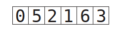

For consistency's sake, we will always select the rightmost value to be our pivot:

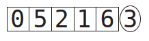

We then assign pointers, one to the leftmost value of the array, and one to the rightmost value of the array, excluding the pivot itself:

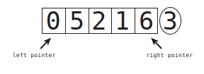

We are now ready to begin the actual partition, which follows these steps:

1. The left pointer continuously moves one cell to the right until it reaches a value that is greater than or equal to the pivot, and then stops.
2. Then, the right pointer continuously moves one cell to the left until it reaches a value that is less than or equal to the pivot, and then stops.
3. We swap the values that the left and right pointers are pointing to. 
4. We continue this process until the pointers are pointing to the very same value or the left pointer has moved to the right of the right pointer.
5. Finally, we swap the pivot with the value that the left pointer is currently
pointing to.

When we are done with a partition, we are now assured that all values to the left of the pivot are less than the pivot, and all values to the right of the pivot are greater than it. And that means that the pivot itself is now in its correct place within the array, although other values are not yet necessarily completely sorted.

Below, we've implemented a `SortableArray` class in Ruby that includes a `partition!` method that partitions the array as we've described:

```ruby
class SortableArray

  attr_reader :array

  def initialize(array)
    @array = array
  end

  def partition!(left_pointer, right_pointer)

    # We always choose the rightmost element as the pivot
    pivot_position = right_pointer
    pivot = @array[pivot_position]

    # We start the right pointer immediately to the left of the pivot
    right_pointer -= 1
    while true do
      while @array[left_pointer] < pivot do
        left_pointer += 1
      end

      while @array[right_pointer] > pivot do
        right_pointer -= 1
      end

      if left_pointer >= right_pointer
        break
      else
        swap(left_pointer, right_pointer)
      end
    end
    # As a final step, we swap the left pointer with the pivot itself
    swap(left_pointer, pivot_position)
    # We return the left_pointer for the sake of the quicksort method
    # which will appear later in this chapter
    return left_pointer
  end

  def swap(pointer_1, pointer_2)
    temp_value = @array[pointer_1]
    @array[pointer_1] = @array[pointer_2]
    @array[pointer_2] = temp_value
  end
end
```

Note that the `partition!` method accepts the starting points of the left and right pointers as parameters, and returns the end position of the left pointer once it's complete. 

### Alternative Version

#### Algorithm

1.	Choose the pivot element (it's best to use the middle element)**.
2.	In the second step, assign `left` and `right` pointers to the leftmost and rightmost indices of the remaining elements in the array, respectively.
3.	Increment the `left` pointer continuously, one cell at a time, until it reaches a value that is greater than or equal to the pivot or until it becomes greater than `right`.
4.	Decrement the `right` pointer continuously, one cell at a time, until it reaches a value that is less than the pivot, or until it becomes smaller than `left`.
5.	Once you're done incrementing and decrementing the pointers, evaluate whether the `left` pointer has gone beyond the `right` pointer.
    - If this is the case, move on to step 6.
    - If this is not the case, swap the values that the `left` and `right` pointers are pointing to, move both pointers toward each other, and repeat steps 3 and 4.
6.	Swap the value at the pivot index with the value the `right` pointer is pointing to. This places the pivot at its correct position in the array.

** A crucial factor that significantly impacts the algorithm's performance is the selection of the pivot element. If the input array is already sorted or nearly sorted, using the first element as the pivot can lead to inefficient partitioning and a time complexity of O(n^2). This degradation in performance is undesirable and undermines the primary objective of Quicksort. Opting for the middle element significantly improves the algorithm's overall performance. By selecting a pivot closer to the median value, the likelihood of encountering already sorted or nearly sorted input arrays decreases. This choice reduces the risk of worst-case scenarios and enables Quicksort to exhibit superior efficiency. When the middle element is selected as the pivot, the partition function starts with the left pointer at the first element and the right pointer at the last element. Notably, the pivot is already in its correct sorted position, eliminating the need for extra swaps. When the middle element is the pivot, the recursive calls in the quickSort function include the pivot element. By doing so, the algorithm avoids worst-case scenarios and generally achieves better performance.

#### Implementation

```js
function partition(arr, low, high) {
  const pivotIndex = Math.floor((low + high) / 2); // note the pivot is the middle!
  const pivot = arr[pivotIndex];
  let left = low;
  let right = high;

  while (left <= right) {
    while (arr[left] < pivot) {
      left++;
    }

    while (arr[right] > pivot) {
      right--;
    }

    if (left > right) {
      break;
    }

    // Swap values at left and right pointers
    [arr[left], arr[right]] = [arr[right], arr[left]];

    left++;
    right--;
  }

  // Return the pivot index
  return left;
}
```

## Quicksort

This algorithm relies heavily on partitions. It works as follows:

1. Partition the array: The pivot is now in its proper place.
2. Treat the subarrays to the left and right of the pivot as their own arrays, and recursively repeats steps #1 and #2. That means that we'll partition each subarray, and end up with even smaller subarrays to the left and right of each subarray's pivot. We then partition those subarrays, and so on and so forth.
3. When we have a subarray that has 0 or 1 elements, that is our base case, and we do nothing.

Below is a `quicksort!` method that we can add to the above `SortableArray` class that would successfully complete Quicksort:

```ruby
def quicksort!(left_index, right_index)
  #base case: the subarray has 0 or 1 elements
  if right_index - left_index <= 0
    return
  end
  # Partition the array and grab the position of the pivot
  pivot_position = partition!(left_index, right_index)
  # Recursively call this quicksort method on whatever is to the left
  # of the pivot:
  quicksort!(left_index, pivot_position - 1)
  # Recursively call this quicksort method on whatever is to the right
  # of the pivot:
  quicksort!(pivot_position + 1, right_index)
end
```

### Alternative Version

#### Algorithm

1.	Partition the array based on a chosen pivot element. Select a pivot element from the array and rearrange the elements so that all elements smaller than the pivot are placed to its left, and all elements greater than the pivot are placed to its right.
2.	Treat the subarrays to the left and right of the pivot as their own arrays and recursively repeat the first step. Partition each smaller subarray by selecting a new pivot and applying the partitioning process again.
3.	Continue recursively partitioning the subarrays until you reach subarrays that have zero or one element. These smaller subarrays serve as the base case, as an empty array or an array with one element is already sorted.

#### Implementation

```js
function quickSort(arr, low = 0, high = arr.length - 1) {
  const pivotIndex = partition(arr, low, high);
  if (low < pivotIndex - 1) {
    quickSort(arr, low, pivotIndex - 1);
  }
  if (pivotIndex < high) {
    quickSort(arr, pivotIndex, high);
  }
}
```

## The Efficiency of Quicksort

Let's first determine the efficiency of a partition. A partition consists of two types of steps:

1. Comparisons: We compare each value to the pivot.
2. Swaps: When appropriate, we swap the values being pointed to by the left and right pointers.

Each partition has at least N comparisons, that is we compare each element of the array with the pivot. 

The number of swaps depends on how the data happens to be sorted. Each partition has at least one swap, and the most swaps that a partition can have would be N / 2:

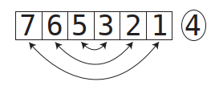

Now, for randomly sorted, data, there would be roughly _half_ of N / 2 swaps, or N / 4 swaps: in total, 1.25N steps. As we ignore constants in Big O Notation, we can say that a partition runs in _O(N)_ time.

But that's for a single partition; Quicksort involves many partitions. The following diagram depicts a typical Quicksort on an array of 8 elements, and on how many elements each partition acts upon (the active subarray is the group of cells that are not grayed out):

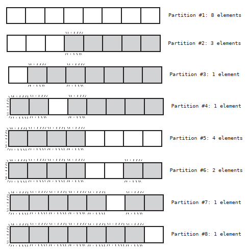

We keep on breaking down each subarray into halves until we reach subarrays with elements of 1, so, for an array of N, we can break it down log N times.

For N elements, there are about N * log N steps; this means an efficiency of _O(N log N)_.

## Worst Case Scenario

The worst case scenario for Quicksort is one in which the pivot always ends
up on one side of the subarray instead of the middle. This can happen in
several cases, including where the array is in perfect ascending or descending
order:

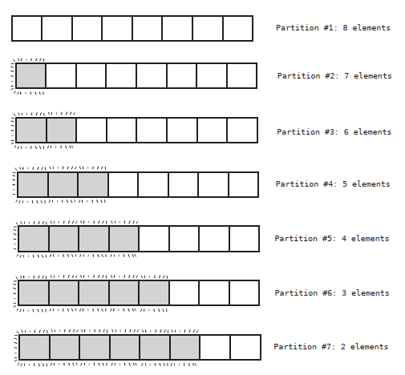

For N elements, there are N + (N - 1) + (N - 2) + (n - 3) ... + 2 steps, which comes out to be about N<sup>2</sup> / 2 steps.

Let's compare Quicksort to Insertion sort:

|  | Best Case | Average Case | Worst case |
| --- | --- | --- | --- |
| Insertion Sort | O(N) | O(N<sup>2</sup>) | O(N<sup>2</sup>) |
| Quicksort | O(N log N) | O(N log N) | O(N<sup>2</sup>) |

The reason why Quicksort is so much superior than Insertion Sort is because of the average scenario -which, again, is what happens most of the time. For average cases, Quicksort is much faster.

The following graph depicts various efficiencies side by side.

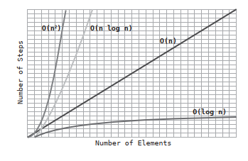

## Quickselect

Let’s say that you have an array in random order, and you don’t need to sort it, but you do want to know the tenth-lowest value in the array, or the fifth highest. This can be useful if we had a bunch of test grades and wanted to know what the 25th percentile was, or if we wanted to find the median grade.

The obvious way to solve this would be to sort the entire array, and then jump to the appropriate cell. Even were we to use a fast sorting algorithm like Quicksort, this algorithm takes at least O(N log N) for average cases, and while that isn’t bad, we can do even better with a brilliant little algorithm known as Quickselect. Quickselect relies on partitioning just like Quicksort, and can be thought of as a hybrid of Quicksort and binary search.

Let’s say that we have an array of eight values, and we want to find the second-to-lowest value within the array.

First, we partition the entire array:

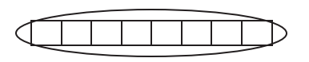

After the partition, the pivot will hopefully end up somewhere towards the middle of the array:

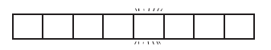

This pivot is now in its correct spot, and since it’s in the fifth cell, we now know which value is the fifth-lowest value within the array. Now, we’re looking for the second lowest value. But we also now know that the second-lowest value is somewhere to the left of the pivot. We can now ignore everything to the right of the pivot, and focus on the left subarray. It is in this respect that Quickselect is similar to binary search. 

Next, we partition the subarray to the left of the pivot:

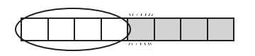

Let’s say that the new pivot of this subarray ends up the third cell:

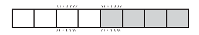

We now know that the value in the third cell is in its correct spot - meaning that it’s the third-to-lowest value in the array. By definition, then, the second-to-lowest value will be somewhere to its left. We can now partition the subarray to the left of the third cell:

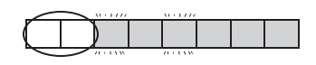

After this next partition, the lowest and second lowest values will end up in
their correct spots within the array:

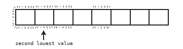

With Quickselect for every time we cut the array in half, we only need to partition the one half that we care about - the half in which we know our value is to be found. 
For N elements, we’d have N + (N/2) + (N/4) + (N/8) + …. 2 steps. This always turns out to be roughly 2N steps. Since Big O ignores constants, we’d say that Quickselect has an efficiency of O(N).

This is an implementation of this algorithm that we can add to the `SortableArray` class:

```ruby 
def quickselect!(kth_lowest_value, left_index, right_index)
  # If we reach a base case - that is, that the subarray has one cell,
  # we know we've found the value we're looking for
  if right_index - left_index <= 0
    return @array[left_index]
  end
  # Partition the array and grab the position of the pivot
  pivot_position = partition!(left_index, right_index)

  if kth_lowest_value < pivot_position
    quickselect!(kth_lowest_value, left_index, pivot_position - 1)
  elsif kth_lowest_value > pivot_position
    quickselect!(kth_lowest_value, pivot_position + 1, right_index)
  else # kth_lowest_value == pivot_position
    # if after the partition, the pivot position is in the same spot
    # as the kth lowest value, we've found the value we're looking for
    return @array[pivot_position]
  end
end
```

The first argument of the` quickselect!` method accepts the position that you’re looking for, starting at index 0. We’ve put in a 1 to represent the second-to-lowest value.