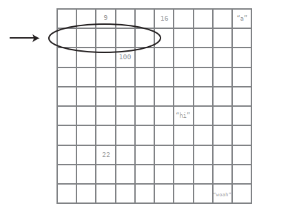
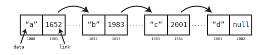
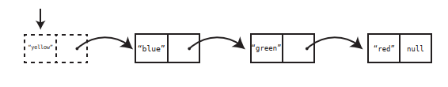
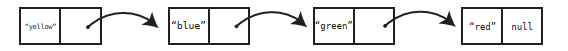
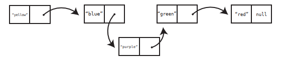
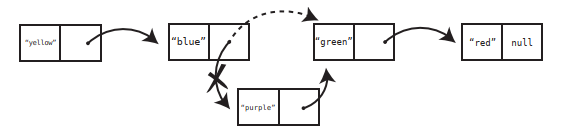
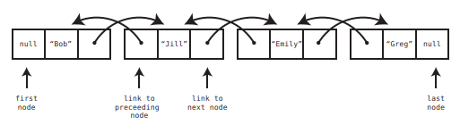

# Chapter 11: Node-based Data Structures

In this chapter we introduce the concept of _node_. Node-based data structures offer new ways to organize and access data that provide a number of major performance advantages.

We will explore the linked list, which is the simplest node-based data structure and the foundation of future chapters. Linked list are almost identical to arrays, but they come with their own set of trade offs in efficiency that can give us a performance boost for certain situations.

## Overview and use cases

Linked Lists are preferable to Arrays when:
- You need insertions/deletions in the list to be extremely fast,
- You don’t need random, unordered access to the data,
- You insert or delete items in the middle of a list,
- You can’t evaluate the exact size of the list (it needs to grow or shrink throughout the execution).

Arrays are preferable over Linked Lists when:
- You frequently need random, unordered access to the data,
- You need extreme performance to access the items,
- The number of items doesn’t change during execution, so you can easily allocate contiguous space of computer memory.

## Linked lists

A linked list is a data structure that represents a list of items, just like an array. Their implementation under the hood, however, is different, and they have different performance in some situations. 

When we create an array, the computer finds a contiguous group of memory addresses or cells and designates them to store data for your application:



Linked lists do not consist of a bunch of memory cells in a row. Instead, it's a bunch of memory cells that are _not_ next to each other, but can be spread across many cells across the computer's memory. These cells that are not adjacent to each other are known as _nodes_.

In addition to the data stored within the node, _each node also stores the memory address of the next node in the linked list_. This extra piece of data -the pointer to the next node's memory address - is known as _link_:



One advantage of a linked list over an array is that the program doesn't need to find a bunch of empty cells in a row to store its data. Instead, the program can store the data across many cells that are not necessarily adjacent to each other.

## Implementing a Linked List

We will create a `Node` class first:

```ruby
class Node
  attr_accessor :data, :next_node

  def initialize(data)
    @data = data
  end
end
```

A `Node` object will have two attributes: `data` contains the value that the node is meant to hold, while `next_node` contains the link to the next node in the list.

```ruby
class LinkedList
  attr_accessor :first_node

  def initialize(first_node)
    @first_node = first_node
  end
end
```

This `LinkedList` class acts as a handle on the linked list by pointing to its first node.

We will now measure its performance against a typical array by analyzing the four classic operations: reading, searching, insertion, and deletion.

## Reading 

We noted above that when reading a value from an array, the computer can jump to the appropriate cell in a single step, which is _O(1)_. This is not the case with a linked list.

To read the data in a specific from a linked list, we need to pass through, via their links, each node until we reach the node we are looking for. Since Big O notation is expressed by the worst case scenario, this means that reading from a linked list has an efficiency of _O(N)_. This is slower than an array.

This is the implementation of a reading operation in our `LinkedList` class:

```ruby
class LinkedList
  attr_accessor :first_node
  def initialize(first_node)
    @first_node = first_node
  end
  def read(index)
    # We begin at the first node of the list:
    current_node = first_node
    current_index = 0
    while current_index < index do
      # We keep following the links of each node until we get to the
      # index we're looking for:
      current_node = current_node.next_node
      current_index += 1
      # If we're past the end of the list, that means the
      # value cannot be found in the list, so return nil:
      return nil unless current_node
    end
    return current_node.data
  end
end
```

## Searching

Arrays and linked lists have the same efficiency for search. With both, the program needs to start at the
first cell and look through each and every cell until it finds the value it’s searching for. For this operation, both have an efficiency of _O(N)_.

This is the implementation of a searching operation:

```ruby
class LinkedList
  attr_accessor :first_node
  # rest of code omitted here...

  def index_of(value)
    # We begin at the first node of the list:
    current_node = first_node
    current_index = 0
    begin
      # If we find the data we're looking for, we return it:
      if current_node.data == value
        return current_index
      end
      # Otherwise, we move on the next node:
      current_node = current_node.next_node
      current_index += 1
    end while current_node
    # If we get through the entire list, without finding the
    # data, we return nil:
    return nil
  end
end
```

## Insertion

Insertion is one operation in which linked lists can have a distinct advantage over arrays in certain situations. Recall that the worst case scenario for insertion into an array is when the program inserts data into index 0, because it then has to shift the rest of the data one cell to the right, which ends up
yielding an efficiency of _O(N)_. With linked lists, however, insertion _at the beginning_ of the list takes just one step - which is _O(1)_.

We just need to create a new node and have it linked to the first node, now second.



In contrast with the array, therefore, a linked list provides the flexibility of inserting data to the front of the list without requiring the shifting of any other data.

The truth is that, theoretically, inserting data anywhere within a linked list takes just one step, however, in practice, the computer first needs to find the node at the appropriate index so it can modify its link to point to the newly created node:





Therefore, inserting at the middle of a linked list takes _O(N)_, just as it does for an array. 

Our analysis shows that the best and worst case scenarios for arrays and linked lists are the opposite of one another. That is, inserting at the beginning is great for linked lists, but terrible for arrays. And inserting at the end is an array’s best case scenario, but the worst case when it comes to a linked list. 

| Scenario | Array | Linked List |
| --- | --- | --- |
| Insert at the beginning | Worst Case | Best Case |
| Insert at middle | Average Case | Average Case | 
| Insert at end | Best Case | Worst Case | 

This is how we can implement the insertion operation:

```ruby
class LinkedList
  attr_accessor :first_node
  # rest of code omitted here...

  def insert_at_index(index, value)
    current_node = first_node
    current_index = 0
    # First, we find the index immediately before where the
    # new node will go:
    while current_index < index do
      current_node = current_node.next_node
      current_index += 1
    end
    # We create the new node:
    new_node = Node.new(value)
    new_node.next_node = current_node.next_node
    # We modify the link of the previous node to point to
    # our new node:
    current_node.next_node = new_node
  end
end
```

## Deletion

Deletion is very similar to insertion in terms of efficiency. To delete a node from the beginning of a linked list, all we need to do is perform one step: We change the first_node of the linked list to now point to the second node.

Contrast this with an array in which deleting the first element means shifting all remaining data one cell to the left, an efficiency of O(N). 

When it comes to deleting the final node of a linked list, the actual deletion takes one step - we just take the second-to-last node and make its link `null`. However, it takes N steps to first get to the second-to-last node, since we need to start at the beginning of the list and follow the links until we reach it. The following table contrasts the various scenarios of deletion for both arrays and linked lists. Note how it’s identical to insertion:

| Scenario | Array | Linked List |
| --- | --- | --- |
| Delete at the beginning | Worst Case | Best Case |
| Delete at middle | Average Case | Average Case | 
| Delete at end | Best Case | Worst Case | 

To delete from the middle of the list, the computer must modify the link of the preceding node:



And this is how we implement the deletion operation:

```ruby
class LinkedList
  attr_accessor :first_node
  # rest of code omitted here...

  def delete_at_index(index)
    current_node = first_node
    current_index = 0
    # First, we find the node immediately before the one we
    # want to delete and call it current_node:
    while current_index < index - 1 do
      current_node = current_node.next_node
      current_index += 1
    end
    # We find the node that comes after the one we're deleting:
    node_after_deleted_node = current_node.next_node.next_node
    # We change the link of the current_node to point to the
    # node_after_deleted_node, leaving the node we want
    # to delete out of the list:
    current_node.next_node = node_after_deleted_node
  end
end
```

This is the comparison of linked lists and arrays:

| Operation | Array | Linked List |
| --- | --- | --- |
| Reading | O(1) | O(N), O(1) from the beginning |
| Searching | O(N) | O(N) |
| Insertion | O(N), O(1) at the end | O(N), O(1) at beginning |
| Deletion | O(N), O(1) at the end | O(N), O(1) at beginning |

Knowing this, why would we ever need a linked list?

## Linked Lists in Action

One case where linked lists shine are when we examine a single list and delete many elements from it. Let’s say, for example, that we were building an application that combs through lists of email addresses and removes any email address that has an invalid format. Our algorithm inspects each and every email address one at a time, and uses a regular expression (a specific pattern for identifying certain types of data) to determine whether the email address is invalid. If it’s invalid, we remove it from the list.

No matter whether the list is an array or a linked list, we need to comb through the entire list one element at a time to inspect each value, which would take N steps. However, let’s examine what happens when we actually delete email addresses. With an array, each time we delete an email address, we need another O(N) steps to shift the remaining data to the left to close the gap. All this shifting
will happen before we can even inspect the next email address. So besides the N steps of reading each email address, we need another N steps multiplied by invalid email addresses to account for deletion of invalid email addresses.

With a linked list, however, as we comb through the list, each deletion takes just one step, as we can simply change a node’s link to point the appropriate node and move on.

## Doubly Linked Lists

Another interesting application of a linked list is that it can be used as the underlying data structure behind a queue (lists of items in which data can only be inserted at the end, and removed from the beginning.)

Arrays will be superior when it comes to inserting data, since we’d be able to do so at an efficiency of O(1). Linked lists, on the other hand, would insert data at O(N). So when it comes to insertion, the array would make for a better choice than a linked list. 

When it comes to deleting data from a queue, though, linked lists would be faster, since it would be O(1) compared to arrays which delete data from the beginning at O(N). Based on this analysis, it would seem that it doesn’t matter whether we use an array or a linked list, as we’d end up with one major operation that is O(1) and another that is O(N).

However, if we use a special variant of a linked list called **the doubly linked list**, we’d be able to insert and delete data from a queue at O(1).

A doubly linked list is like a linked list, except that each node has two links - one that points to the next node, and one that points to the preceding node. In addition, the doubly linked list keeps track of both the first and last nodes:



This is the core of the implementation of a doubly linked list:

```ruby
class Node
  attr_accessor :data, :next_node, :previous_node
  def initialize(data)
    @data = data
  end
end

class DoublyLinkedList
  attr_accessor :first_node, :last_node
  def initialize(first_node=nil, last_node=nil)
    @first_node = first_node
    @last_node = last_node
  end
end
```

Since a doubly linked list always know where both its first and last nodes are, we can access each of them in a single step, or O(1).

Here’s the implementation of a new insert_at_end method available to doubly linked lists:

```ruby
class DoublyLinkedList
  attr_accessor :first_node, :last_node

  def initialize(first_node=nil, last_node=nil)
   @first_node = first_node
    @last_node = last_node
  end

  def insert_at_end(value)
    new_node = Node.new(value)
    # If there are no elements yet in the linked list:
    if !first_node
      @first_node = new_node
      @last_node = new_node
    else
      new_node.previous_node = @last_node
      @last_node.next_node = new_node
      @last_node = new_node
    end
  end
end
```

Because doubly linked lists have immediate access to both the front and end of the list, they can insert data on either side at O(1) as well as delete data on either side at O(1). And since doubly linked lists can insert data at the end in O(1) time and delete data from the front in O(1) time, **they make the perfect underlying data structure for a queue**.

This is the comparison of doubly linked lists and arrays:

| Operation | Array | Doubly Linked List |
| --- | --- | --- |
| Reading | O(1) | O(N), O(1) from the beginning |
| Searching | O(N) | O(N) |
| Insertion | O(N), O(1) at the end | O(N), O(1) at beginning AND the end |
| Deletion | O(N), O(1) at the end | O(N), O(1) at beginning AND the end |

Here’s a more complete example of a queue that is built upon a doubly linked list:

```ruby
class Node
  attr_accessor :data, :next_node, :previous_node
  def initialize(data)
    @data = data
  end
end

class DoublyLinkedList
  attr_accessor :first_node, :last_node
  def initialize(first_node=nil, last_node=nil)
    @first_node = first_node
    @last_node = last_node
  end

  def insert_at_end(value)
    new_node = Node.new(value)
    # If there are no elements yet in the linked list:
    if !first_node
      @first_node = new_node
      @last_node = new_node
    else
      new_node.previous_node = @last_node
      @last_node.next_node = new_node
      @last_node = new_node
    end
  end

  def remove_from_front
    removed_node = @first_node
    @first_node = @first_node.next_node
    return removed_node
  end
end

class Queue
  attr_accessor :queue
  def initialize
    @queue = DoublyLinkedList.new
  end

  def enque(value)
    @queue.insert_at_end(value)
  end

  def deque
    removed_node = @queue.remove_from_front
    return removed_node.data
  end
  
  def tail
    return @queue.last_node.data
  end
end
```