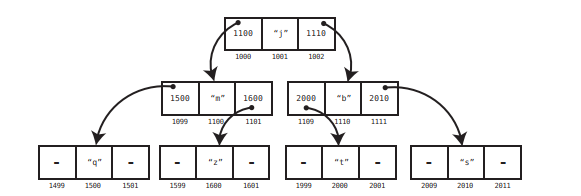
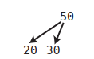
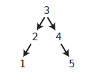
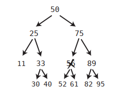
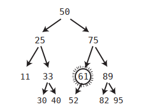
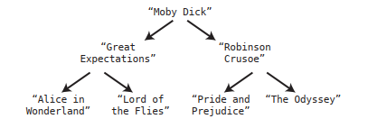
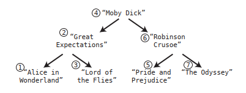

# Chapter 12: Speeding Up All the Things with Binary

Remember that with binary search, we can locate any value in O(log N) time if we have an ordered array.

However, in ordered arrays, insertions and deletions are slow: when a value is inserted in its correct place in the array, all the other values at its right have to move one step to the right in order to make space for the new value; and, when an item is deleted, all item at its right have to move one step to the left. This give us a O(N) time for insertion and deletions in ordered arrays, which is slow. 

Hash tables are O(1) for reading, insertion, and deletion, but they don't maintain order. 

What do we do if we need a data structure that maintains order, and also has fast search, insertion, and deletion?

The answer to that is the _binary tree_.

## Binary Trees

In a simple linked list, each node contains a link that connects this node to a single other node. A tree is also a node-based data structure, but within a tree, each node can have links to multiple nodes.

This is the visualization of a simple tree:



In this example, each node has links that lead to two other nodes. For the sake of simplicity, we can represent this tree visually without showing all the actual links:


Trees come with their own unique nomenclature:
- The uppermost node (in our example, the “j”) is called the _root_. 
- In our example, we’d say that the “j” is a _parent_ to “m” and “b”, which are in turn _children_ of “j”. The “m” is a parent of “q” and “z”, which are in turn children of “m”.
- Trees are said to have _levels_.

The above tree has three levels:


There are many kinds of tree-based data structures, but in this chapter we’ll be focusing on particular tree known as a binary tree. A binary tree is a tree that abides by the following rules:
- Each node has either zero, one, or two children.
- If a node has two children, it must have one child that has a lesser value than the parent, and one child that has a greater value than the parent.

Here’s an example of a binary tree, in which the values are numbers:


Note that each node has one child with a lesser value than itself which is depicted using a left arrow, and one child with a greater value than itself which is depicted using a right arrow.

While the following example is a tree, it is not a _binary tree_:



It is not a valid binary tree because both children of the parent node have values less than the parent itself.

The implementation of a tree node in Python might look something like this:

```python
class TreeNode:
  def __init__(self,val,left=None,right=None):
    self.value = val
    self.leftChild = left
    self.rightChild = right
```

We can build a simple tree like this:

```py
node = TreeNode(1)
node2 = TreeNode(10)
root = TreeNode(5, node, node2)
```


## Searching

We can search for any value within a binary tree very quickly, as we will see.

Again, this is an example of binary tree:


The algorithm for searching within a binary tree begins at the root node:
  1. Inspect the value at the node.
  2. If we’ve found the value we’re looking for, great!
  3. If the value we’re looking for is less than the current node, search for it in its left subtree.
  4. If the value we’re looking for is greater than the current node, search for
  it in its right subtree.

Here’s a simple, recursive implementation for this search in Python:

```py
def search(value, node):
  # Base case: If the node is nonexistent
  # or we've found the value we're looking for:
  if node is None or node.value == value:
    return node
  # If the value is less than the current node, perform
  # search on the left child:
  elif value < node.value:
    return search(value, node.leftChild)
  # If the value is less than the current node, perform
  # search on the right child:
  else: # value > node.value
    return search(value, node.rightChild)
```

More generally, we’d say that searching in a binary tree is O(log N). This is because each step we take eliminates half of the remaining possible values in which our value can be stored.

(This is only for perfectly balanced binary tree, which is the best case scenario.)

## Insertion

Where binary trees really shine over ordered arrays, though, is with insertion.

To insert a new value we have to:
1. First, find the correct node to attach the new value to (O(log N) speed).
2. Then, we attach the children.

This gives a O(log N) speed (Big O notation ignores the 1 constant of the insertion step.) This is much more efficient than inserting a new value in an ordered array: binary trees have O(log N) and O(log N) insertion. This becomes critical in an application where you anticipate a lot of changes to your data.

Here’s a Python implementation of inserting a value into a binary tree. Like the `search` function, it is recursive:

```py
def insert(value, node):
  if value < node.value:
    # If the left child does not exist, we want to insert
    # the value as the left child:
    if node.leftChild is None:
      node.leftChild = TreeNode(value)
    else:
      insert(value, node.leftChild)
  elif value > node.value:
    # If the right child does not exist, we want to insert
    # the value as the right child:
    if node.rightChild is None:
      node.rightChild = TreeNode(value)
    else:
      insert(value, node.rightChild)
```

It is important to note that only when creating a tree out of randomly sorted data do trees usually wind up well-balanced. However, if we insert sorted data into a tree, it can become imbalanced and less efficient.

For example, if we were to insert the following data in this order: 1, 2, 3, 4,
5, we’d end up with a tree that looks like this:


Searching for the 5 within this tree would take O(N). However, if we inserted the same data in the following order: 3, 2, 4, 1, 5, the tree would be evenly balanced:



Because of this, if you ever wanted to convert an ordered array into a binary tree, you’d better first randomize the order of the data. 

It emerges that in the worst case scenario, where a tree is completely imbalanced, search is O(N). In the best case scenario, where it is perfectly balanced, search is O(log N). 

In the typical scenario, in which data is inserted in random order, a tree will be pretty well-balanced and search will take about O(log N).

## Deletion 

Deletion is the least straightforward operation within a binary tree, and requires some careful maneuvering.

There are three possible cases:

- When the node to be deleted has no children: just find it and delete the node.
- When the node to be deleted has just one child: just find it, delete the node, and plug the child into the spot where the deleted node was.
- When the node to be deleted has two children: this is the most complex scenario: replace the deleted node with the _successor_ node. The successor node is the child node whose value is the least of all values that are greater than the deleted node.  In other words, the successor node is the next number up from the deleted value.

For example, let's say we want to delete the node 56:



In this case, the next number up among the descendants of 56 is 61. The node 61 is the successor. So we replace the 56 with the 61:



This is the algorithm to find the successor value:

- Visit the right child of the deleted value
- Then keep on visiting the left child of each subsequent child until there are no more left children. The bottom value is the successor node.

There is one case that we haven’t accounted for yet, and that’s where the successor node has a right child of its own:

- When the node to be deleted has two children, and the successor child has a right child of its own: after plugging the successor into the spot of the deleted node, take the right child of the successor node and turn it into the left child of the parent of the successor node.

Pulling all the steps together, this is the algorithm for deletion from a binary tree:

- If the node being deleted has no children, simply delete it.
- If the node being deleted has one child, delete it and plug the child into the spot where the deleted node was.
- When deleting a node with two children, replace the deleted node with the successor node. The successor node is the child node whose value is the least of all values that are greater than the deleted node.
- If the successor node has a right child, after plugging the successor node into the spot of the deleted node, take the right child of the successor node and turn it into the left child of the parent of the successor node.

Here’s a recursive Python implementation of deletion from a binary tree:

```py
def delete(valueToDelete, node):
  # The base case is when we've hit the bottom of the tree,
  # and the parent node has no children:
  if node is None:
    return None
  # If the value we're deleting is less or greater than the current node,
  # we set the left or right child respectively to be
  # the return value of a recursive call of this very method on the current
  # node's left or right subtree.
  elif valueToDelete < node.value:
    node.leftChild = delete(valueToDelete, node.leftChild)
    # We return the current node (and its subtree if existent) to
    # be used as the new value of its parent's left or right child:
    return node
  elif valueToDelete > node.value:
    node.rightChild = delete(valueToDelete, node.rightChild)
    return node

  # If the current node is the one we want to delete:
  elif valueToDelete == node.value:
    # If the current node has no left child, we delete it by
    # returning its right child (and its subtree if existent)
    # to be its parent's new subtree:
    if node.leftChild is None:
      return node.rightChild

    # (If the current node has no left OR right child, this
    # ends up being None as per the first line of code in this
    # function.)
    elif node.rightChild is None:
      return node.leftChild

    # If the current node has two children, we delete the current node
    # by calling the lift function (below), which changes the current node's
    # value to the value of its successor node:
    else:
      node.rightChild = lift(node.rightChild, node)
      return node

  def lift(node, nodeToDelete):

    # If the current node of this function has a left child,
    # we recursively call this function to continue down
    # the left subtree to find the successor node.
    if node.leftChild:
      node.leftChild = lift(node.leftChild, nodeToDelete)
      return node
      # If the current node has no left child, that means the current node
      # of this function is the successor node, and we take its value
      # and make it the new value of the node that we're deleting:
    else:
      nodeToDelete.value = node.value
      # We return the successor node's right child to be now used
      # as its parent's left child:
      return node.rightChild
```

## Binary Trees in Action

Binary trees boast efficiencies of O(log N) for search, insertion, and deletion, making it an efficient choice for scenarios in which we need to store and manipulate ordered data. This is particularly true if we will be
modifying the data often, because while ordered arrays are just as fast as binary trees when searching data, binary trees are significantly faster when it comes to inserting and deleting data.

For example, let’s say that we’re creating an application that maintains a list of book titles. We’d want our application to have the following functionality:
- Our program should be able to print out the list of book titles in alphabetical order.
- Our program should allow for constant changes to the list.
- Our program should allow the user to search for a title within the list.

If we didn’t anticipate that our book list would be changing that often, an ordered array would be a suitable data structure to contain our data. However, we’re building an app should be able to handle many changes in real time. If our list had millions of titles, we’d better use a binary tree. 

Such a tree might look something like this:



Now, we’ve already covered how to search, insert, and delete data from a binary tree. We mentioned, though, that we also want to be able to print the entire list of book titles in alphabetical order. How can we do that?

- First, we will need the ability to visit every single node in the tree. The process of visiting every node in a data structure is known as _traversing_ the data structure.
- Secondly, we need to make sure that we traverse the tree in alphabetically ascending order so that we can print out the list in that order. There are multiple ways to traverse a tree, but for this application we will perform what is known as in order traversal so that we can print out each title in alphabetical order.

Recursion is a great tool for performing ordered traversal. We’ll create a recursive function called traverse that can be called on a particular node. The function then performs the following steps:
1. Call itself (traverse) on the node’s left child if it has one.
2. Visit the node. (For our book title app, we print the value of the node at this step.)
3. Call itself (traverse) on the node’s right child if it has one.

For this recursive algorithm, the base case is when a node has no children in which case we simply print the node’s title but do not call traverse again. 

If we called traverse on the “Moby Dick” node, we’d visit all the nodes of the tree in this order:



Here’s a Python traverse_and_print function that will work for our list of book titles:

```py
def traverse_and_print(node):
  if node is None:
    return
  traverse_and_print(node.leftChild)
  print(node.value)
  traverse_and_print(node.rightChild)
```