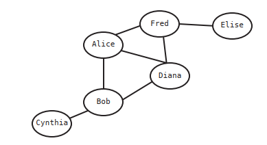
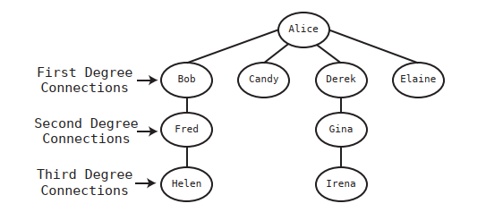
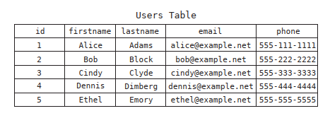
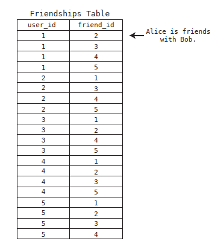
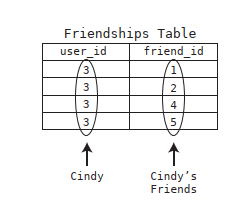
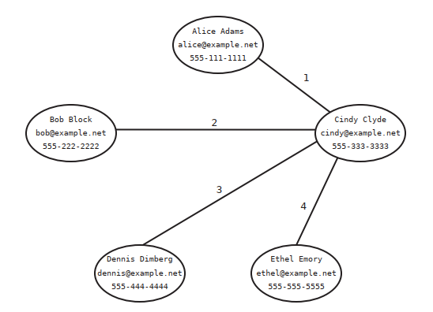
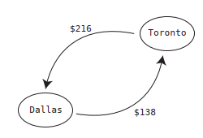
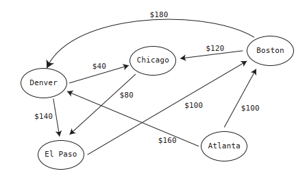

# Chapter 13: Connecting Everything with Graphs

Graphs are extremely powerful tools for dealing with data involving relationships, and in addition to making our code fast, they can also help solve tricky problems.

How can we represent mutual relationships (like friendships) in a data structure?

We can do it with a 2d array, in which every subarray represents a relationship between 2 persons:

```
relationships = [
  ["Alice", "Bob"],
  ["Bob", "Cynthia"],
  ["Alice", "Diana"],
  ["Bob", "Diana"],
  ["Elise", "Fred"],
  ["Diana", "Fred"],
  ["Fred", "Alice"]
]
```

Unfortunately, with this approach there’s no quick way to see who Alice’s (or anybody's) friends are.  We’d have to inspect each relationship within the array, and check to see whether Alice is contained within the relationship. We’d also perform the same process if we wanted to simply check whether Elise was Alice’s friend.

These processes imply an efficiency of O(N), since we need to inspect every relationship in our database.

But with a structure known as a _graph_, we can find each Alice's friends in just O(1) time!

## Graphs

A graph is a data structure that specializes in relationships, as it easily conveys how data is connected.

This is a graph visualization of our `relationships` list:



Each person is represented by a node, and each line indicates a friendship with another person.

Each node is called a _vertex_, and each line is called an _edge_. Vertices that are connected by an edge are said to be adjacent to each other.

There are many ways that a graph can be implemented; one of the simplest is using a hash table:

```ruby
friends = {
  "Alice" => ["Bob", "Diana", "Fred"],
  "Bob" => ["Alice", "Cynthia", "Diana"],
  "Cynthia" => ["Bob"],
  "Diana" => ["Alice", "Bob", "Fred"],
  "Elise" => ["Fred"],
  "Fred" => ["Alice", "Diana", "Elise"]
}
```

With a graph, we can look up Alice's friends in O(1), because we can look up the value of any key in a hash table in just one step:

```ruby
friends['Alice']
```

But what if we need to represent non-mutual relationships (when, for example, Alice follows Bob, but Bob does not follow Alice)? 


Using our hash table approach, we’d use the following code:
```ruby
followees = {
  "Alice" => ["Bob", "Cynthia"],
  "Bob" => ["Cynthia"],
  "Cynthia" => ["Bob"]
}
```

A graph that follows this model of non-mutual relationships is called a _directed graph_; a graph in which relationships are mutual is called a _non-directed graph_.

This is a more robust implementation (than a hash table) of a graph, using Ruby:

```ruby
class Person
  attr_accessor :name, :friends

  def initialize(name)
    @name = name
    @friends = []
  end

  def add_friend(friend)
    @friends << friend
  end
end
```

We can create people and establish relationships:

```ruby
mary = Person.new("Mary")
peter = Person.new("Peter")
mary.add_friend(peter)
peter.add_friend(mary)
```

## Breadth-first Search

In the following diagram: 


Alice is connected directly to Bob, and Bob is connected directly to Cynthia. However, Alice is not connected directly to Cynthia. Since Cynthia is connected to Alice by way of Bob, Cynthia is said to be Alice’s second-degree connection.



There are two classic ways to traverse a graph:

- Breadth-first search
- Depth-first search

The breadth-first search algorithm uses a queue, which keeps track of which vertices to process next. At the very beginning, the queue only contains the starting vertex (Alice, in our case):

```
[Alice]
```

We then process the Alice vertex by removing it from the queue, marking it as having been “visited”, and designating it as the current vertex. 

We then follow three steps:
1. Visit each vertex adjacent to the current vertex. If it has not yet been visited, mark it as visited, and add it to a queue. (We do not yet make it the current vertex, though.)
2. If the current vertex has no unvisited vertices adjacent to it, remove the next vertex from the queue and make it the current vertex.
3. If there are no more unvisited vertices adjacent to the current vertex, and there are no more vertices in the queue, the algorithm is complete.

This is a `display_network` method to our `Person` class that uses breadth-first search do display the names of a person’s entire network:

```ruby
class Person
  attr_accessor :name, :friends, :visited

  def initialize(name)
    @name = name
    @friends = []
    @visited = false
  end

  def add_friend(friend)
    @friends << friend
  end

  def display_network
    # We keep track of every node we ever visit, so we can reset
    # their 'visited' attribute back to false after our algorithm
    # is complete:
    to_reset = [self]
    # Create the queue. It starts out containing the root vertex:
    queue = [self]
    self.visited = true
    while queue.any?
      # The current vertex is whatever is removed from the queue
      current_vertex = queue.shift
      puts current_vertex.name
      # We add all adjacent vertices of the current vertex to the queue:
      current_vertex.friends.each do |friend|
        if !friend.visited
          to_reset << friend
          queue << friend
          friend.visited = true
        end
      end
    end
    # After the algorithm, is complete, we reset each node's 'visited'
    # attribute to false:
    to_reset.each do |node|
      node.visited = false
    end
  end
end
```

The efficiency of breadth-first search in our graph can be calculated by breaking down the algorithm’s steps into two types:
  - We remove a vertex from the queue to designate it as the current vertex.
  - For each current vertex, we visit each of its adjacent vertices.
Now, each vertex ends up being removed from the queue once. In Big O Notation this is called O(V). That is, for V vertices in the graph, there are V removals from the queue.

Why don’t call this O(N) - with N being the number of vertices? Because in this (and many graph algorithms) we also have additional steps that process not just the vertices themselves, but also the edges.

The number of times we visit adjacent vertices is twice the number of edges in the graph. This is because each edge connects two vertices, and for every vertex, we check all of its adjacent vertices. So each edge gets used twice.

So, for E edges, we check adjacent vertices 2E times. That is, for E edges in the graph, we check twice that number of adjacent vertices. However, since Big O ignores constants, we just write it as O(E). Since there are O(V) removals from the queue, and O(E) visits, we say that breadth-first search has an efficiency of O(V + E).

## Graph Databases

Because graphs are so versatile at handling relationships, there are actually databases that store data in the form of a graph.

Let’s say that we have a social network in which there are five friends who are all connected to each other. These friends are Alice, Bob, Cindy, Dennis, and Ethel. A graph database that will store their personal information may look something like this:


In a traditional relational database, we would need two tables: one for the friends personal information, and other to represent relationships between them. Here is the Users table:



And here is the Friendships' table to keep track of who is friends with whom:



If we would like to see the info of all the friends of a particular person, in a traditional relataional database we would have to, first, look up that person's id in the Users table (i.e.: Cindy):


Then, we’d look for all the rows in the Friendships table where the user id is
3:



We now have a list of the id’s of all of Cindy’s friends: [1, 2, 4, 5].

With this id list, we need to return to the Users table to find each row with the appropriate id. The speed at which the computer can find each row in the Users table will be approximately O(log N). This is because the database maintains the rows in order their id’s, and the database can then use binary search to find each row.

Since Cindy has four friends, the computer needs to perform O(log N) four times to pull all the friends’ personal data. To say this more generally, for M friends, the efficiency of pulling their information is O(M log N). That is, for each friend, we run a search that takes log N steps. 

If our application was backed by a graph database, once we’ve located Cindy in our database, it takes just one step to find one friend’s info. This is because each vertex in the database contains all the information of its user, so we simply traverse the edges from Cindy to each of her friends. This takes a grand total of four steps:



With a graph database, for N friends, pulling their data takes O(N) steps. This is a significant improvement over the efficiency of O(M log N) that a relational database would provide.

Note that graph databases aren’t always the best solution for a given application. You’ll need to carefully assess each application and its needs.

## Weighted Graphs

Another type of graph is one known as a weighted graph. A weighted graph is like a regular graph but contains additional information about the edges in the graph.

Here’s a weighted graph that represents a basic map of a few major cities the US:


In a weighted graph, each edge is accompanied by some value(s). In this case, each edge has a number that represents the distance in miles between the cities that the edge connects.

It’s also possible to have directional weighted graphs. In the following example,
we can see that although a flight from Dallas to Toronto is $138, a flight from
Toronto to Dallas is $216:



To add weights to our graph, we need to make a slight modification to our Ruby implementation. Specifically, we’ll be using a hash table rather than an array to represent the adjacent nodes. In this case, each vertex will be represented by a `City` class:

```ruby
class City
  attr_accessor :name, :routes

  def initialize(name)
    @name = name
    # For the adjacent vertices, we are now using a hash table
    # instead of an array:
    @routes = {}
  end
  def add_route(city, price)
    @routes[city] = price
  end
end
```

Now, we can create cities and routes with prices:

```ruby
dallas = City.new("Dallas")
toronto = City.new("Toronto")
dallas.add_route(toronto, 138)
toronto.add_route(dallas, 216)
```

Imagined that, instead of miles, we have a weighted graph that represents the costs of available flights between different cities:



A weighted graph is linked to a question that looks like this: how could I get from a city X to a city Y with the least amount of money? This is known as the _shortest path problem_.

## Dijkstra's Algorithm

There are numerous algorithms for solving the shortest path problem, and a fascinating one was discovered by Edsger Dijkstra in 1959. Unsurprisingly, this algorithm is known as Dijkstra’s Algorithm.

Here are the rules of Dijkstra’s Algorithm: 

1. We make the starting vertex our current vertex.
2. We check all the vertices adjacent to the current vertex and calculate and record the weights from the starting vertex to all known locations.
3. To determine the next current vertex, we find the cheapest unvisited known vertex that can be that reached from our starting vertex.
4. Repeat the first three steps until we have visited every vertex in the graph.

Here is a Ruby implementation of Dijkstra’s algorithm:

We’ll begin by creating a Ruby class representing a city. Each city is a node in a graph, which keeps track of its own name, and routes to adjacent cities:

```ruby
class City
  attr_accessor :name, :routes

  def initialize(name)
    @name = name
    # For the adjacent nodes, we are now using a hash table
    # instead of an array:
    @routes = {}
    # As as an example, if this were Atlanta, its routes would be:
    # {boston => 100, denver => 160}
  end

  def add_route(city, price_info)
    @routes[city] = price_info
  end
end
```

We’ll use the add_route method to set up the cities from our example:

```rb
atlanta = City.new("Atlanta")
boston = City.new("Boston")
chicago = City.new("Chicago")
denver = City.new("Denver")
el_paso = City.new("El Paso")
atlanta.add_route(boston, 100)
atlanta.add_route(denver, 160)
boston.add_route(chicago, 120)
boston.add_route(denver, 180)
chicago.add_route(el_paso, 80)
denver.add_route(chicago, 40)
denver.add_route(el_paso, 140)
```

And this is the code for the Dijkstra's Algorithm:

```rb
def dijkstra(starting_city, other_cities)
  # The routes_from_city hash table below holds the data of all price_infos
  # from the given city to all other destinations, and the city which it
  # took to get there:

  routes_from_city = {}

  # The format of this data is:
  # {city => [price, other city which immediately precedes this city
  # along the path from the original city]}
  # In our example this will end up being:
  # {atlanta => [0, nil], boston => [100, atlanta], chicago => [200, denver],
  # denver => [160, atlanta], el_paso => [280, chicago]}
  # Since it costs nothing to get to the starting city from the starting city:

  routes_from_city[starting_city] = [0, starting_city]

  # When initializing our data, we set up all other cities having an
  # infinite cost - since the cost and the path to get to each other city
  # is currently unknown:

  other_cities.each do |city|
    routes_from_city[city] = [Float::INFINITY, nil]
  end

  # In our example, our data starts out as:
  # {atlanta => [0, nil], boston => [Float::INFINITY, nil],
  # chicago => [Float::INFINITY, nil],
  # denver => [Float::INFINITY, nil], el_paso => [Float::INFINITY, nil]}
  # We keep track of which cities we visited in this array:

  visited_cities = []

  # We begin visiting the starting city by making it the current_city:

  current_city = starting_city

  # We launch the heart of the algorithm, which is a loop that visits each city:
  
  while current_city
    # We officially visit the current city:
    visited_cities << current_city
    # We check each route from the current city:
    current_city.routes.each do |city, price_info|
    # If the route from the starting city to the other city
    # is cheaper than currently recorded in routes_from_city, we update it:
      if routes_from_city[city][0] > price_info +
        routes_from_city[current_city][0]
        routes_from_city[city] =
        [price_info + routes_from_city[current_city][0], current_city]
      end
    end
    # We determine which city to visit next:
    current_city = nil
    cheapest_route_from_current_city = Float::INFINITY
    # We check all available routes:
    routes_from_city.each do |city, price_info|
    # if this route is the cheapest from this city, and it has not yet been
    # visited yet, it should be marked as the city we'll visit next:
      if price_info[0] < cheapest_route_from_current_city &&
        !visited_cities.include?(city)
        cheapest_route_from_current_city = price_info[0]
        current_city = city
      end
    end
  end

  return routes_from_city
end
```

We can run this method as follows:
```rb
routes = dijkstra(atlanta, [boston, chicago, denver, el_paso])
routes.each do |city, price_info|
  p "#{city.name}: #{price_info[0]}"
end
```

Although our example here focused on finding the cheapest flight, the same exact approach can be used for mapping and GPS technology. If the weights on each edge represented how fast it would take to drive from each city to the other rather than the price, we’d just as easily use Dijkstra’s algorithm to determine which route you should take to drive from one place to another.

