# Chapter 01: Why Data Structures Matter

Data is a broad term that refers to all types of information, down to the most basic numbers and strings.

The organization of data does not just matter for organization's sake, but can significantly impact _how fast your code runs_. Depending on how you choose to organize your data, your program may run faster or slower by orders of magnitude.

## The Array: the Foundational Data Structure

The array is one of the most basic data structures in computer science; it's simply a list of data elements.

The _index_ of an array is the number which identifies where a piece of data lives inside the array. We begin counting the index at 0. (Arrays are zero-indexed)

To understand the performance of a data structure, like an array, we need to analyze the common ways that our code might interact with that data structure.

Most data structures are used in four basic ways (we interact with them in four basic ways), which we refer to as _operations_:

1. Read: looking something up from a particular spot within a data structure.

2. Search: looking for a particular value within a data structure.

3. Insert: adding another value to a data structure.

4. Delete: removing a value from a data structure.

_In the DSA (data structures and algorithms) context, when we measure how fast an operation takes, we do not refer to how fast the operation takes in terms of pure time, but instead in how many steps it takes_

Why?

Measuring the speed of an operation in terms of time is flaky, since it will always change depending on the hardware that it is run on. However, we can measure the speed of an operation in terms of how many steps it takes.

Measuring the speed of an operation is also known as measuring its _time complexity_. Throughout this book, we will use the terms _speed_, _time complexity_, _efficiency_ and _performance_ interchangeably. They all refer to the number of steps that a given operation takes.

### Reading

Reading from an array actually takes just one step. This is because the computer has the ability to jump to any particular index in the array and peek inside.

A computer's memory can be viewed as a giant collection of cells. 

When a program declares an array, it allocates a contiguous set of empty cells for use in the program.

Every cell in a computer's memory has a specific address, represented by a simple number. Each cell's memory address is one number greater than the previous cell.

When the computer reads a value at a particular index of an array, it can jump straight to that index in one step because of the combination of the following facts:

1. A computer can jump to any memory address in one step.

2. Recorded in each array is the memory address which it begins at.

3. Every array begins at index 0.

Reading from an array is a very efficient operation, since it takes just one step. An operation with just one step is naturally the fastest type of operation.

### Searching 

To search for a value within an array, the computer starts at index 0, checks the value, and if it does not find what it's looking for, moves on to the next index. It does this until it finds the value it's seeking.

This basic search operation in which the computer checks each cell one at a time is known as _linear search_.

For N cells in an array, linear search will take a maximum of N steps. In this context N is just a variable that can be replaced by any number.

Searching is less efficient than reading, since searching can take many steps, while reading always takes just one step no matter how large the array.

### Insertion

The efficiency of inserting a new piece of data inside an array depends on where inside the array you'd like to insert it. 

Inserting an element at the end of the array just takes one step; Inserting a new piece of data at the beginning or the _middle_ of the array is a different story. In these cases, we need to _shift_ many pieces of data to make room for what we're inserting, leading to additional steps.

The worst case scenario for insertion into an array -that is, the scenario in which insertion takes the most steps- is where we insert data at the beginning of the array. This is because when inserting into the beginning of the array we have to move all the other values one cell to the right.

We say that insertion in the worst case scenario can take up to N + 1 steps for an array containing N elements. (N shifts, 1 insertion)

### Deletion

The actual deletion itself is really just one step, but we need to follow up with additional steps of shifting data to the left to close the gap caused by the deletion.

Like insertion, the worst case scenario of deleting an element is deleting the very first element of the array.


## Sets: How a Single Rule Can Affect Efficiency

A set is a data structure that does not allow duplicate values to be contained within it. There are many types of sets, but for this discussion we'll talk about an _array-based set_. The only difference between this set and a classic array is that the set never allows duplicate values to be inserted into it. 

Sets are useful when you need to ensure that you don't have duplicate data.

In any case, a set is an array with one simple constraint of not allowing duplicates. Yet, this constraint causes the set to have a different efficiency for one of the four primary operations.

Reading from a set is exactly the same as reading from an array.

Searching a set is also the same as searching an array.

Insertion, however, is where arrays and sets diverge. With a set, the computer first needs to determine _that this value does not already exist in this set_. So, every insertion requires a search.

In a worst case scenario, where we are inserting a value at the beginning of a set, the computer needs to search N cells to ensure that the set does not already contain that value; that gives a total of 2N + 1 steps.

Sets are important when you need to ensure that there is no duplicate data. But when you don't have such a need, an array may preferable.

## Wrapping Up

Analyzing the number of steps that an operation takes is the heart of understanding the performance of data structures. Choosing the right data structure for your program can spell the difference between bearing a heavy load versus collapsing under it. 

# Chapter 02: Why Algorithms Matter

There is another major factor that can affect the efficiency of our code: The proper selection of which algorithm to use.

An algorithm is simply a particular process for solving a problem. In computer science, an algorithm is a process for going a particular operation: there are multiple algorithms than can achieve a particular operation.

## A New Data Structure: the Ordered Array

(There is more than one algorithm for searching an ordered array.)

The ordered array is like any array except the values are always kept in order; every time a value is added, it gets placed in the proper cell so that the values of the array remain sorted. (In a standard array, values are just inserted at the end)

While insertion is less efficient in an ordered array than in a regular array, the ordered array has a secret superpower when it comes to the search operation

## Searching an Ordered Array

When we check each cell one at a time until we find the value we are looking for is a process called linear search. This is the only search process available for an unordered array

With an ordered array, we can stop a search early even if the value is not contained within the array (If we don't find the value where it should be)

Here's a Ruby implementation of linear search on an ordered array:

```ruby
def linear_search(array, value)
  # We iterate through every element in the array:
  array.each do |element|
    # If we find the value we're looking for, we return it:
    if element == value
      return value
    # If we reach an element that is greater than the value
    # we're looking for, we can exit the loop early:
    elsif element > value
      break
    end
  end
  # We return nil if we do not find the value within the array:
  return nil
end
```

In this light linear search will take fewer steps in an ordered array versus a standard array _in most situations_. But if the value we are looking for is the last value or is greater than the last value, we still end up searching every cell.

But the big advantage of an ordered array over a regular array is that an ordered array allows for an alternative searching algorithm: _binary search_. This algorithm is much, much faster than linear search.

## Binary Search

This algorithm is only possible in an ordered array, and it consists in dividing the total number of cells in which to look for in half successively.  

Here is an implementation of binary search in Ruby:

```ruby
def binary_search(array, value)
  # First, we establish the lower and upper bounds of where the value
  # we're searching for can be. To start, the lower bound is the first
  # value in the array, while the upper bound is the last value:

  lower_bound = 0
  upper_bound = array.length - 1

  # We begin a loop in which we keep inspecting the middlemost value
  # between the upper and lower bounds:
  while lower_bound <= upper_bound do
  # We find the midpoint between the upper and lower bounds:
  # (We don't have to worry about the result being a non-integer
  # since in Ruby, the result of division of integers will always
  # be rounded down to the nearest integer.)
    midpoint = (upper_bound + lower_bound) / 2
    # We inspect the value at the midpoint:
    value_at_midpoint = array[midpoint]

    # If the value at the midpoint is the one we're looking for, we're done.
    # If not, we change the lower or upper bound based on whether we need
    # to guess higher or lower:

    if value < value_at_midpoint
      upper_bound = midpoint -1
    elsif value > value_atmidpoint
      lower_bound = midpoint + 1
    elsif value == value_at_midpoint
      return midpoint
    end
  end

  # If we've narrowed the bounds until they've reached each other, that
  # means that the value we're searching for is not contained within
  # this array:
  return nil
end
```

## Binary Search vs. Linear Search

With ordered arrays of a small size, the algorithm of binary search doesn’t have much of an advantage over the algorithm of linear search. But let’s see what happens with larger arrays. 

With an array containing 100 values, the maximum number of steps it takes for search:
- Linear Search: 100 steps.
- Binary Search: 7 steps.

With linear search, if the value we’re searching for is in the final cell, or is greater than the value in the final cell, we have to inspect each and every element. For an array which is the size of 100, this would take 100 steps. 

When we use binary search, however, each guess we make eliminates half of the possible cells we’d have to search. In our very first guess, we get to eliminate a whopping 50 cells.

The pattern is unusually efficient: for every time we double the data, the binary search algorithm adds a maximum of just one more step.  For binary search, every time we double the number of elements in the array, we only need to add one more step.

We can visualize the difference in performance between linear and binary search with this graph:


But here's the tradeoff: by using an ordered array, you have somewhat slower insertion, but much faster search. Again, you must analyze your application to see what is a better fit.

## Wrapping Up

There usually isn’t a single data structure or algorithm that is perfect for every situation. For example, just because ordered arrays allow for binary search doesn’t mean you should always use ordered arrays. In situations where you don’t anticipate searching the data much, but only adding data, standard arrays may be a better choice because their insertion is faster.

# Chapter 03 : Big O Notation

In order to help ease communication regarding time complexity, computer scientist have borrowed a concept from the world of mathematics to describe a concise and consistent language around the efficiency of data structures and algorithms. Known as _Big O Notation_, this formalized expression around these concepts allows us to easily categorize the efficiency of a given algorithm and convey it to others. 

## Big 0: Count the Steps

Big O achieves consistency by focusing only on the number of steps that an algorithm takes.

When an operation takes just one step, no matter how large the data structure is, the way to express this in Big O notation is 

$$ \mathcal{O}(1) $$

This simply means that the algorithm takes the same number of steps no matter how much data there is.

Other operations that fall under this category are the insertion and deletion of a value at the end of an array.

For N elements in the array, linear search can take up to a maximum of N steps. The appropiate way to express this in Big O notation is:

$$ \mathcal{O}(N) $$

This is the way to say that for N elements inside an array, the algorithm would take N steps to complete.

Mathematically, one way of describing Big O is that it describes the upper bound of the growth rate of a function, or that if a function _g(x)_ grows no faster than a function _f(x)_, then _g_ is said to be a member of _O(f)_.

## Constant Time vs. Linear Time

Big O Notation does more than simply describe the number of steps than an algorithm takes. Rather, it describes **how many steps an algorithm takes based on the number of data elements that the algorithm is acting upon**. Or, in another way, _How does the number of steps change as the data increases?_.

An algorithm that is O(N) will take as many steps as there are elements of data. So when an array increases in size by one element, an O(N) algorithm will increase by one step. An algorithm that is O(1) will take the same number
of steps no matter how large the array gets.

Let's look at how these two types of algorithms are plotted on a graph:


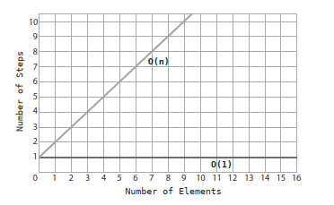

O(N) makes a perfect diagonal line. This is because for every additional piece of data, the algorithm takes one additonal step.

Contrast this with O(1), which is a perfect horizontal line, since the number of steps in the algorithm remains constant no matter how much data there is. Because of this, O(1) is also referred to as _constant time_.

As Big O is primarily concerned about how an algorithm performs across varying amounts of data, an important point emerges: An algorithm can be described as O(1) even if it takes more than one step. The number of steps remains constant no matter how much data there is. O(1) is the way to describe any algorithm that does not change its number of steps even when the data increases.

## Same Algorithm, Different Scenarios

While Big O effectively describes both the best and worst case scenarios of a given algorithm, Big O notation generally refers to worst case scenario unless specified otherwise.

The reason for this is that this pessimistic approach can be a useful tool: this prepares us for the worst and may have a strong impact on our choices.

## An Algorithm of the Third Kind

The way to describe binary search in terms of Big O Notation is by saying that it has a time complexity of 

$$ \mathcal{O}(\log{N}) $$

This is the way of describing an algorithm that increases one step each time the data is doubled.

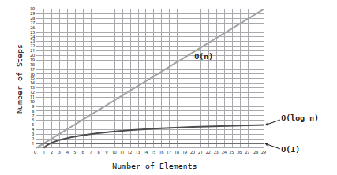

Logarithms are the inverse of exponents.

$$ 2^3$$ 

is the equivalent of 

$$ 2 * 2 * 2 $$

which happens to be 8. Now, $$\log_2{8}$$ is the converse of the above. It means: How many times do you have to multiply 2 by itself to get a result of 8?

## 0(log N) Explained

O(log N) is the shorthand for saying $$\log_2$$. We just omit the 2 for convenience. 

O(log N) means that for N data elements, the algorithm would take log<sub>2</sub> N steps. If there are 8 elements, the algorithm would take 3 steps, since log<sub>2</sub> 8 = 3. Said another way, if we keep dividing the 8 elements in half, it would take us 3 steps until we end up with one element. This is exactly what happens with binary search. As we search for a particular item, we keep dividing the array’s cells in half until we narrow it down to the correct number.

The following table demonstrates a striking difference between the efficiencies
of O(N) and O(log N):


## Wrapping Up

We have a consistent system that allows us to compare any two algorithms. With it, we will be able to examine real-life scenarios and choose between competing data structures and algorithms to make our code faster and able to handle heavier loads.


# Chapter 04: Speeding Up Your Code with Big O

Big O Notation is a great tool for comparing competing algorithms, as it gives
an objective way to measure them.

## Bubble Sort

Sorting algorithms have been the subject of extensive research in computer science, and tens of such algorithms have been developed over the years. They all solve the following problem: _Given an array of unsorted numbers, how can we sort them so that they end up in ascending order?_.

Bubble Sort is a very basic sorting algorithm, and not very efficient. It follows these steps:

1. Point to two consecutive items in the array. (Initially, we start at the very
beginning of the array and point to its first two items.) Compare the first item
with the second one:


2. If the two items are out of order (i.e. the left value is greater than the right value), swap them: (If they already happen to be in the correct order, do nothing)


3. Move the pointers one cell to the right:


Repeat steps 1 and 2 until we reach the end of the array or any items that have already been sorted.

4. Repeat steps 1 through 3 until we have a round in which we didn’t have to make any swaps. This means that the array is in order.

Each time we repeat steps 1 through 3 is known as a _passthrough_. That is, we “passed through” the primary steps of the algorithm, and will repeat the same process until the array is fully sorted.

## Bubble Sort Implemented

Here's an implementation of the Bubble Sort in Ruby:

```ruby
def bubble_sort(array)
  unsorted_until_index = array.length - 1
  sorted = false

  while !sorted 
    sorted = true

    unsorted_until_index.times do |i|
      if array[i] > array[i + 1]
        sorted = false
        array[i], array[i+1] = array[i+1], array[i]
      end
    end

    unsorted_until_index -= 1
  end

  array
end

list = [65, 55, 45, 35, 25, 15, 10]
bubble_sort(list)
print(list) ## => [10, 15, 25, 35, 45, 55, 65]
```

## Alternative version

### Algorithm

Assuming we want to sort an array in ascending order, bubble sort works like this:

1. The algorithm starts by comparing the first two elements of the array.
    - If the first element is greater than the second element (in ascending order), they are swapped.
    - If they are in the correct order, no change is made.
2. The algorithm then moves to the next pair of elements (the second and third elements) and compares them.
3. This process continues, comparing and swapping adjacent elements until the end of the array is reached.
4. At the end of the first iteration, the largest element in the array will be in its correct position at the end.
5. The algorithm then starts the next iteration, repeating steps 1 to 3, but excluding the last element, as it is already in its correct position.
6. Each iteration moves the next largest element to its correct position at the end of the remaining unsorted portion of the array.
7. The iterations continue until no more swaps are needed, indicating that the array is completely sorted.
If we wanted to sort the array in descending order, then we would use a "less than" comparison instead of "greater than", and that would move the smaller elements toward the end of the array.

### Implementation

```js
function bubbleSort(array) {
  const len = array.length;

  for (let i = 0; i < len - 1; i++) {
     // Flag to track if any swaps were made
    let swapped = false;

    // Last i elements are already in place
    for (let j = 0; j < len - 1 - i; j++) {

      // Check if the element in the current iteration is greater than the one in the next iteration
      if (array[j] > array[j + 1]) {
        // Swapping elements
        [array[j], array[j + 1]] = [array[j + 1], array[j]];
        swapped = true
      }
    }
    if (!swapped) {
      // If no swaps were made in this iteration, the array is already sorted
      break;
    }
  }

  return array;
}
```

## The Efficiency of Bubble Sort

The Bubble Sort contains two kinds of steps:

1. Comparisons - in which two numbers are compared with one another to determine which is greater.

2. Swaps - two numbers are swapped with one another.

For N elements, we make $$ (N - 1) + (N - 2) + (N - 3) … + 1 $$ comparisons.

In a worst case scenario, where the array is not just randomly shuffled, but sorted in descending order, we'd actually need a swap for each comparison, which adds up to the already high number of comparisons.

And, as the number of elements increase, the number of total steps grows exponentially or almost exponentially (N<sup>2</sup>)


Therefore, in Big O notation, we say that Bubble Sort has an efficiency of $$ \mathcal{O}(N^2) $$

This makes of this algorithm not a very efficient one, since as the data increases, the steps increase dramatically:


_O(N<sup>2</sup>)_ is also referred to as _quadratic time_.

## A Quadratic Problem

Let’s say you’re writing a JavaScript application that requires you to check whether an array contains any duplicate values:

```js
function hasDuplicateValue(array) {
  for(let i = 0; i < array.length; i++) {
    for(let j = 0; j < array.length; j++) {
      if(i !== j && array[i] == array[j]) {
        return true;
      }
    }
  }

  return false;
}
```

Remember that Big O is a measure of how many steps our algorithm would take relative to how much data there is.

Based on this, we can conclude that for N elements in the array, our function would perform N<sup>2</sup> comparisons. This is because we perform an outer loop that must iterate N times to get through the entire array, and for each iteration, we must iterate another N times with our inner loop. That’s N steps * N steps, which is otherwise known as N<sup>2</sup>steps, leaving us with an algorithm of _O(N<sup>2</sup>)_.

_O(N<sup>2</sup>)_ is the efficiency of algorithms in which nested loops are used.

_O(N<sup>2</sup>)_ is considered a relatively slow algorithm. Whenever encountering a slow algorithm, it’s worth spending some time to think about whether there may be any faster alternatives. This is especially true if you anticipate that your function may need to handle large amounts of data, and your application may come to a screeching halt if not optimized properly. There may not be any better alternatives.

## A Linear Solution

This is another implementation of the `hasDuplicateValue` function that does not rely upon nested loops:

```js
function hasDuplicateValue(array) {
  let existingNumbers = [];
  for(let i = 0; i < array.length; i++) {
    if(existingNumbers[array[i]] === undefined) {
      existingNumbers[array[i]] = 1;
    } else {
      return true;
    }
  }
  return false;
}
```

This implementation uses a single loop, and keeps track of which numbers it has already encountered using an array called `existingNumbers`. It uses this array in an interesting way: Every time the code encounters a new number, it stores the value `1` inside the index of the `existingNumbers` corresponding to
that number.

Once again, the worst case scenario is when the array contains no duplicates, in which case our function must complete the entire loop. This new algorithm appears to make N comparisons for N data elements. This
is because there’s only one loop, and it simply iterates for as many elements as there are in the array. 

We know that O(N) is much faster than O(N2), so by using this second approach, we’ve optimized our `hasDuplicateValue` significantly. If our program handles lots of data, this will make a big difference. 

(There is actually one disadvantage with this new implementation, which is that we will need more physical memory to store the extra array needed for visited numbers.)

## Wrapping Up

It’s clear that having a solid understanding of Big O Notation can allow us to identify slow code and select the faster of two competing algorithms. However, there are situations in which Big O Notation will have us believe that two algorithms have the same speed, while one is actually faster. In the next
chapter, we’re going to learn how to evaluate the efficiencies of various algorithms even when Big O isn’t nuanced enough to do so.

# Chapter 05: Optimizing Code With and Without Big O

There are times when two competing algorithms may be described in exactly the same way using Big O, yet one algorithm is significantly faster than the other.

## Selection Sort

In the last chapter, we explored an algorithm for sorting data known as Bubble Sort, which had an efficiency of _O(N<sup>2</sup>)_. We’re now going to dig into another sorting algorithm called Selection Sort, and see how it measures up to Bubble Sort.

The steps of Selection Sort are as follows:

1. We check each cell of the array from left to right to determine which value is least. As we move from cell to cell, we keep in a variable the lowest value we've encountered so far. (Really, we keep track of its index, but for the purposes of the diagrams below, we’ll just focus on the actual value.) If we encounter a cell that contains a value that is even less than the one in our variable, we replace it so that the variable now points to the new index. See the following diagram:


2. Once we've determined which index contains the lowest value, we swap that index with the value we began the passthrough with. This would be the index 0 in the first passthrough, index 1 in the second passthrough, and so on and so forth. In the next diagram, we make the swap of the first passthrough:

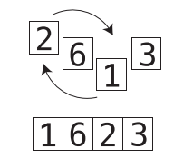

3. Repeat steps 1 and 2 until all the data is sorted.

## Selection Sort Implemented

Here's a JavaScript implementation of Selection Sort:

```js
function selectionSort(array) {
  for (let i = 0; i < array.length; i += 1) {
    let lowestNumberIndex = i;

    for (let j = i + 1; j < array.length; j += 1) {
      if (array[j] < array[lowestNumberIndex]) {
        lowestNumberIndex = j;
      }
    }

    if (lowestNumberIndex === i) continue;

    [array[i], array[lowestNumberIndex]] = [array[lowestNumberIndex], array[i]]
  }

  return array;
}
```

## Alternative Version

### Algorithm

1. The algorithm divides the array into two parts: the sorted part and the unsorted part.
2. Initially, the sorted part is empty, and the unsorted part contains the entire array.
3. In each pass, the algorithm scans the unsorted part of the array to find the smallest element.
4. Once the smallest element is identified, it is swapped with the leftmost element of the unsorted part (the element at the boundary of the sorted and unsorted parts).
5. After the swap, the boundary between the sorted and unsorted parts is shifted one position to the right.
6. The selected element is now considered part of the sorted part, and the unsorted part is reduced by one element.
7. Steps 3 to 6 are repeated until the unsorted part contains just one element, which means it must be sorted. Consequently, the entire array is sorted.

### Implementation

```js
function selectionSort(array) {
  const len = array.length;

  for (let i = 0; i < len - 1; i++) {
    let minIndex = i;

    for (let j = i + 1; j < len; j++) {
      if (array[j] < array[minIndex]) {
        minIndex = j;
      }
    }

    if (minIndex !== i) {
      [array[i], array[minIndex]] = [array[minIndex], array[i]];
    }
  }

  return array;
}
```

## The Efficiency of Selection Sort

Selection Sort contains two types of steps: Comparisons and Swaps. With an array `[4, 2, 7, 1, 3 ]` of 5 elements, these are the comparisons that we would have to do:

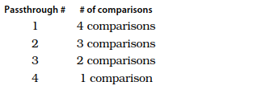

This means that for N elements, we make:
$$ (N - 1) + (N - 2) + (N - 3) ... + 1 $$
comparisons.

As for swaps, we only need to make a maximum of one swap per passthrough. This is because in each passthrough, we make either one or zero swaps, depending on whether the lowest number of that passthrough is already in the correct position. Contrast this with Bubble Sort, where in a worst case scenario - an array in descending order - we had to make a swap for each and every comparison.

Here is the side-by-side comparison between Bubble Sort and Selection Sort:

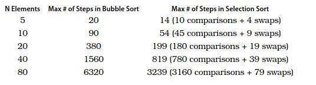

It's clear that Selection Sort is twice as fast.

## Ignoring Constants

But in the world of Big O notation, Selection Sort and Bubble Sort are described in exactly the same way.

Again, Big O notation describes how many steps are required relative to the number of data elements. So, at first glance_ we should describe the number of steps of Selection sort as roughly the half of N<sup>2</sup>: _O(N<sup>2</sup> / 2)_. See this table:


But, in reality, Selection Sort is described as having a time complexity of  _O(N<sup>2</sup>)_. Why? Because of a major rule in Big O notation: 

_Big O notation ignores constants_

This is simply a mathematical way of saying that Big O never includes regular numbers that are not an exponent. So, what technically should be  _O(N<sup>2</sup> / 2)_ becomes  _O(N<sup>2</sup>)_. Similarly _O(2N)_ would become _O(N)_, and  _O(N / 2)_ would also become _O(N)_ too. Even  _O(100N)_ would also become _O(N)_. 

Offhand, it would seem that this rule would render Big O Notation entirely useless, as you can have two algorithms that are described in the same exact way with Big O, and yet one can be 100 times faster than the other. And that’s exactly what we’re seeing here with Selection Sort and Bubble Sort. Both are described Big O as _O(N2)_, but Selection Sort is actually twice as fast as Bubble Sort. And indeed - between if given the choice between those two options, Selection Sort is the better choice. Remember, _Big O describes a growth rate relative to the amount of data_.

## The Role of Big O

This notation serves a great way to classify the _long term growth rate_ of algorithms. That, for _some amount of data_, _O(N)_ will always be faster than _O(N<sup>2</sup>)_. And this is true no matter whether the  _O(N)_ is really  _O(2N)_ or  _O(100N)_ under the hood. It is a fact that, at some point, with some amount of data _O(100N)_ will become faster than _O(N<sup>2</sup>)_.

Take a look at the following graph, in which we compare  _O(N)_ with _O(N<sup>2</sup>)_:

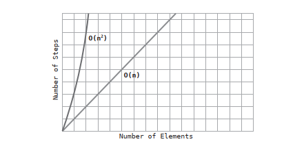

We've seen this graph in the previous chapter. It depicts how _O(N)_ is faster than _O(N<sup>2</sup>)_ for _all_ amounts of data.

Now take a look at this second graph, where we compare _O(100N)_ with _O(N<sup>2</sup>)_:

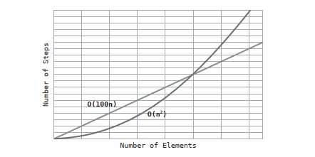

In this second graph, we see that _O(N<sup>2</sup>)_ is faster than _O(100N)_ for certain amounts of data, but, after some point, even _O(100N)_ becomes faster, and remains faster for all increasing amounts of data from that point forward.

It is for this reason that Big O ignores constants. The purpose of Big O is that for different classifications, _there will always be a point at which one classification supersedes the other in speed, and will remain faster forever. When the point occurs exactly, however, is not the concern of Big O. 

Similary, with large amounts of data, _O(log N)_ will always by faster than _O(N)_, even if the given _O(log N)_ altorithm is actually _O(2 * log N)_ under the hood.

So Big O is an extremely useful tool, because if two algorithms fall under different classifications of Big O, you'll generally know which algorithm to use since with large amounts of data, one algorithm is guaranteed to be faster than the other at a certain point.

However, the main takeaway of this chapter is that when two algorithms fall under the same classification of Big O, it doesn't necessarily mean that both algorithms process at the same speed. After all, Buble Sort is twice as slow as Selection Sort even though both are _O(N<sup>2</sup>)_. So while Big O is perfect for contrasting algorithms that fall under different classifications of Big O, when two algorithms fall under the _same_ classification, further analysis is required to determine which algorithm is faster.

## A Practical Example

Let’s say you’re tasked with writing a Ruby application that takes an array and creates a new array out of every other element from the original array. It might be tempting to use the each_with_index method available to arrays to loop through the original array as follows:

```ruby
def every_other(array)
  new_array = []
  array.each_with_index do |element, index|
    new_array << element if index.even?
  end
  return new_array
end
```
We perform N array lookups, since we loop through each and every element of the array. We only perform N / 2 insertions, though, since we only insert every other element into the new array. Since we have N lookups, and N / 2 insertions, we’d say that our algorithm technically has an efficiency of _O(N + (N / 2))_, which we can also rephrase as _O(1.5N)_. But since Big O Notation
throws out the constants, we’d say that our algorithm is simply _O(N)_.

Instead of iterating through each element of the array and checking whether the index is an even number, we can instead simply look up every other element of the array in the first place:

```ruby
def every_other(array)
  new_array = []
  index = 0
  while index < array.length
    new_array << array[index]
    index += 2
  end
  return new_array
end
```
In this second implementation we use a while loop to skip over each element, rather than check each one. It turns out that for N elements, there are N / 2 lookups and N / 2 insertions into the new array. Like the first implemetation, we’d say that the algorithm is _O(N)_. However, our first implementation truly takes 1.5N steps, while our second implementation only takes N steps, making our second implementation significantly faster. While the first implementation is more idiomatic in the way Ruby programmers write their code, if we’re dealing with large amounts of data, it’s worth considering using the second implementation to get a significant  performance boost.

## Wrapping Up

We now have some very powerful analysis tools at our disposal. We can use Big O to determine broadly how efficient an algorithm is, and we can also compare two algorithms that fall within one classification of Big O. However, there is another important factor to take into account when comparing the efficiencies of two algorithms. Until now, we’ve focused on how slow an algorithm is in a worst case scenario. Now, worst case scenarios, by definition, don’t happen all the time. On average, the scenarios that occur are -
well - average case scenarios. In the next chapter, we’ll learn how to take all scenarios into account.

# Chapter 06: Optimizing for Optimistic Scenarios

The worst case scenario is not the only situation worth considering. Being able to consider _all_ scenarios is an important skill that can help you choose the appropriate algorithm for every situation.

## Insertion Sort

We've encountered two different sorting algorithms: Bubble Sort and Selection Sort. Both have efficiencies of _O(N<sup>2</sup>)_, but Selection Sort is actually twice as fast. The next sorting algorithm, Insertion Sort, will reveal the power of analyzing scenarios beyond the worst case.

Insertion Sort consists of the following steps:

1. In the first passthrough, we temporally remove the value at index 1 (the second cell in the array), and store it in a temporary variable. this will leave a gap at that index, since it contains no value:

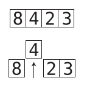

In subsequent passthroughs, we remove the values at the subsequent indexes. 

2. We then begin a shifting phase, where we take each value to the left of the gap, and compare it to the value in the temporary variable:

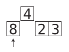

If the value to the left of the gap is greater than the temporary variable, we shift that value to the right:

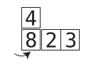

As we shift values to the right, inherently, the gap moves leftwards. As soon as we encounter a value that is lower that the temporarily removed value, or we reach the left end of the array, this shifting phase is over.

3. We then insert the temporarily removed value into the current gap:

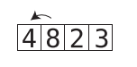

4. We repeat steps 1 to 3 until the array is fully sorted.

## Insertion Sort Implemented

Here is a Python implementation of this algorithm

```python
def insertion_sort(array):
  for index in range(1, len(array)):
    position = index
    temp_value = array[index]
    while position > 0 and array[position - 1] > temp_value:
      array[position] = array[position - 1]
      position = position - 1
    array[position] = temp_value
```

## Alternative Version

### Algorithm

1. Start with the second element in the array (index 1).
2. Temporarily remove that element from the array, creating a gap.
3. Compare the removed value to the elements on its left.
4. If an element on the left is greater than the removed value, shift it to the right.
5. Continue the shifting phase, by moving until a smaller value is encountered or the left end of the array is reached.
6. Insert the removed value into the current gap.
7. Move to the next element in the array and repeat steps 2 to 6 until you reach the end of the array.
8. The sorted portion of the array gradually grows from left to right with each pass-through, until the array is fully sorted.

### Implementation

```js
function insertionSort(array) {
  const len = array.length;

  for (let i = 1; i < len; i++) {
    let current = array[i];
    let j = i - 1;

    while (j >= 0 && array[j] > current) {
      array[j + 1] = array[j];
      j--;
    }

    array[j + 1] = current;
  }

  return array;
}
```

## The Efficiency of Insertion Sort

There are four types of steps that occur in Insertion Sort: Removals, comparisons, shifts, and insertions. 

A comparison takes place each time we compare a value to the left of the gap with the temp_value. We can, therefore, formulate the total number of comparisons as:

$$ 1 + 2 + 3 + … + N - 1 $$

It emerges that for an array containing N elements, there are approximately _N<sup>2</sup> / 2_ comparisons. 

Shifts occur each time we move a value one cell to the right. When an array is sorted in reverse order, there will be as many shifts as there are comparisons since every comparison will force us to shift a value to the right.

Removing and inserting the temp_value from the array happen once per passthrough. Since there are always _N - 1_ passthroughs, we can conclude that there are _N - 1_ removals and _N - 1_ insertions.

Combined, we've got _N<sup>2</sup> + 2N - 2_ steps

We've already learned that Big O ignores constants. With this rule in mind, we'd simplify this to _O (N<sup>2</sup> + N)_. However, there is another major rule of Big O that we'll reveal now:

_Big O notation only takes into account the highest order of N_. That is, if we have some algorithm that takes N<sup>4</sup> + N<sup>3</sup> + N<sup>2</sup> + N steps, we only consider N<sup>4</sup> to be significant - and just call it _O (N<sup>4</sup>)_.

In this case, _O (N<sup>2</sup> + N)_ simply becomes _O (N<sup>2</sup>)_. It emerges that in a worst case scenario, Insertion Sort has the same time complexity as Bubble Sort and Selection Sort. They’re all _O (N<sup>2</sup>)_.

We noted in the previous chapter that although Bubble Sort and Selection Sort are both _O (N<sup>2</sup>)_., Selection Sort is faster since Selection Sort has N<sup>2</sup> / 2 steps compared with Bubble Sort’s N<sup>2</sup> steps. At first glance, then, we’d say that Insertion Sort is as slow as Bubble Sort, since it too has N<sup>2</sup> steps. (It’s really N<sup>2</sup> + 2N - 2 steps.)

## The Average Case

In a worst case scenario, Selection Sort is faster than Insertion Sort. However, it's critical that we also take into account the average case scenario. Why?

By definition, the cases that occur most frequently are average scenarios. The worst and vest case scenarios happen only rarely. Let's look at this simple bell curve:

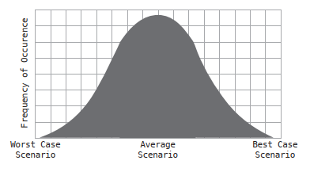

Best and worst cases scenarios happen relatively infrequently. In the real world, however, average scenarios are what occur most of the time.

The performance of Insertion Sort varies _greatly_ based on the scenario: While in the worst case scenario, we compare and shift all the data, and in the best case scenario, we shift none of the data (and just make one comparison per passthrough), for the average scenario - we can say that in the aggregate, we probably compare and shift about _half_ of the data.

So if Insertion Sort takes N<sup>2</sup> steps for the worst case scenario, we’d say that it takes about N<sup>2</sup> / 2 steps for the average scenario. (In terms of Big O, however, both scenarios are  _O (N<sup>2</sup>)_):


If we compare this with Selection Sort, we will find out that Selection Sort takes  _N<sup>2</sup>/ in all cases, because it does not have any mechanism to for ending a passthrough early at any point.

So, which is better, Selection Sort or Insertion Sort? It depends. In an average case -when the array is randomly sorted - they perform similarly. If you have reason to assume that you'll be dealing with data that is _mostly_ sorted, Insertion Sort will be a better choice. If you have reason to assume that you'll be dealing with data that is mostly sorted in reverse order, Selection Sort will be faster. If you have no idea what the data will be like, that's essentially an average case, and both will be equal.

## A Practical Case

When we have to perform a nested iteration ( _O (N<sup>2</sup>)_ by definition), for example, to create an array from common elements from two arrays, if we include a mechanism to avoid having to iterate through the rest of the elements of one of the arrays the moment one common element is found, we can improve the speed on average cases (when some elements are common and others are not). This can be achieved by having a `break` type condition within the inner loop:

```js
function intersection(first_array, second_array){
  let result = [];
  for (let i = 0; i < first_array.length; i += 1) {
    for (let j = 0; j < second_array.length; j += 1) {
      if (first_array[i] === second_array[j]) {
        result.push(first_array[i]);
        break; // this is the trick
      }
    }
  }
  return result;
}
```

## Wrapping Up

Having the ability to discern between best, average and worst case scenarios is a key skill in choosing the best algorithm for your needs, as well as taking existing algorithms and optimizing them further to make them significantly faster. Remember, while it's good to be prepared for the worst case, average cases are what happen most of the time.

# Chapter 07: Blazing Fast Lookup With Hash Tables

## Enter the Hash Table

Most programming languages include a data structure called a hash table, and it has an amazing superpower: Fast reading. Hash tables are
called by different names in various programming languages. Other names include hashes, maps, hash maps, dictionaries, and associative arrays. Reading from a hash table has an efficiency of _O (1)_, as it takes just one step.

## Hashing with Hashing Functions

_Hashing_ means the translation of certain data into other data, and the code that is used to translate that data is called a _hashing function_. An example of hashing would be the mapping of some letters into numbers using a cipher, for instance:

If 

| Letter | Value |
| --- | --- |
| A | 1 |
| B | 2 |
| C | 3 |
| D | 4 |
| E | 5 |

ACE converts to 135, CAB converts to 312, DAB converts to 412, and BAD converts to 214.

There are many other models of hash functions besides this one. Another example of a hash function would be taking each letter's corresponding number and return the sum of all the numbers, or its product; that way, BAD would become 7 (2 + 1 + 4), or 8 (2 * 1 * 4).

Of course, real-world hash functions are much more complex than this.

The truth is that a hash function needs to meet only one criterion to be valid: A hash function must convert the same data input to the same output each time it's applied. If the hash function returns inconsistent values, it is not valid. Examples of invalid hash functions include functions that use random numbers or the current time as part of its calculation.

## How Hash Tables Work

Under the hood, a hash table stores its data in a bunch of cells in a row, similar to an array. Each cell has a corresponding value associated with it. 


To store data in a hash like this

```ruby
hash['BAD'] => 'evil'
```

the computer first applies the hash function to the key (`'BAD'`), for example using the multiplication hash function (2 * 1 * 4 = 8). Since the key (`'BAD'`) hashes to 8, the computer places the value (`'evil'`) into the cell 8:


To look up or read a value from a hash, the computer executes two simple steps:

1. The computer hashes (process the data via the hash function) the key we are looking up (BAD = 2 * 1 * 4 = 8).
2. Since the result is 8, the computer looks inside cell 8 and returns the value that is stored there. In this case, that would be the string `'evil'`.

That's why looking up a value in a hash table is typically _O (1)_: it's a process that takes a constant amount of steps. 

In an unordered array, this would take _O (N)_ steps; in a sorted array, looking up a value would take up to _O (log N)_, but in a hash table, looking up a value is much faster.

## Dealing with Collisions

What happens when two pieces of data hashes to the same output, like in the case of BAD (2 * 1 * 4 = 8) and DAB (4 * 1 * 2 = 8)?

Trying to add data to a cell that is already filled is known as a _collision_. There are various ways around it. 

One classic approach for handling collision is known as _separate chaining_. When a collision occurs, instead of placing _a single value_ in the cell, it places in it a reference to an array. In the case of a thesaurus (a dictionary of synonyms), for example, this array would contain subarrays, each one containing the word itself, and the synonyms. 

In our example, the computer wants to add PAT (synonym of DAB), to the cell 8 in the thesaurus (remember that DAB also hashed to 8), but it already contains the string `'evil'`. So it replaces the contents of cell 8 with an array:

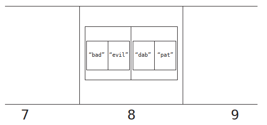

To look up a value in this sceneario, the computer takes the following steps:

1. It hashes the key (DAB => 4 * 1 * 2 = 8).
2. It looks up cell 8. The computer takes note that cell 8 contains an array of arrays rather than a single value.
3. It searches through the array linearly, looking at index 0 of each subarray until it finds the word we're looking up (`'pat'`). It then returns the value at index 1 of the correct subarray.

In a scenario where the computer hits upon a cell that references an array, its search can take some extra steps, as it needs to conduct a linear search within an array of multiple values. If somehow all of our data ended up within a single cell of our hash table, our hash table would be no better than an array. So it actually turns out that the worst case performance for a hash table lookup is _O (N)_.

Because of this, it is critical that a hash table be designed in a way that it will have few collisions.

## The Great Balancing Act

How hash tables are implemented in the real world to avoid frequent collisions?

Ultimately, a hash table efficiency depends on three factors:

1. How much data we're storing in the hash table.
2. How many cells are available in the hash table.
3. Which hash function we're using.

It makes sense why the first two factors are important. If you have a lot of data to store in only a few cells, there will be many collisions and the hash table will lose its efficiency. Let’s explore, however, why the hash function itself is important for efficiency.

Imagine that our hash function always produces a value that, for whatever reason, falls in the range between 1 and 9, both inclusive, and that our hash table has 16 cells. With this hash function, the computer will never even use cells 10 through 16.

_A good hash function, therefore, is one that distributes its data across all available cells_

If we need a hash table to store just 5 values, how big should our hash table be, and what type of hash function should we use?
If a hash table had only 5 cells, we’d need a hash function that converts keys into numbers 1 through 5. Even if we only planned on storing 5 pieces of data, there’s a good chance that there will be a collision or two, since two keys may be easily hashed to the same value.

However, if our hash table were to have 100 cells, and our hash function converts strings into numbers 1 through 100, when storing just 5 values it would be much less likely to have any collisions since there are 100 possible cells that each of those strings might end up in. Although a hash table with 100 cells is great for avoiding collisions, we’d be using up 100 cells to store just 5 pieces of data, and that’s a poor use of memory.

And this is the balancing act that a hash table must perform. A good hash table _strikes a balance of avoiding collisions while not consuming lots of memory_

To accomplish this, computer scientists have developed the following rule of thumb: for every 7 data elements stored in a hash table, it should have 10 cells.

This ratio of data to cells is called the _load factor_. Using this terminology, we'd say that the ideal load factor is 0.7 (7 elements/10 cells).

Luckily, most of the internals of a hash table are managed by the computer language you're using. It decided how big the hash table needs to be, what hash function to use, and when it's time to expand the hash table. But now that you understand how hashes work, you can use them to replace arrays in many cases to optimize your code performance and take advantage of superior lookups that have an efficiency of _O (1)_.

...

Hash tables are indispensable when it comes to building efficient software. With their _O (1)_ reads and insertions, it's a difficult data structure to beat. But some data structures provide advantages other than speed...

# Chapter 08: Crafting Elegant Code with Stacks and Queues

Stacks and queues are not entirely new: they are simply arrays with restrictions.

Stacks and queues are elegant tools for handling temporary data; from operating system architecture to printing jobs, they are ideal as temporary containers.

Stacks and queues allow you to handle data in order, and then get rid of it once you don't need it anymore.

## Stacks

Stacks store data as arrays do - it's simply a list of elements. They have three constraints, however:

1. Data can only be inserted at the end of a stack.
2. Data can only be read from the end of a stack.
3. Data can only be removed from the end of a stack

Most computer science literature refers to the end of the stack as its top, and the beginning of the stack as its bottom. Inserting a new value into a stack is also called _pushing_ onto the stack; removing elements from the top of the stack is called _popping_ from the stack.

A common acronym used to describe stack operations is LIFO: Last In, First Out.

```ruby
stack = []

stack.push(1)
stack.push(2)
stack.push(3)

stack # => [1, 2, 3]

stack.pop

stack # => [1, 2]
```

## Stacks in Action

Although a stack is not typically used to store data on a long term basis, it can be a great tool to handle temporary data as part of various algorithms.

Here is an algorithm to check if a string has the correct number of matching parentheses and other bracing symbols:

We’d prepare an empty stack, and then we read each character from left to right, following these rules:

1. If we find any character that isn’t a type of brace (parenthesis, square bracket, or curly brace), we ignore it and move on.

2. If we find an opening brace, we push it onto the stack. Having it on the stack means we’re waiting to close that particular brace.

3. If we find a closing brace, we inspect the top element in the stack. We then analyze:
    - If there are no elements in the stack, that means we’ve found a closing brace without a corresponding opening brace beforehand. This is Syntax Error Type #2.
    - If there is data in the stack, but the closing brace is not a corresponding match for the top element of the stack, that means we’ve encountered Syntax Error Type #3.
    - If the closing character is a corresponding match for the element at the top of the stack, that means we’ve successfully closed that opening brace. We pop the top element from the stack, since we no longer need to keep track of it.
    
4. If we make it to the end of the line and there’s still something left on the stack, that means there’s an opening brace without a corresponding closing brace, which is Syntax Error Type #1.

Stacks are ideal for processing any data that should be handled in reverse order to how it was received (LIFO). For example, the 'undo' function in a word processor or function calls in a networked application.

## Queues

Like stacks, queues are arrays with three restrictions:

1. Data can only be inserted at the end of the queue.
2. Data can only be read from the front of the queue.
3. Data can obly be removed from the front of the queue.

## Queues in Action

Queues are very comon in many applications, ranging from printing jobs to background workers in web applications.

Queues are also the perfect tool for handling asyncronous requests - they ensure that the requests are processed in the same order they were received. They are also commonly used to model real-world scenarios where events need to occur in a certain order, such as airplanes waiting for takeoff and patients waiting for their doctors.

# Chapter 09: Recursively Recurse with Recursion

Recursion is official name for when a function calls itself. While infinite function calls are generally useless - and even dangerous - recursion is a powerful tool that can be harnessed. And when we harness the power of recursion, we can solve particularly tricky problems.

## Recurse instead of Loop

We can use recursion instead of looping through an array;

```js
function countdown(number) {
  console.log(number);
  countdown(number - 1)
}
```

In almost any case in which you can use a loop, you can also use recursion. Now, just because you can use recursion does not mean that you should use it. Recursion is a tool that allows for writing elegant code. In that example and in other simple iterations, the recursive approach is not better than a classic `for` loop. However, there are cases in which recursion really shines.

## The Base Case

We need a clause that will stop the recursion to go infinitely: the case in which the function will not recurse is known as the _base case_:

```js
function countdown(number) {
  console.log(number);
  if(number === 0) { // Base Case
    return;
  } else {
    countdown(number - 1);
  }
}
```

## Reading Recursive Code

It takes time and practice to get used to recursion, and you will ultimately learn two sets of skills: Reading recursive code, and writing recursive code. Reading recursive code is somewhat easier.

This is the process you need to know for reading recursive code:

1. Identify what the base case is.
2. Walk through the function assuming it’s dealing with the base case.
3. Then, walk through the function assuming it’s dealing with the case immediately before the base case.
4. Progress through your analysis by moving up the cases one at a time.

This is a recursive function that returns a number's factorial:

```ruby
def factorial(number)
  if number == 1 # Base case
    return 1 
  else
    return number * factorial(number - 1)
  end
end
```

1!                 = 1 <-- Base case
2! = 2 * 1         = 2
3! = 3 * 2 * 1     = 6
4! = 4 * 3 * 2 * 1 = 24

Becomes

factorial(4) = 4 * factorial(3)  A
factorial(3) = 3 * factorial(2)  |
factorial(2) = 2 * factorial(1)  |
factorial(1) = 1                 | <-- Base case

## Recursion in the Eyes of the Computer

The computer calls `factorial(4)`, and, before the method is complete, it calls `factorial(3)`; then, before `factorial(3)` is complete, it calls `factorial(2)`, and then, before it completes `factorial(2)`, it calls `factorial(1)`. Technically, while the computer runs `factorial(1)`, it’s still in the middle of `factorial(2)`, which in turn is running within `factorial(3)`.

The computer uses a stack to keep track of which functions it's in the middle of calling. This stack is called the _call stack_.

The computer begins by calling factorial(4). Before the method completes executing, however, factorial(3) gets called. In order to track that the computer is still in the middle of factorial(4), the computer pushes that info onto a call stack, and does the same until it reaches the base case, resulting in a call stack that looks like this:
```
[factorial(1)] <--- Base case
[factorial(2)]
[factorial(3)]
[factorial(4)]
```

When the computer reaches this case, it can resolve it, returning the value of `1`, to then popping the last function in the call stack:

```
                  ------> [factorial(1)]
[factorial(2)]
[factorial(3)]
[factorial(4)]
```

Even after the computer completes `factorial(1)`, it knows that it’s not finished with everything it needs to do since there’s data in the call stack, which indicates that it’s still in the middle of running other methods that it needs to complete. So, once factorial(1) has been popped out and it has returned the `1`, the next function in the stack can be resolved as well, returning the factorial of 2 (2 * 1; the 1 that got from the 1 returning from `factorial(2 - 1)`). Then, the function is popped as the last one:

```
                  ------> [factorial(2)]
[factorial(3)]
[factorial(4)]
```

And this process continues:

```
                  ------> [factorial(3)]
[factorial(4)]
```

```
                  ------> [factorial(4)]
```

At this point the stack is empty, so the computer knows it's done executing all of the methods, and the recursion is complete.

Looking back at the example, we can see that the order in which the computer calculates the factorial of 4 is as follows:

1. `factorial(4)` is called first.
2. `factorial(3)` is called second.
3. `factorial(2)` is called third.
4. `factorial(1)` is called fourth.
5. `factorial(1)` is _resolved_ first.
6. `factorial(2)` is resolved based on the result from `factorial(1)`
7. `factorial(3)` is resolved based on the result from `factorial(2)`
8. `factorial(4)` is resolved based on the result from `factorial(3)`

Interestingly, in the case of infinite recursion (such as the very first example in our chapter), the program keeps on pushing the same method over and over again onto the call stack, until there’s no more room in the computer’s memory - and this causes an error known as _stack overflow_.

## Recursion in Action

Recursion is a natural fit in any situation where you find yourself having to repeat an algorithm within the same algorithm. In these cases, recursion can make for more readable code.

Imagine the example of having to traverse through a filesystem; you don't want the script to only deal with the files inside the one directory, but act on all the files within the _subdirectories_ of the directory, and the subdirectories of the subdirectories, etc.

This is a recursive method that can go arbitrarily deep into a directory to get all files' names:

```ruby
def find_directories(directory)
  Dir.foreach(directory) do |filename|
    if File.directory?("#{directory}/#{filename}") && filename != "." && filename != ".."
      puts "#{directory}/#{filename}"
      find_directories("#{directory}/#{filename}")
    end
  end
end
```

This diagram illustrates this algorithm, and specifies the order in which the script traverses the subdirectories:


Recursion is often a great choice for an algorithm in which the algorithm itself does not know on the outset how many levels deep into something it needs to dig.

# Chapter 10: Recursive Algorithms For Speed

In previous chapters we’ve encountered a number of sorting algorithms, including Bubble Sort, Selection Sort, and Insertion Sort. In real life, however, none of these methods are actually used to sort arrays. Most computer languages have built-in sorting functions for arrays that save us the time and effort from implementing our own. And in many of these languages, the sorting algorithm that is employed under the hood is _Quicksort_.

Quicksort is a recursive algorithm; by studying it, we can learn how recursion can greatly speed up an algorithm.

Quicksort is an extremely fast sorting algorithm that is particularly efficient for average scenarios. In worst case scenarios (that is, inversely sorted arrays) it performs similarly to Insertion Sort and Selection Sort, but it is much faster for average scenarios, which are what occur most of the time.

Quicksort relies on a concept called _partitioning_.

## Partitioning

To partition an array is to take an arbitrary value from the array, which is then called the _pivot_, and make sure that every number that is less than the pivot ends up to the left of the pivot, and that every number that is greater than the pivot will be to the right of the pivot.

For example, if we have the following array:

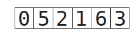

For consistency's sake, we will always select the rightmost value to be our pivot:


We then assign pointers, one to the leftmost value of the array, and one to the rightmost value of the array, excluding the pivot itself:


We are now ready to begin the actual partition, which follows these steps:

1. The left pointer continuously moves one cell to the right until it reaches a value that is greater than or equal to the pivot, and then stops.
2. Then, the right pointer continuously moves one cell to the left until it reaches a value that is less than or equal to the pivot, and then stops.
3. We swap the values that the left and right pointers are pointing to. 
4. We continue this process until the pointers are pointing to the very same value or the left pointer has moved to the right of the right pointer.
5. Finally, we swap the pivot with the value that the left pointer is currently
pointing to.

When we are done with a partition, we are now assured that all values to the left of the pivot are less than the pivot, and all values to the right of the pivot are greater than it. And that means that the pivot itself is now in its correct place within the array, although other values are not yet necessarily completely sorted.

Below, we've implemented a `SortableArray` class in Ruby that includes a `partition!` method that partitions the array as we've described:

```ruby
class SortableArray

  attr_reader :array

  def initialize(array)
    @array = array
  end

  def partition!(left_pointer, right_pointer)

    # We always choose the rightmost element as the pivot
    pivot_position = right_pointer
    pivot = @array[pivot_position]

    # We start the right pointer immediately to the left of the pivot
    right_pointer -= 1
    while true do
      while @array[left_pointer] < pivot do
        left_pointer += 1
      end

      while @array[right_pointer] > pivot do
        right_pointer -= 1
      end

      if left_pointer >= right_pointer
        break
      else
        swap(left_pointer, right_pointer)
      end
    end
    # As a final step, we swap the left pointer with the pivot itself
    swap(left_pointer, pivot_position)
    # We return the left_pointer for the sake of the quicksort method
    # which will appear later in this chapter
    return left_pointer
  end

  def swap(pointer_1, pointer_2)
    temp_value = @array[pointer_1]
    @array[pointer_1] = @array[pointer_2]
    @array[pointer_2] = temp_value
  end
end
```

Note that the `partition!` method accepts the starting points of the left and right pointers as parameters, and returns the end position of the left pointer once it's complete. 

### Alternative Version

#### Algorithm

1.	Choose the pivot element (it's best to use the middle element)**.
2.	In the second step, assign `left` and `right` pointers to the leftmost and rightmost indices of the remaining elements in the array, respectively.
3.	Increment the `left` pointer continuously, one cell at a time, until it reaches a value that is greater than or equal to the pivot or until it becomes greater than `right`.
4.	Decrement the `right` pointer continuously, one cell at a time, until it reaches a value that is less than the pivot, or until it becomes smaller than `left`.
5.	Once you're done incrementing and decrementing the pointers, evaluate whether the `left` pointer has gone beyond the `right` pointer.
    - If this is the case, move on to step 6.
    - If this is not the case, swap the values that the `left` and `right` pointers are pointing to, move both pointers toward each other, and repeat steps 3 and 4.
6.	Swap the value at the pivot index with the value the `right` pointer is pointing to. This places the pivot at its correct position in the array.

** A crucial factor that significantly impacts the algorithm's performance is the selection of the pivot element. If the input array is already sorted or nearly sorted, using the first element as the pivot can lead to inefficient partitioning and a time complexity of O(n^2). This degradation in performance is undesirable and undermines the primary objective of Quicksort. Opting for the middle element significantly improves the algorithm's overall performance. By selecting a pivot closer to the median value, the likelihood of encountering already sorted or nearly sorted input arrays decreases. This choice reduces the risk of worst-case scenarios and enables Quicksort to exhibit superior efficiency. When the middle element is selected as the pivot, the partition function starts with the left pointer at the first element and the right pointer at the last element. Notably, the pivot is already in its correct sorted position, eliminating the need for extra swaps. When the middle element is the pivot, the recursive calls in the quickSort function include the pivot element. By doing so, the algorithm avoids worst-case scenarios and generally achieves better performance.

#### Implementation

```js
function partition(arr, low, high) {
  const pivotIndex = Math.floor((low + high) / 2); // note the pivot is the middle!
  const pivot = arr[pivotIndex];
  let left = low;
  let right = high;

  while (left <= right) {
    while (arr[left] < pivot) {
      left++;
    }

    while (arr[right] > pivot) {
      right--;
    }

    if (left > right) {
      break;
    }

    // Swap values at left and right pointers
    [arr[left], arr[right]] = [arr[right], arr[left]];

    left++;
    right--;
  }

  // Return the pivot index
  return left;
}
```

## Quicksort

This algorithm relies heavily on partitions. It works as follows:

1. Partition the array: The pivot is now in its proper place.
2. Treat the subarrays to the left and right of the pivot as their own arrays, and recursively repeats steps #1 and #2. That means that we'll partition each subarray, and end up with even smaller subarrays to the left and right of each subarray's pivot. We then partition those subarrays, and so on and so forth.
3. When we have a subarray that has 0 or 1 elements, that is our base case, and we do nothing.

Below is a `quicksort!` method that we can add to the above `SortableArray` class that would successfully complete Quicksort:

```ruby
def quicksort!(left_index, right_index)
  #base case: the subarray has 0 or 1 elements
  if right_index - left_index <= 0
    return
  end
  # Partition the array and grab the position of the pivot
  pivot_position = partition!(left_index, right_index)
  # Recursively call this quicksort method on whatever is to the left
  # of the pivot:
  quicksort!(left_index, pivot_position - 1)
  # Recursively call this quicksort method on whatever is to the right
  # of the pivot:
  quicksort!(pivot_position + 1, right_index)
end
```

### Alternative Version

#### Algorithm

1.	Partition the array based on a chosen pivot element. Select a pivot element from the array and rearrange the elements so that all elements smaller than the pivot are placed to its left, and all elements greater than the pivot are placed to its right.
2.	Treat the subarrays to the left and right of the pivot as their own arrays and recursively repeat the first step. Partition each smaller subarray by selecting a new pivot and applying the partitioning process again.
3.	Continue recursively partitioning the subarrays until you reach subarrays that have zero or one element. These smaller subarrays serve as the base case, as an empty array or an array with one element is already sorted.

#### Implementation

```js
function quickSort(arr, low = 0, high = arr.length - 1) {
  const pivotIndex = partition(arr, low, high);
  if (low < pivotIndex - 1) {
    quickSort(arr, low, pivotIndex - 1);
  }
  if (pivotIndex < high) {
    quickSort(arr, pivotIndex, high);
  }
}
```

## The Efficiency of Quicksort

Let's first determine the efficiency of a partition. A partition consists of two types of steps:

1. Comparisons: We compare each value to the pivot.
2. Swaps: When appropriate, we swap the values being pointed to by the left and right pointers.

Each partition has at least N comparisons, that is we compare each element of the array with the pivot. 

The number of swaps depends on how the data happens to be sorted. Each partition has at least one swap, and the most swaps that a partition can have would be N / 2:


Now, for randomly sorted, data, there would be roughly _half_ of N / 2 swaps, or N / 4 swaps: in total, 1.25N steps. As we ignore constants in Big O Notation, we can say that a partition runs in _O(N)_ time.

But that's for a single partition; Quicksort involves many partitions. The following diagram depicts a typical Quicksort on an array of 8 elements, and on how many elements each partition acts upon (the active subarray is the group of cells that are not grayed out):


We keep on breaking down each subarray into halves until we reach subarrays with elements of 1, so, for an array of N, we can break it down log N times.

For N elements, there are about N * log N steps; this means an efficiency of _O(N log N)_.

## Worst Case Scenario

The worst case scenario for Quicksort is one in which the pivot always ends
up on one side of the subarray instead of the middle. This can happen in
several cases, including where the array is in perfect ascending or descending
order:

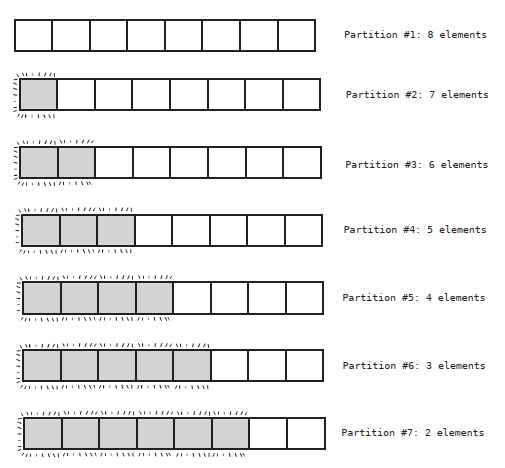

For N elements, there are N + (N - 1) + (N - 2) + (n - 3) ... + 2 steps, which comes out to be about N<sup>2</sup> / 2 steps.

Let's compare Quicksort to Insertion sort:

|  | Best Case | Average Case | Worst case |
| --- | --- | --- | --- |
| Insertion Sort | O(N) | O(N<sup>2</sup>) | O(N<sup>2</sup>) |
| Quicksort | O(N log N) | O(N log N) | O(N<sup>2</sup>) |

The reason why Quicksort is so much superior than Insertion Sort is because of the average scenario -which, again, is what happens most of the time. For average cases, Quicksort is much faster.

The following graph depicts various efficiencies side by side.


## Quickselect

Let’s say that you have an array in random order, and you don’t need to sort it, but you do want to know the tenth-lowest value in the array, or the fifth highest. This can be useful if we had a bunch of test grades and wanted to know what the 25th percentile was, or if we wanted to find the median grade.

The obvious way to solve this would be to sort the entire array, and then jump to the appropriate cell. Even were we to use a fast sorting algorithm like Quicksort, this algorithm takes at least O(N log N) for average cases, and while that isn’t bad, we can do even better with a brilliant little algorithm known as Quickselect. Quickselect relies on partitioning just like Quicksort, and can be thought of as a hybrid of Quicksort and binary search.

Let’s say that we have an array of eight values, and we want to find the second-to-lowest value within the array.

First, we partition the entire array:


After the partition, the pivot will hopefully end up somewhere towards the middle of the array:

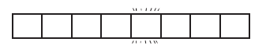

This pivot is now in its correct spot, and since it’s in the fifth cell, we now know which value is the fifth-lowest value within the array. Now, we’re looking for the second lowest value. But we also now know that the second-lowest value is somewhere to the left of the pivot. We can now ignore everything to the right of the pivot, and focus on the left subarray. It is in this respect that Quickselect is similar to binary search. 

Next, we partition the subarray to the left of the pivot:


Let’s say that the new pivot of this subarray ends up the third cell:


We now know that the value in the third cell is in its correct spot - meaning that it’s the third-to-lowest value in the array. By definition, then, the second-to-lowest value will be somewhere to its left. We can now partition the subarray to the left of the third cell:


After this next partition, the lowest and second lowest values will end up in
their correct spots within the array:


With Quickselect for every time we cut the array in half, we only need to partition the one half that we care about - the half in which we know our value is to be found. 
For N elements, we’d have N + (N/2) + (N/4) + (N/8) + …. 2 steps. This always turns out to be roughly 2N steps. Since Big O ignores constants, we’d say that Quickselect has an efficiency of O(N).

This is an implementation of this algorithm that we can add to the `SortableArray` class:

```ruby 
def quickselect!(kth_lowest_value, left_index, right_index)
  # If we reach a base case - that is, that the subarray has one cell,
  # we know we've found the value we're looking for
  if right_index - left_index <= 0
    return @array[left_index]
  end
  # Partition the array and grab the position of the pivot
  pivot_position = partition!(left_index, right_index)

  if kth_lowest_value < pivot_position
    quickselect!(kth_lowest_value, left_index, pivot_position - 1)
  elsif kth_lowest_value > pivot_position
    quickselect!(kth_lowest_value, pivot_position + 1, right_index)
  else # kth_lowest_value == pivot_position
    # if after the partition, the pivot position is in the same spot
    # as the kth lowest value, we've found the value we're looking for
    return @array[pivot_position]
  end
end
```

The first argument of the` quickselect!` method accepts the position that you’re looking for, starting at index 0. We’ve put in a 1 to represent the second-to-lowest value.

# Chapter 11: Node-based Data Structures

In this chapter we introduce the concept of _node_. Node-based data structures offer new ways to organize and access data that provide a number of major performance advantages.

We will explore the linked list, which is the simplest node-based data structure and the foundation of future chapters. Linked list are almost identical to arrays, but they come with their own set of trade offs in efficiency that can give us a performance boost for certain situations.

## Overview and use cases

Linked Lists are preferable to Arrays when:
- You need insertions/deletions in the list to be extremely fast,
- You don’t need random, unordered access to the data,
- You insert or delete items in the middle of a list,
- You can’t evaluate the exact size of the list (it needs to grow or shrink throughout the execution).

Arrays are preferable over Linked Lists when:
- You frequently need random, unordered access to the data,
- You need extreme performance to access the items,
- The number of items doesn’t change during execution, so you can easily allocate contiguous space of computer memory.

## Linked lists

A linked list is a data structure that represents a list of items, just like an array. Their implementation under the hood, however, is different, and they have different performance in some situations. 

When we create an array, the computer finds a contiguous group of memory addresses or cells and designates them to store data for your application:


Linked lists do not consist of a bunch of memory cells in a row. Instead, it's a bunch of memory cells that are _not_ next to each other, but can be spread across many cells across the computer's memory. These cells that are not adjacent to each other are known as _nodes_.

In addition to the data stored within the node, _each node also stores the memory address of the next node in the linked list_. This extra piece of data -the pointer to the next node's memory address - is known as _link_:

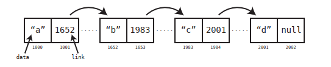

One advantage of a linked list over an array is that the program doesn't need to find a bunch of empty cells in a row to store its data. Instead, the program can store the data across many cells that are not necessarily adjacent to each other.

## Implementing a Linked List

We will create a `Node` class first:

```ruby
class Node
  attr_accessor :data, :next_node

  def initialize(data)
    @data = data
  end
end
```

A `Node` object will have two attributes: `data` contains the value that the node is meant to hold, while `next_node` contains the link to the next node in the list.

```ruby
class LinkedList
  attr_accessor :first_node

  def initialize(first_node)
    @first_node = first_node
  end
end
```

This `LinkedList` class acts as a handle on the linked list by pointing to its first node.

We will now measure its performance against a typical array by analyzing the four classic operations: reading, searching, insertion, and deletion.

## Reading 

We noted above that when reading a value from an array, the computer can jump to the appropriate cell in a single step, which is _O(1)_. This is not the case with a linked list.

To read the data in a specific from a linked list, we need to pass through, via their links, each node until we reach the node we are looking for. Since Big O notation is expressed by the worst case scenario, this means that reading from a linked list has an efficiency of _O(N)_. This is slower than an array.

This is the implementation of a reading operation in our `LinkedList` class:

```ruby
class LinkedList
  attr_accessor :first_node
  def initialize(first_node)
    @first_node = first_node
  end
  def read(index)
    # We begin at the first node of the list:
    current_node = first_node
    current_index = 0
    while current_index < index do
      # We keep following the links of each node until we get to the
      # index we're looking for:
      current_node = current_node.next_node
      current_index += 1
      # If we're past the end of the list, that means the
      # value cannot be found in the list, so return nil:
      return nil unless current_node
    end
    return current_node.data
  end
end
```

## Searching

Arrays and linked lists have the same efficiency for search. With both, the program needs to start at the
first cell and look through each and every cell until it finds the value it’s searching for. For this operation, both have an efficiency of _O(N)_.

This is the implementation of a searching operation:

```ruby
class LinkedList
  attr_accessor :first_node
  # rest of code omitted here...

  def index_of(value)
    # We begin at the first node of the list:
    current_node = first_node
    current_index = 0
    begin
      # If we find the data we're looking for, we return it:
      if current_node.data == value
        return current_index
      end
      # Otherwise, we move on the next node:
      current_node = current_node.next_node
      current_index += 1
    end while current_node
    # If we get through the entire list, without finding the
    # data, we return nil:
    return nil
  end
end
```

## Insertion

Insertion is one operation in which linked lists can have a distinct advantage over arrays in certain situations. Recall that the worst case scenario for insertion into an array is when the program inserts data into index 0, because it then has to shift the rest of the data one cell to the right, which ends up
yielding an efficiency of _O(N)_. With linked lists, however, insertion _at the beginning_ of the list takes just one step - which is _O(1)_.

We just need to create a new node and have it linked to the first node, now second.

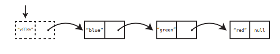

In contrast with the array, therefore, a linked list provides the flexibility of inserting data to the front of the list without requiring the shifting of any other data.

The truth is that, theoretically, inserting data anywhere within a linked list takes just one step, however, in practice, the computer first needs to find the node at the appropriate index so it can modify its link to point to the newly created node:


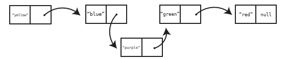

Therefore, inserting at the middle of a linked list takes _O(N)_, just as it does for an array. 

Our analysis shows that the best and worst case scenarios for arrays and linked lists are the opposite of one another. That is, inserting at the beginning is great for linked lists, but terrible for arrays. And inserting at the end is an array’s best case scenario, but the worst case when it comes to a linked list. 

| Scenario | Array | Linked List |
| --- | --- | --- |
| Insert at the beginning | Worst Case | Best Case |
| Insert at middle | Average Case | Average Case | 
| Insert at end | Best Case | Worst Case | 

This is how we can implement the insertion operation:

```ruby
class LinkedList
  attr_accessor :first_node
  # rest of code omitted here...

  def insert_at_index(index, value)
    current_node = first_node
    current_index = 0
    # First, we find the index immediately before where the
    # new node will go:
    while current_index < index do
      current_node = current_node.next_node
      current_index += 1
    end
    # We create the new node:
    new_node = Node.new(value)
    new_node.next_node = current_node.next_node
    # We modify the link of the previous node to point to
    # our new node:
    current_node.next_node = new_node
  end
end
```

## Deletion

Deletion is very similar to insertion in terms of efficiency. To delete a node from the beginning of a linked list, all we need to do is perform one step: We change the first_node of the linked list to now point to the second node.

Contrast this with an array in which deleting the first element means shifting all remaining data one cell to the left, an efficiency of O(N). 

When it comes to deleting the final node of a linked list, the actual deletion takes one step - we just take the second-to-last node and make its link `null`. However, it takes N steps to first get to the second-to-last node, since we need to start at the beginning of the list and follow the links until we reach it. The following table contrasts the various scenarios of deletion for both arrays and linked lists. Note how it’s identical to insertion:

| Scenario | Array | Linked List |
| --- | --- | --- |
| Delete at the beginning | Worst Case | Best Case |
| Delete at middle | Average Case | Average Case | 
| Delete at end | Best Case | Worst Case | 

To delete from the middle of the list, the computer must modify the link of the preceding node:

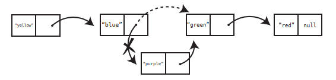

And this is how we implement the deletion operation:

```ruby
class LinkedList
  attr_accessor :first_node
  # rest of code omitted here...

  def delete_at_index(index)
    current_node = first_node
    current_index = 0
    # First, we find the node immediately before the one we
    # want to delete and call it current_node:
    while current_index < index - 1 do
      current_node = current_node.next_node
      current_index += 1
    end
    # We find the node that comes after the one we're deleting:
    node_after_deleted_node = current_node.next_node.next_node
    # We change the link of the current_node to point to the
    # node_after_deleted_node, leaving the node we want
    # to delete out of the list:
    current_node.next_node = node_after_deleted_node
  end
end
```

This is the comparison of linked lists and arrays:

| Operation | Array | Linked List |
| --- | --- | --- |
| Reading | O(1) | O(N), O(1) from the beginning |
| Searching | O(N) | O(N) |
| Insertion | O(N), O(1) at the end | O(N), O(1) at beginning |
| Deletion | O(N), O(1) at the end | O(N), O(1) at beginning |

Knowing this, why would we ever need a linked list?

## Linked Lists in Action

One case where linked lists shine are when we examine a single list and delete many elements from it. Let’s say, for example, that we were building an application that combs through lists of email addresses and removes any email address that has an invalid format. Our algorithm inspects each and every email address one at a time, and uses a regular expression (a specific pattern for identifying certain types of data) to determine whether the email address is invalid. If it’s invalid, we remove it from the list.

No matter whether the list is an array or a linked list, we need to comb through the entire list one element at a time to inspect each value, which would take N steps. However, let’s examine what happens when we actually delete email addresses. With an array, each time we delete an email address, we need another O(N) steps to shift the remaining data to the left to close the gap. All this shifting
will happen before we can even inspect the next email address. So besides the N steps of reading each email address, we need another N steps multiplied by invalid email addresses to account for deletion of invalid email addresses.

With a linked list, however, as we comb through the list, each deletion takes just one step, as we can simply change a node’s link to point the appropriate node and move on.

## Doubly Linked Lists

Another interesting application of a linked list is that it can be used as the underlying data structure behind a queue (lists of items in which data can only be inserted at the end, and removed from the beginning.)

Arrays will be superior when it comes to inserting data, since we’d be able to do so at an efficiency of O(1). Linked lists, on the other hand, would insert data at O(N). So when it comes to insertion, the array would make for a better choice than a linked list. 

When it comes to deleting data from a queue, though, linked lists would be faster, since it would be O(1) compared to arrays which delete data from the beginning at O(N). Based on this analysis, it would seem that it doesn’t matter whether we use an array or a linked list, as we’d end up with one major operation that is O(1) and another that is O(N).

However, if we use a special variant of a linked list called **the doubly linked list**, we’d be able to insert and delete data from a queue at O(1).

A doubly linked list is like a linked list, except that each node has two links - one that points to the next node, and one that points to the preceding node. In addition, the doubly linked list keeps track of both the first and last nodes:


This is the core of the implementation of a doubly linked list:

```ruby
class Node
  attr_accessor :data, :next_node, :previous_node
  def initialize(data)
    @data = data
  end
end

class DoublyLinkedList
  attr_accessor :first_node, :last_node
  def initialize(first_node=nil, last_node=nil)
    @first_node = first_node
    @last_node = last_node
  end
end
```

Since a doubly linked list always know where both its first and last nodes are, we can access each of them in a single step, or O(1).

Here’s the implementation of a new insert_at_end method available to doubly linked lists:

```ruby
class DoublyLinkedList
  attr_accessor :first_node, :last_node

  def initialize(first_node=nil, last_node=nil)
   @first_node = first_node
    @last_node = last_node
  end

  def insert_at_end(value)
    new_node = Node.new(value)
    # If there are no elements yet in the linked list:
    if !first_node
      @first_node = new_node
      @last_node = new_node
    else
      new_node.previous_node = @last_node
      @last_node.next_node = new_node
      @last_node = new_node
    end
  end
end
```

Because doubly linked lists have immediate access to both the front and end of the list, they can insert data on either side at O(1) as well as delete data on either side at O(1). And since doubly linked lists can insert data at the end in O(1) time and delete data from the front in O(1) time, **they make the perfect underlying data structure for a queue**.

This is the comparison of doubly linked lists and arrays:

| Operation | Array | Doubly Linked List |
| --- | --- | --- |
| Reading | O(1) | O(N), O(1) from the beginning |
| Searching | O(N) | O(N) |
| Insertion | O(N), O(1) at the end | O(N), O(1) at beginning AND the end |
| Deletion | O(N), O(1) at the end | O(N), O(1) at beginning AND the end |

Here’s a more complete example of a queue that is built upon a doubly linked list:

```ruby
class Node
  attr_accessor :data, :next_node, :previous_node
  def initialize(data)
    @data = data
  end
end

class DoublyLinkedList
  attr_accessor :first_node, :last_node
  def initialize(first_node=nil, last_node=nil)
    @first_node = first_node
    @last_node = last_node
  end

  def insert_at_end(value)
    new_node = Node.new(value)
    # If there are no elements yet in the linked list:
    if !first_node
      @first_node = new_node
      @last_node = new_node
    else
      new_node.previous_node = @last_node
      @last_node.next_node = new_node
      @last_node = new_node
    end
  end

  def remove_from_front
    removed_node = @first_node
    @first_node = @first_node.next_node
    return removed_node
  end
end

class Queue
  attr_accessor :queue
  def initialize
    @queue = DoublyLinkedList.new
  end

  def enque(value)
    @queue.insert_at_end(value)
  end

  def deque
    removed_node = @queue.remove_from_front
    return removed_node.data
  end
  
  def tail
    return @queue.last_node.data
  end
end
```

# Chapter 12: Speeding Up All the Things with Binary

Remember that with binary search, we can locate any value in O(log N) time if we have an ordered array.

However, in ordered arrays, insertions and deletions are slow: when a value is inserted in its correct place in the array, all the other values at its right have to move one step to the right in order to make space for the new value; and, when an item is deleted, all item at its right have to move one step to the left. This give us a O(N) time for insertion and deletions in ordered arrays, which is slow. 

Hash tables are O(1) for reading, insertion, and deletion, but they don't maintain order. 

What do we do if we need a data structure that maintains order, and also has fast search, insertion, and deletion?

The answer to that is the _binary tree_.

## Binary Trees

In a simple linked list, each node contains a link that connects this node to a single other node. A tree is also a node-based data structure, but within a tree, each node can have links to multiple nodes.

This is the visualization of a simple tree:


In this example, each node has links that lead to two other nodes. For the sake of simplicity, we can represent this tree visually without showing all the actual links:


Trees come with their own unique nomenclature:
- The uppermost node (in our example, the “j”) is called the _root_. 
- In our example, we’d say that the “j” is a _parent_ to “m” and “b”, which are in turn _children_ of “j”. The “m” is a parent of “q” and “z”, which are in turn children of “m”.
- Trees are said to have _levels_.

The above tree has three levels:


There are many kinds of tree-based data structures, but in this chapter we’ll be focusing on particular tree known as a binary tree. A binary tree is a tree that abides by the following rules:
- Each node has either zero, one, or two children.
- If a node has two children, it must have one child that has a lesser value than the parent, and one child that has a greater value than the parent.

Here’s an example of a binary tree, in which the values are numbers:


Note that each node has one child with a lesser value than itself which is depicted using a left arrow, and one child with a greater value than itself which is depicted using a right arrow.

While the following example is a tree, it is not a _binary tree_:


It is not a valid binary tree because both children of the parent node have values less than the parent itself.

The implementation of a tree node in Python might look something like this:

```python
class TreeNode:
  def __init__(self,val,left=None,right=None):
    self.value = val
    self.leftChild = left
    self.rightChild = right
```

We can build a simple tree like this:

```py
node = TreeNode(1)
node2 = TreeNode(10)
root = TreeNode(5, node, node2)
```


## Searching

We can search for any value within a binary tree very quickly, as we will see.

Again, this is an example of binary tree:


The algorithm for searching within a binary tree begins at the root node:
  1. Inspect the value at the node.
  2. If we’ve found the value we’re looking for, great!
  3. If the value we’re looking for is less than the current node, search for it in its left subtree.
  4. If the value we’re looking for is greater than the current node, search for
  it in its right subtree.

Here’s a simple, recursive implementation for this search in Python:

```py
def search(value, node):
  # Base case: If the node is nonexistent
  # or we've found the value we're looking for:
  if node is None or node.value == value:
    return node
  # If the value is less than the current node, perform
  # search on the left child:
  elif value < node.value:
    return search(value, node.leftChild)
  # If the value is less than the current node, perform
  # search on the right child:
  else: # value > node.value
    return search(value, node.rightChild)
```

More generally, we’d say that searching in a binary tree is O(log N). This is because each step we take eliminates half of the remaining possible values in which our value can be stored.

(This is only for perfectly balanced binary tree, which is the best case scenario.)

## Insertion

Where binary trees really shine over ordered arrays, though, is with insertion.

To insert a new value we have to:
1. First, find the correct node to attach the new value to (O(log N) speed).
2. Then, we attach the children.

This gives a O(log N) speed (Big O notation ignores the 1 constant of the insertion step.) This is much more efficient than inserting a new value in an ordered array: binary trees have O(log N) and O(log N) insertion. This becomes critical in an application where you anticipate a lot of changes to your data.

Here’s a Python implementation of inserting a value into a binary tree. Like the `search` function, it is recursive:

```py
def insert(value, node):
  if value < node.value:
    # If the left child does not exist, we want to insert
    # the value as the left child:
    if node.leftChild is None:
      node.leftChild = TreeNode(value)
    else:
      insert(value, node.leftChild)
  elif value > node.value:
    # If the right child does not exist, we want to insert
    # the value as the right child:
    if node.rightChild is None:
      node.rightChild = TreeNode(value)
    else:
      insert(value, node.rightChild)
```

It is important to note that only when creating a tree out of randomly sorted data do trees usually wind up well-balanced. However, if we insert sorted data into a tree, it can become imbalanced and less efficient.

For example, if we were to insert the following data in this order: 1, 2, 3, 4,
5, we’d end up with a tree that looks like this:


Searching for the 5 within this tree would take O(N). However, if we inserted the same data in the following order: 3, 2, 4, 1, 5, the tree would be evenly balanced:


Because of this, if you ever wanted to convert an ordered array into a binary tree, you’d better first randomize the order of the data. 

It emerges that in the worst case scenario, where a tree is completely imbalanced, search is O(N). In the best case scenario, where it is perfectly balanced, search is O(log N). 

In the typical scenario, in which data is inserted in random order, a tree will be pretty well-balanced and search will take about O(log N).

## Deletion 

Deletion is the least straightforward operation within a binary tree, and requires some careful maneuvering.

There are three possible cases:

- When the node to be deleted has no children: just find it and delete the node.
- When the node to be deleted has just one child: just find it, delete the node, and plug the child into the spot where the deleted node was.
- When the node to be deleted has two children: this is the most complex scenario: replace the deleted node with the _successor_ node. The successor node is the child node whose value is the least of all values that are greater than the deleted node.  In other words, the successor node is the next number up from the deleted value.

For example, let's say we want to delete the node 56:


In this case, the next number up among the descendants of 56 is 61. The node 61 is the successor. So we replace the 56 with the 61:


This is the algorithm to find the successor value:

- Visit the right child of the deleted value
- Then keep on visiting the left child of each subsequent child until there are no more left children. The bottom value is the successor node.

There is one case that we haven’t accounted for yet, and that’s where the successor node has a right child of its own:

- When the node to be deleted has two children, and the successor child has a right child of its own: after plugging the successor into the spot of the deleted node, take the right child of the successor node and turn it into the left child of the parent of the successor node.

Pulling all the steps together, this is the algorithm for deletion from a binary tree:

- If the node being deleted has no children, simply delete it.
- If the node being deleted has one child, delete it and plug the child into the spot where the deleted node was.
- When deleting a node with two children, replace the deleted node with the successor node. The successor node is the child node whose value is the least of all values that are greater than the deleted node.
- If the successor node has a right child, after plugging the successor node into the spot of the deleted node, take the right child of the successor node and turn it into the left child of the parent of the successor node.

Here’s a recursive Python implementation of deletion from a binary tree:

```py
def delete(valueToDelete, node):
  # The base case is when we've hit the bottom of the tree,
  # and the parent node has no children:
  if node is None:
    return None
  # If the value we're deleting is less or greater than the current node,
  # we set the left or right child respectively to be
  # the return value of a recursive call of this very method on the current
  # node's left or right subtree.
  elif valueToDelete < node.value:
    node.leftChild = delete(valueToDelete, node.leftChild)
    # We return the current node (and its subtree if existent) to
    # be used as the new value of its parent's left or right child:
    return node
  elif valueToDelete > node.value:
    node.rightChild = delete(valueToDelete, node.rightChild)
    return node

  # If the current node is the one we want to delete:
  elif valueToDelete == node.value:
    # If the current node has no left child, we delete it by
    # returning its right child (and its subtree if existent)
    # to be its parent's new subtree:
    if node.leftChild is None:
      return node.rightChild

    # (If the current node has no left OR right child, this
    # ends up being None as per the first line of code in this
    # function.)
    elif node.rightChild is None:
      return node.leftChild

    # If the current node has two children, we delete the current node
    # by calling the lift function (below), which changes the current node's
    # value to the value of its successor node:
    else:
      node.rightChild = lift(node.rightChild, node)
      return node

  def lift(node, nodeToDelete):

    # If the current node of this function has a left child,
    # we recursively call this function to continue down
    # the left subtree to find the successor node.
    if node.leftChild:
      node.leftChild = lift(node.leftChild, nodeToDelete)
      return node
      # If the current node has no left child, that means the current node
      # of this function is the successor node, and we take its value
      # and make it the new value of the node that we're deleting:
    else:
      nodeToDelete.value = node.value
      # We return the successor node's right child to be now used
      # as its parent's left child:
      return node.rightChild
```

## Binary Trees Efficiency Table

| Operation | Worst Case Scenario (Totally Imbalanced tree; data inserted in order) | Average Scenario (Balanced Tree; data inserted in random order) | Best Case Scenario (Perfectly Balanced tree; data inserted in a explicitly balanced manner)|
| --- | --- | --- | --- |
| Search | O(N) | O(log N) | O(log N) |
| Insertion | O(N) | O(log N) | O(log N) |
| Deletion | O(N) | O(log N) | O(log N) |

## Binary Trees in Action (Tree traversal)

Binary trees boast efficiencies of O(log N) for search, insertion, and deletion, making it an efficient choice for scenarios in which we need to store and manipulate ordered data. This is particularly true if we will be
modifying the data often, because while ordered arrays are just as fast as binary trees when searching data, binary trees are significantly faster when it comes to inserting and deleting data.

For example, let’s say that we’re creating an application that maintains a list of book titles. We’d want our application to have the following functionality:

- Our program should be able to print out the list of book titles in alphabetical order.
- Our program should allow for constant changes to the list.
- Our program should allow the user to search for a title within the list.

If we didn’t anticipate that our book list would be changing that often, an ordered array would be a suitable data structure to contain our data. However, we’re building an app should be able to handle many changes in real time. If our list had millions of titles, we’d better use a binary tree. 

Such a tree might look something like this:


Now, we’ve already covered how to search, insert, and delete data from a binary tree. We mentioned, though, that we also want to be able to print the entire list of book titles in alphabetical order. How can we do that?

- First, we will need the ability to visit every single node in the tree. The process of visiting every node in a data structure is known as _traversing_ the data structure.
- Secondly, we need to make sure that we traverse the tree in alphabetically ascending order so that we can print out the list in that order. There are multiple ways to traverse a tree, but for this application we will perform what is known as in order traversal so that we can print out each title in alphabetical order.

Recursion is a great tool for performing ordered traversal. We’ll create a recursive function called traverse that can be called on a particular node. The function then performs the following steps:
1. Call itself (traverse) on the node’s left child if it has one.
2. Visit the node. (For our book title app, we print the value of the node at this step.)
3. Call itself (traverse) on the node’s right child if it has one.

For this recursive algorithm, the base case is when a node has no children in which case we simply print the node’s title but do not call traverse again. 

If we called traverse on the “Moby Dick” node, we’d visit all the nodes of the tree in this order:


Here’s a Python traverse_and_print function that will work for our list of book titles:

```py
def traverse_and_print(node):
  if node is None:
    return
  traverse_and_print(node.leftChild)
  print(node.value)
  traverse_and_print(node.rightChild)
```

# Chapter 13: Connecting Everything with Graphs

Graphs are extremely powerful tools for dealing with data involving relationships, and in addition to making our code fast, they can also help solve tricky problems.

How can we represent mutual relationships (like friendships) in a data structure?

We can do it with a 2d array, in which every subarray represents a relationship between 2 persons:

```
relationships = [
  ["Alice", "Bob"],
  ["Bob", "Cynthia"],
  ["Alice", "Diana"],
  ["Bob", "Diana"],
  ["Elise", "Fred"],
  ["Diana", "Fred"],
  ["Fred", "Alice"]
]
```

Unfortunately, with this approach there’s no quick way to see who Alice’s (or anybody's) friends are.  We’d have to inspect each relationship within the array, and check to see whether Alice is contained within the relationship. We’d also perform the same process if we wanted to simply check whether Elise was Alice’s friend.

These processes imply an efficiency of O(N), since we need to inspect every relationship in our database.

But with a structure known as a _graph_, we can find each Alice's friends in just O(1) time!

## Graphs

A graph is a data structure that specializes in relationships, as it easily conveys how data is connected.

This is a graph visualization of our `relationships` list:


Each person is represented by a node, and each line indicates a friendship with another person.

Each node is called a _vertex_, and each line is called an _edge_. Vertices that are connected by an edge are said to be adjacent to each other.

There are many ways that a graph can be implemented; one of the simplest is using a hash table:

```ruby
friends = {
  "Alice" => ["Bob", "Diana", "Fred"],
  "Bob" => ["Alice", "Cynthia", "Diana"],
  "Cynthia" => ["Bob"],
  "Diana" => ["Alice", "Bob", "Fred"],
  "Elise" => ["Fred"],
  "Fred" => ["Alice", "Diana", "Elise"]
}
```

With a graph, we can look up Alice's friends in O(1), because we can look up the value of any key in a hash table in just one step:

```ruby
friends['Alice']
```

But what if we need to represent non-mutual relationships (when, for example, Alice follows Bob, but Bob does not follow Alice)? 


Using our hash table approach, we’d use the following code:
```ruby
followees = {
  "Alice" => ["Bob", "Cynthia"],
  "Bob" => ["Cynthia"],
  "Cynthia" => ["Bob"]
}
```

A graph that follows this model of non-mutual relationships is called a _directed graph_; a graph in which relationships are mutual is called a _non-directed graph_.

This is a more robust implementation (than a hash table) of a graph, using Ruby:

```ruby
class Person
  attr_accessor :name, :friends

  def initialize(name)
    @name = name
    @friends = []
  end

  def add_friend(friend)
    @friends << friend
  end
end
```

We can create people and establish relationships:

```ruby
mary = Person.new("Mary")
peter = Person.new("Peter")
mary.add_friend(peter)
peter.add_friend(mary)
```

## Breadth-first Search

In the following diagram: 


Alice is connected directly to Bob, and Bob is connected directly to Cynthia. However, Alice is not connected directly to Cynthia. Since Cynthia is connected to Alice by way of Bob, Cynthia is said to be Alice’s second-degree connection.


There are two classic ways to traverse a graph:

- Breadth-first search
- Depth-first search

The breadth-first search algorithm uses a queue, which keeps track of which vertices to process next. At the very beginning, the queue only contains the starting vertex (Alice, in our case):

```
[Alice]
```

We then process the Alice vertex by removing it from the queue, marking it as having been “visited”, and designating it as the current vertex. 

We then follow three steps:
1. Visit each vertex adjacent to the current vertex. If it has not yet been visited, mark it as visited, and add it to a queue. (We do not yet make it the current vertex, though.)
2. If the current vertex has no unvisited vertices adjacent to it, remove the next vertex from the queue and make it the current vertex.
3. If there are no more unvisited vertices adjacent to the current vertex, and there are no more vertices in the queue, the algorithm is complete.

This is a `display_network` method to our `Person` class that uses breadth-first search do display the names of a person’s entire network:

```ruby
class Person
  attr_accessor :name, :friends, :visited

  def initialize(name)
    @name = name
    @friends = []
    @visited = false
  end

  def add_friend(friend)
    @friends << friend
  end

  def display_network
    # We keep track of every node we ever visit, so we can reset
    # their 'visited' attribute back to false after our algorithm
    # is complete:
    to_reset = [self]
    # Create the queue. It starts out containing the root vertex:
    queue = [self]
    self.visited = true
    while queue.any?
      # The current vertex is whatever is removed from the queue
      current_vertex = queue.shift
      puts current_vertex.name
      # We add all adjacent vertices of the current vertex to the queue:
      current_vertex.friends.each do |friend|
        if !friend.visited
          to_reset << friend
          queue << friend
          friend.visited = true
        end
      end
    end
    # After the algorithm, is complete, we reset each node's 'visited'
    # attribute to false:
    to_reset.each do |node|
      node.visited = false
    end
  end
end
```

The efficiency of breadth-first search in our graph can be calculated by breaking down the algorithm’s steps into two types:
  - We remove a vertex from the queue to designate it as the current vertex.
  - For each current vertex, we visit each of its adjacent vertices.
Now, each vertex ends up being removed from the queue once. In Big O Notation this is called O(V). That is, for V vertices in the graph, there are V removals from the queue.

Why don’t call this O(N) - with N being the number of vertices? Because in this (and many graph algorithms) we also have additional steps that process not just the vertices themselves, but also the edges.

The number of times we visit adjacent vertices is twice the number of edges in the graph. This is because each edge connects two vertices, and for every vertex, we check all of its adjacent vertices. So each edge gets used twice.

So, for E edges, we check adjacent vertices 2E times. That is, for E edges in the graph, we check twice that number of adjacent vertices. However, since Big O ignores constants, we just write it as O(E). Since there are O(V) removals from the queue, and O(E) visits, we say that breadth-first search has an efficiency of O(V + E).

## Graph Databases

Because graphs are so versatile at handling relationships, there are actually databases that store data in the form of a graph.

Let’s say that we have a social network in which there are five friends who are all connected to each other. These friends are Alice, Bob, Cindy, Dennis, and Ethel. A graph database that will store their personal information may look something like this:


In a traditional relational database, we would need two tables: one for the friends personal information, and other to represent relationships between them. Here is the Users table:


And here is the Friendships' table to keep track of who is friends with whom:


If we would like to see the info of all the friends of a particular person, in a traditional relataional database we would have to, first, look up that person's id in the Users table (i.e.: Cindy):


Then, we’d look for all the rows in the Friendships table where the user id is
3:


We now have a list of the id’s of all of Cindy’s friends: [1, 2, 4, 5].

With this id list, we need to return to the Users table to find each row with the appropriate id. The speed at which the computer can find each row in the Users table will be approximately O(log N). This is because the database maintains the rows in order their id’s, and the database can then use binary search to find each row.

Since Cindy has four friends, the computer needs to perform O(log N) four times to pull all the friends’ personal data. To say this more generally, for M friends, the efficiency of pulling their information is O(M log N). That is, for each friend, we run a search that takes log N steps. 

If our application was backed by a graph database, once we’ve located Cindy in our database, it takes just one step to find one friend’s info. This is because each vertex in the database contains all the information of its user, so we simply traverse the edges from Cindy to each of her friends. This takes a grand total of four steps:


With a graph database, for N friends, pulling their data takes O(N) steps. This is a significant improvement over the efficiency of O(M log N) that a relational database would provide.

Note that graph databases aren’t always the best solution for a given application. You’ll need to carefully assess each application and its needs.

## Weighted Graphs

Another type of graph is one known as a weighted graph. A weighted graph is like a regular graph but contains additional information about the edges in the graph.

Here’s a weighted graph that represents a basic map of a few major cities the US:


In a weighted graph, each edge is accompanied by some value(s). In this case, each edge has a number that represents the distance in miles between the cities that the edge connects.

It’s also possible to have directional weighted graphs. In the following example,
we can see that although a flight from Dallas to Toronto is $138, a flight from
Toronto to Dallas is $216:


To add weights to our graph, we need to make a slight modification to our Ruby implementation. Specifically, we’ll be using a hash table rather than an array to represent the adjacent nodes. In this case, each vertex will be represented by a `City` class:

```ruby
class City
  attr_accessor :name, :routes

  def initialize(name)
    @name = name
    # For the adjacent vertices, we are now using a hash table
    # instead of an array:
    @routes = {}
  end
  def add_route(city, price)
    @routes[city] = price
  end
end
```

Now, we can create cities and routes with prices:

```ruby
dallas = City.new("Dallas")
toronto = City.new("Toronto")
dallas.add_route(toronto, 138)
toronto.add_route(dallas, 216)
```

Imagined that, instead of miles, we have a weighted graph that represents the costs of available flights between different cities:


A weighted graph is linked to a question that looks like this: how could I get from a city X to a city Y with the least amount of money? This is known as the _shortest path problem_.

## Dijkstra's Algorithm

There are numerous algorithms for solving the shortest path problem, and a fascinating one was discovered by Edsger Dijkstra in 1959. Unsurprisingly, this algorithm is known as Dijkstra’s Algorithm.

Here are the rules of Dijkstra’s Algorithm: 

1. We make the starting vertex our current vertex.
2. We check all the vertices adjacent to the current vertex and calculate and record the weights from the starting vertex to all known locations.
3. To determine the next current vertex, we find the cheapest unvisited known vertex that can be that reached from our starting vertex.
4. Repeat the first three steps until we have visited every vertex in the graph.

Here is a Ruby implementation of Dijkstra’s algorithm:

We’ll begin by creating a Ruby class representing a city. Each city is a node in a graph, which keeps track of its own name, and routes to adjacent cities:

```ruby
class City
  attr_accessor :name, :routes

  def initialize(name)
    @name = name
    # For the adjacent nodes, we are now using a hash table
    # instead of an array:
    @routes = {}
    # As as an example, if this were Atlanta, its routes would be:
    # {boston => 100, denver => 160}
  end

  def add_route(city, price_info)
    @routes[city] = price_info
  end
end
```

We’ll use the add_route method to set up the cities from our example:

```rb
atlanta = City.new("Atlanta")
boston = City.new("Boston")
chicago = City.new("Chicago")
denver = City.new("Denver")
el_paso = City.new("El Paso")
atlanta.add_route(boston, 100)
atlanta.add_route(denver, 160)
boston.add_route(chicago, 120)
boston.add_route(denver, 180)
chicago.add_route(el_paso, 80)
denver.add_route(chicago, 40)
denver.add_route(el_paso, 140)
```

And this is the code for the Dijkstra's Algorithm:

```rb
def dijkstra(starting_city, other_cities)
  # The routes_from_city hash table below holds the data of all price_infos
  # from the given city to all other destinations, and the city which it
  # took to get there:

  routes_from_city = {}

  # The format of this data is:
  # {city => [price, other city which immediately precedes this city
  # along the path from the original city]}
  # In our example this will end up being:
  # {atlanta => [0, nil], boston => [100, atlanta], chicago => [200, denver],
  # denver => [160, atlanta], el_paso => [280, chicago]}
  # Since it costs nothing to get to the starting city from the starting city:

  routes_from_city[starting_city] = [0, starting_city]

  # When initializing our data, we set up all other cities having an
  # infinite cost - since the cost and the path to get to each other city
  # is currently unknown:

  other_cities.each do |city|
    routes_from_city[city] = [Float::INFINITY, nil]
  end

  # In our example, our data starts out as:
  # {atlanta => [0, nil], boston => [Float::INFINITY, nil],
  # chicago => [Float::INFINITY, nil],
  # denver => [Float::INFINITY, nil], el_paso => [Float::INFINITY, nil]}
  # We keep track of which cities we visited in this array:

  visited_cities = []

  # We begin visiting the starting city by making it the current_city:

  current_city = starting_city

  # We launch the heart of the algorithm, which is a loop that visits each city:
  
  while current_city
    # We officially visit the current city:
    visited_cities << current_city
    # We check each route from the current city:
    current_city.routes.each do |city, price_info|
    # If the route from the starting city to the other city
    # is cheaper than currently recorded in routes_from_city, we update it:
      if routes_from_city[city][0] > price_info +
        routes_from_city[current_city][0]
        routes_from_city[city] =
        [price_info + routes_from_city[current_city][0], current_city]
      end
    end
    # We determine which city to visit next:
    current_city = nil
    cheapest_route_from_current_city = Float::INFINITY
    # We check all available routes:
    routes_from_city.each do |city, price_info|
    # if this route is the cheapest from this city, and it has not yet been
    # visited yet, it should be marked as the city we'll visit next:
      if price_info[0] < cheapest_route_from_current_city &&
        !visited_cities.include?(city)
        cheapest_route_from_current_city = price_info[0]
        current_city = city
      end
    end
  end

  return routes_from_city
end
```

We can run this method as follows:
```rb
routes = dijkstra(atlanta, [boston, chicago, denver, el_paso])
routes.each do |city, price_info|
  p "#{city.name}: #{price_info[0]}"
end
```

Although our example here focused on finding the cheapest flight, the same exact approach can be used for mapping and GPS technology. If the weights on each edge represented how fast it would take to drive from each city to the other rather than the price, we’d just as easily use Dijkstra’s algorithm to determine which route you should take to drive from one place to another.

# Chapter 14: Dealing with Space Constraints

When analyzing the efficiency of various algorithms, we’ve focused exclusively on their _time complexity_ - that is, how fast they run. There are situations, however, where we need to measure algorithm efficiency by another measure known as_ space complexity_, which is how much memory an algorithm consumes.

Space complexity becomes an important factor when memory is limited. This can happen when programming for small hardware devices that only contain a relatively small amount of memory or when dealing with very large amounts of data, which can quickly fill even large memory containers.

In a perfect world, we’d always use algorithms that are both quick and consume a small amount of memory. However, there are times when we’re faced with choosing between the speedy algorithm or the memory

## Big O Notation As Applied to Space Complexity

Computer scientists use Big O Notation to describe space complexity just as they do to describe time complexity. 

We’ve used Big O Notation to describe an algorithm’s speed as follows: For N elements of data, an algorithm takes a relative number of operational steps. For example, O(N) means that for N data elements, the algorithm takes N steps. And O(N<sup>2</sup>) means that for N data elements, the algorithm takes N<sup>2</sup> steps.

Big O can similarly be used to describe how much space an algorithm takes up: _For N elements of data, an algorithm consumes a relative number of additional data elements in memory_. 

Let’s say that we were writing a JavaScript function that would accept an array of strings, and return an array of those strings in ALL CAPS:

```js
function makeUpperCase(array) {
  let newArray = [];
  for(let i = 0; i < array.length; i++) {
    newArray[i] = array[i].toUpperCase();
  }
  return newArray;
}
```

By the time this function is complete, we have two arrays floating around in our computer’s memory. We have `array`, which contains `["amy", "bob", "cindy","derek"]`, and we have `newArray`, which contains `["AMY", "BOB", "CINDY", "DEREK"]`.

When we analyze this function in terms of space complexity, we can see that it accepts an array with N elements, and creates a brand new array that also contains N elements. Because of this, we’d say that the `makeUpperCase()` function has a space efficiency of `O(N)`.

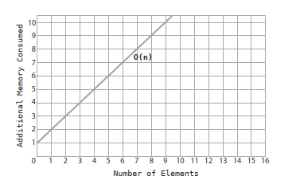

This graph is identical to the way we’ve depicted O(N) in the graphs from previous chapters, with the exception that the vertical axis now represents memory rather than speed.

Let’s present an alternative `makeUpperCase() `function that is more memory efficient (assuming we can modify the original input array):

```js
function makeUpperCase(array) {
  for(var i = 0; i < array.length; i++) {
    array[i] = array[i].toUpperCase();
  }
    return array;
  }
```

In this second version, we do not create any new variables or new arrays. Instead, we modify each string within the original array in place. 

Since this function does not consume any memory in addition to the original array, we’d describe the space complexity of this function as being O(1). Remember that by time complexity, O(1) represents that the speed of an algorithm is constant no matter how large the data. Similarly, by space complexity, O(1) means that the memory consumed by an algorithm is constant no matter how large the data.

It’s important to reiterate that in this book, we judge the space complexity based on additional memory consumed - known as auxiliary space - meaning that we don’t count the original data.

Let’s now compare the two versions of `makeUpperCase()` in both time and space complexity:

| Version | Time Complexity | Space complexity |
| --- | --- | --- |
| Vesion 01 | O(N) | O(N) |
| Version 02 | O(N) | O(1) |

This is a pretty strong case that Version #2 is preferable to Version #1.

## Trade-offs between time and space

In Speeding Up Your Code with Big O, we wrote a JavaScript function that checked whether an array contained any duplicate values. Our first version looked like this:
```js
function hasDuplicateValue(array) {
  for(let i = 0; i < array.length; i++) {
    for(let j = 0; j < array.length; j++) {
      if(i !== j && array[i] == array[j]) {
        return true;
      }
    }
  }
  return false;
}
```

It uses nested for loops, and we pointed out that it has a time complexity of O(N<sup>2</sup>).

We then created a more efficient version, which looked like this:

```js
function hasDuplicateValue(array) {
  let existingNumbers = [];
  for(let i = 0; i < array.length; i++) {
    if(existingNumbers[array[i]] === undefined) {
      existingNumbers[array[i]] = 1;
    } else {
     return true;
    }
  }
  return false;
}
```

We declared victory with this second version, pointing to its time complexity of O(N) compared with the first version’s O(N2). Indeed, from the perspective of time alone, the second version is much faster.

However, when we take space into account, we find that this second version has a disadvantage compared with the first version. The first version does not consume any additional memory beyond the original array, and therefore has a space complexity of O(1). On the other hand, this second version creates a brand new array that is the same size as the original array, and therefore
has a space complexity of O(N).

Let’s look at the complete contrast between the two versions of `hasDuplicateValue()`:

| Version | Time Complexity | Space complexity |
| --- | --- | --- |
| Vesion 01 | O(N<sup>2</sup>) | O(1) |
| Version 02 | O(N) | O(N) |

How do we decide which to choose? The answer, of course, is that it depends on the situation.

## Final Toughts

The analysis of data structures and algorithms can dramatically affect your code - in speed, memory, and even elegance.
What you can take away from this book is a framework for making educated technology decisions. Now, computing contains many details, and while something like Big O Notation may suggest that one approach is better than another, other factors can also come in to play. The way memory is organized within your hardware and the way that your computer language of choice implements things under the hood can also affect how efficient your code may be. Sometimes what you think is the most efficient choice may not be due to various external reasons.

Because of this, it is always best to test your optimizations with benchmarking tools. There are many excellent software applications out there that can measure the speed and memory consumption of your code. The knowledge in this book will point you in the right direction, and the benchmarking tools will confirm whether you’ve made the right choices.# A Common Sense Guide to Data Structures and Algorithms

This repository contains notes made while studying the Jay Wengrow's book: 'A Common-Sense Guide to Data Structures and Algorithms: Level Up Your Core Programming Skills'.

For an alternative approach to these topics, please visit the [Launch School 'Introduction to DSA' course](https://github.com/lucsorr/launch-school/tree/main/LS220/notes).

## Contents:


1. [Why Data Structures Matter](./01_why_data_structures_matter.md)

    - The Array: The Foundational Data Structure
    - Reading 
    - Searching 
    - Insertion 
    - Deletion 
    - Sets: How a Single Rule Can Affect Efficiency

.

2. [Why Algorithms Matter](./02_why_algorithms_matter.md)

    - Ordered Arrays
    - Searching an Ordered Array
    - Binary Search
    - Binary Search Vs. Linear Search

.

3. [Big O Notation](./03_big_o_notation.md)

    - Big O: Count the Steps
    - Constant Time Vs. Linear Time 
    - Same Algorithm, Different Scenarios
    - An Algorithm of the Third Kind
    - Logarithms 
    - O(log N) Explained

.

4. [Speeding Up Your Code with Big O](./04_speeding_up_your_code_with_big_o.md)

    - Bubble Sort
    - Bubble Sort Implemented
    - The Efficiency of Bubble Sort
    - A Quadratic Problem 
    - A Linear Solution [_Nice trick to check for duplicates in an array fast, in linear time_]

.

5. [Optimizing Code With and Without Big O](./05_optimizing_code_with_and_without_big_o.md)
    - Selection Sort
    - Selection Sort Implemented
    - The Efficiency of Selection Sort
    - Ignoring Constants
    - The Role of Big O
    - A Practical Example [_Nice trick to add every other element of an array to another array_]

.

6. [Optimizing for Optimistic Scenarios](./06_optimizing_for_optimistic_scenarios.md)
    - Insertion Sort
    - Insertion Sort Implemented
    - The Efficiency of Insertion Sort
    - The Average Case
    - A Practical Example [_Nice trick to improve the speed of some nested iterations_]

.

7. [Blazing Fast Lookup With Hash Tables](./07_blazing_fast_lookup_with_hash_tables.md)
    - Enter the Hash Table
    - Hashing with Hash Functions
    - How Hash Function Work
    - Dealing with Collisions
    - The Great Balancing Act [_Load factor (data/cells ratio) when implementing hashes_]

.

8. [Crafting Elegant Code with Stacks and Queues](./08_crafting_elegant_code_with_stacks_and_queues.md)
    - Stacks
    - Stacks in Action [_Algorithm to check for valid braces in a string_]
    - Queues
    - Queues in Action

.

9. [Recursively Recurse with Recursion](./09_recursively_recurse_with_recursion.md)
    - Recurse Instead of Loop
    - The Base Case
    - Reading Recursive Code
    - Recursion in the Eyes of the Computer
    - Recursion in Action [_Algorithm to recursively traverse all files and subdirectories from a root folder_]

.

10. [Recursive Algorithms for Speed](./10_recursive_algorithms_for_speed.md)
    - Partitioning
    - Quicksort
    - The Efficiency of Quicksort
    - Worst Case Scenario 
    - Quickselect

.

11. [Node-based Data Structures](./11_node_based_data_structures.md)
    - Linked Lists
    - Implementing a Linked List
    - Reading
    - Searching
    - Insertion
    - Deletion
    - Linked Lists in Action [_Good practice case for the need of a linked list_]
    - Doubly Linked Lists

.

12. [Speeding Up All the Things with Binary Trees](./12_speeding_up_all_the_things_with_binary_trees.md)
    - Binary Trees
    - Searching
    - Insertion
    - Deletion
    - Binary Trees in Action [_Includes traversal algorithm_]

.

13. [Connecting Everything with Graphs](./13_connecting_everything_with_graphs.md)
    - Graphs
    - Breadth-First Search
    - Graph Databases
    - Weighted Graphs
    - Dijkstra's Algorithm

.

14. [Dealing with Space Constraints](./14_dealing_with_space_constraints.md)
    - Big O Notation As Applied to Space Complexity
    - Trade-offs between time and space