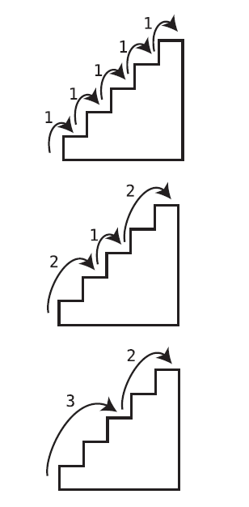

# 11: Learning to Write in Recursive


Through deliberate practice and taking note of various recursive patterns, I discovered some techniques that helped me to learn to “write in recursive”
more easily.

Over the course of tackling various recursive problems, I began to find that there are various “categories” of problems. Once I learned an effective technique for a certain category, when I found another problem that belonged to the same category, I was able to apply the same technique to solve it.

<!-- TOC start (generated with https://github.com/derlin/bitdowntoc) -->

- [Recursive Category: Repeatedly Execute](#recursive-category-repeatedly-execute)
   * [Recursive Trick: Passing Extra Parameters](#recursive-trick-passing-extra-parameters)
- [Recursive Category: Calculations on Progressively Smaller Subproblems](#recursive-category-calculations-on-smaller-subproblems)
   * [Two Approaches to Calculations](#two-approaches-to-calculations)
      + [The Bottom Up Approach](#the-bottom-up-approach)
      + [The Top-Down Approach in Recursion: A New Way of Thinking](#the-top-down-approach-in-recursion-a-new-way-of-thinking)
         - [The Top-Down Thought Process](#the-top-down-thought-process)
         - [Example: Array Sum](#example-array-sum)
         - [Example: String Reversal](#example-string-reversal)
         - [Example: Count `x` character occurrences in a string](#example-count-x-character-occurrences-in-a-string)
         - [Example: The Staircase Problem (how many possible paths in a N-step staircase)](#example-the-staircase-problem-how-many-possible-paths-in-a-n-step-staircase)
         - [Example: Anagram Generation](#example-anagram-generation)

<!-- TOC end -->

<!-- TOC --><a name="recursive-category-repeatedly-execute"></a>
## Recursive Category: Repeatedly Execute

Problems of this category imply to repeatedly perform some operation on n elements of a data structure (like integers in an array).

For problems of this category, the last line of code in the function is a simple, single call to the function again. This line does one thing: it makes the next recursive call.

For instance:

```js
function countdown(number) {
  console.log(number);

  if(number === 0) { // number being 0 is the base case
    return;
  }
  
  countdown(number - 1);
}
```

```ruby
def find_directories(directory)
  Dir.foreach(directory) do |filename|
    if File.directory?("#{directory}/#{filename}") && filename != "." && filename != ".."
      puts "#{directory}/#{filename}"

      # Recursively call this function on the subdirectory:
      find_directories("#{directory}/#{filename}")
    end
  end
end
```

<!-- TOC --><a name="recursive-trick-passing-extra-parameters"></a>
### Recursive Trick: Passing Extra Parameters

```python
def double_array(array, index=0):
  # Base case: when the index goes past the end of the array
  if (index >= len(array)):
    return
  
  array[index] *= 2
  double_array(array, index + 1)
```

Once we have the index as a function argument, we now have a way of incrementing and tracking the index as we make each successive recursive call. In each successive call, we pass in the array again as the first argument, but we also pass along an incremented index. This allows us to keep track of an index just as we would in a classical loop.

All we updated here was setting a default argument of index=0. This way, the first time we call the function, we don’t have to pass in the index parameter. However, we still get to use the index parameter for all successive calls.

The “trick” of using extra function parameters (in this case, a reference to the data structure itself we want to modify in place) is a common technique in writing recursive functions, and a handy one.

<!-- TOC --><a name="recursive-category-calculations-on-smaller-subproblems"></a>
## Recursive Category: Calculations on Progressively Smaller Subproblems

In this second general category, the problems perform a calculation based on a subproblem. 

One area in which recursion shines is where we need to act on _a problem that has an arbitrary number of levels of depth_; recursion shines _when it is able to make a calculation based on a subproblem of the problem at hand_.

A subproblem is a version of the very same problem applied to a smaller input.

For example, the factorial of 6 is the result of 6 * the factorial of 5; the factorial of 5 is the result of 5 * the factorial of 4, and so on. This is a recursive structure.

```ruby
def factorial(number)
  if number == 1
    return 1
  end
  
  return number * factorial(number - 1)
end
```

<!-- TOC --><a name="two-approaches-to-calculations"></a>
### Two Approaches to Calculations

We’ve seen that when writing a function that makes a calculation, there are two potential approaches: we can try to build the solution from the “bottom up,” or we can attack the problem going “top down” by making the calculation based on the problem’s subproblem. The truth is that both approaches can be achieved through recursion.

<!-- TOC --><a name="the-bottom-up-approach"></a>
#### The Bottom Up Approach

While we previously saw the bottom-up approach using a classic loop, we can also use recursion to implement the bottom-up strategy.

```ruby
def factorial(n, i=1, product=1)
  return product if i > n

  return factorial(n, i + 1, product * i)
end
```

While we can use recursion in this way to achieve the bottom-up approach, it’s not particularly elegant and does not add much value over using a classic loop.

When going bottom up, we’re employing the same strategy for making the calculation whether we’re using a loop or recursion. The computational approach is the same.

But to go top down, we need recursion. And because recursion is the only way to achieve a top-down strategy, it’s one of the key factors that makes recursion a powerful tool.

<!-- TOC --><a name="the-top-down-approach-in-recursion-a-new-way-of-thinking"></a>
#### The Top-Down Approach in Recursion: A New Way of Thinking

This brings us to the central point of this chapter: recursion shines when implementing a top-down approach because going top down offers a new mental strategy for tackling a problem. That is, a recursive top-down approach allows one to think about a problem in a completely different way.

Specifically, when we go top down, we get to mentally “kick the problem down the road.” We can free our mind from some of the nitty-gritty details we normally have to think about when going bottom up.

>Top-down recursion consists on dividing bigger problems (our main problem) into smaller problems (subproblems), of which the smallest subproblem becomes the base case.

<!-- TOC --><a name="the-top-down-thought-process"></a>
##### The Top-Down Thought Process

I found that when tackling a top-down problem, it helps to think the following three thoughts:

1. Imagine the function you’re writing has already been implemented by someone else.
2. Identify the subproblem of the problem.
3. See what happens when you call the function on the subproblem and go from there.

<!-- TOC --><a name="example-array-sum"></a>
##### Example: Array Sum

Write a function called sum that sums up all the numbers in a given array.

The first thing we’ll do is imagine that the sum function has already been implemented.

Next, let’s identify the subproblem. In our case, we can say that the subproblem is the array, `[2, 3, 4, 5]` —that is, all the numbers from the array save the first one.

Finally, let’s see what happens when we apply the sum function to our sub problem. If the sum function “already works,” and the subproblem is `[2, 3, 4, 5]`, what happens when we call sum(`[2, 3, 4, 5]`)? Well, we get the sum of 2 + 3 + 4 + 5, which is 14. To solve our problem of finding the sum of `[1, 2, 3, 4, 5]` then, we can just add the first number, 1, to the result of sum(`[2, 3, 4, 5]`).

The last thing we need to do is handle the base case. That is, if each subproblem recursively calls its own subproblem, we’ll eventually reach the subproblem of sum(`[5]`). This function will eventually try to add the 5 to the remainder of the array, but there are no other elements in the array. To deal with this, we can add the base case.

```ruby
def sum(array)
  # Base case: only one element in the array:
  return array[0] if array.length == 1
  
  return array[0] + sum(array[1, array.length - 1])
end
```

<!-- TOC --><a name="example-string-reversal"></a>
##### Example: String Reversal

```ruby
def reverse(string)
  # Base case: string with just one character
  return string if string.length == 1

  return reverse(string[1..]) + string[0]
end
```

<!-- TOC --><a name="example-count-x-character-occurrences-in-a-string"></a>
##### Example: Count `x` character occurrences in a string

```ruby
def count_x(string, count=0)
  return 0 if string.length === 0 
  
  if string[0] === 'x'
    return 1 + count_x(string[1..])
  end
  
  count_x(string[1..])
end
```

<!-- TOC --><a name="example-the-staircase-problem-how-many-possible-paths-in-a-n-step-staircase"></a>
##### Example: The Staircase Problem (how many possible paths in a N-step staircase)

We have a staircase of N steps, and a person has the ability to climb one, two, or three steps at a time. How many different possible “paths” can someone take to reach the top? Write a function that will calculate this for N steps.



For N steps, the number of paths is:

```ruby
number_of_paths(n - 1) + number_of_paths(n - 2) + number_of_paths(n - 3)
```

We know that we definitely want the result of number_of_paths(1) to be 1, so we’ll start with the base case of:

```ruby
return 1 if n == 1
```

Now, we know that we want `number_of_paths(2)` to return `2`, but we don’t have to create that base case explicitly. Instead, we can take advantage of the fact that `number_of_paths(2)` will compute as `number_of_paths(1) + number_of_paths(0) + number_of_paths(-1)`. Since `number_of_paths(1)` returns `1`, if we made `number_of_paths(0)` also return `1`, and `number_of_paths(-1)` return `0`, we’d end up with a sum of 2, which is what we want.

So, we can add the following base cases:

```ruby
return 0 if n < 0 
return 1 if n == 1 || n == 0
```

This is the complete function:

```ruby
def number_of_paths(n)
  return 0 if n < 0

  return 1 if n == 1 || n == 0

  number_of_paths(n - 1) + number_of_paths(n - 2) + number_of_paths(n - 3)
end
```

<!-- TOC --><a name="example-anagram-generation"></a>
##### Example: Anagram Generation

Write a function that returns an array of all anagrams of a given string.

An anagram is a reordering of all the characters within a string.

For example, the anagrams of "abc" are:

```txt
["abc",
"acb",
"bac",
"bca",
"cab",
"cba"]
```

Suppose we have to find the anagrams for "abcd". Let's identify the subproblem:

The subproblem for "abcd" is "abc". 

Supposing we already have an `anagrams` function that returns the list of every possible anagram of the string "abc", one possible approach would be **to add the last letter "d" to every possible spot, in every anagram in the received list**:


The formula to calculate the number of anagrams (permutations without repetition) is

N!

Where N is the number of characters in the string. In this case, 24: (4! = 24).

The base case is the string of size 1, `a`; the recursive step would be something like:


```txt
for every word in the list of anagrams (string minus the last character: `abc`)

  - for every possible spot of the last character `d`

      - add letter
      - add resulting word to output list

return the output list with all the resulting words
```

The base case would imply to return an array with a single string (in this case, for the string `a`, the function would return `['a']`)

The stack would look something like:

a         => `['A']`
a     b   => `['aB', 'Ba']`
ab    c   => `['abC','aCb','baC','bCa','Cab','Cba']`
abc   d   => `['abcD', "abDc", "aDbc", ...]`

Here is a possible implementation in Ruby of this algorithm:

```ruby
def anagrams_of(string)
  # Base case: if the string is only one character,
  # return an array containing just a single-character string:
  return [string] if string.length == 1

  # Create an array to hold all the anagrams:
  collection = []

  # Find all anagrams of the substring from the second character until
  # the end. For example, if the string is "abcd", the substring is "bcd",
  # so we'll find all anagrams of "bcd":
  substring_anagrams = anagrams_of(string[1, string.length - 1])         # Recursive call

  # Adds letter to every possible spot to every word in the list:

  # Iterate over each substring
  substring_anagrams.each do |substring_anagram|

    # Iterate over each index of the substring, from 0 until
    # one index past the end of the string:
    (0..substring_anagram.length).each do |index|

        # Create a copy of the substring anagram:
        copy = String.new(substring_anagram)

        # Insert the first character of our string into the
        # substring anagram copy. Where it will go depends
        # on the index we're up to within this loop.
        # Then, take this new string and add it to our collection of anagrams:
        collection << copy.insert(index, string[0])
    end
  end

  # Return the entire collection of anagrams:
  return collection
end
```
        


