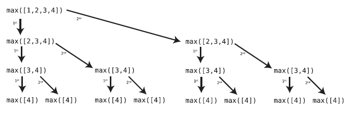
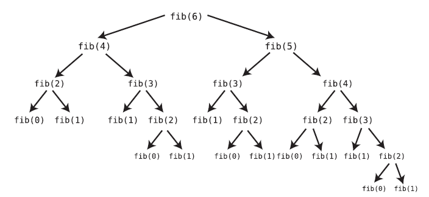
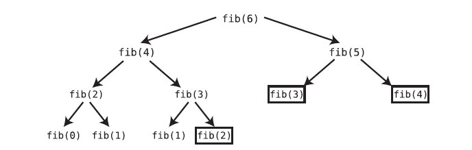

# 12 Dynamic Programming

While recursion can certainly solve some problems, it can also create new ones if not used properly. In fact, unoptimized recursion is often the culprit behind some of the slowest categories of Big O, such as O(2<sup>n</sup>).

<!-- TOC start (generated with https://github.com/derlin/bitdowntoc) -->

- [Most Common Speed Traps in Recursion](#most-common-speed-traps-in-recursion)
   * [Redundant Recursive Calls](#redundant-recursive-calls)
      + [A solution](#a-solution)
   * [Overlapping Subproblems](#overlapping-subproblems)
- [Dynamic Programming](#dynamic-programming)
   * [Memoization](#memoization)
   * [Bottom-Up Approach](#bottom-up-approach)
      + [Example: Bottom-up Fibonacci](#example-bottom-up-fibonacci)
   * [Memoization vs. Bottom-Up](#memoization-vs-bottom-up)

<!-- TOC end -->

<!-- TOC --><a name="most-common-speed-traps-in-recursion"></a>
## Most Common Speed Traps in Recursion

<!-- TOC --><a name="redundant-recursive-calls"></a>
### Redundant Recursive Calls

Here’s a recursive function that finds the greatest number from an array:

```ruby
def max(array)
  # Base case - if the array has only one element, it is
  # by definition the greatest number:
  return array[0] if array.length == 1

  # Compare the first element with the greatest element
  # from the remainder of the array. If the first element
  # is greater, return it as the greatest number:
  if array[0] > max(array[1, array.length - 1])  # !!!
    return array[0]
  end

  # Otherwise, return the greatest number from the remainder of the array:
  return max(array[1, array.length - 1])         # !!!
end
```

While this code works, it contains a hidden inefficiency. If you look carefully, you’ll note that our code contains the phrase, `max(array[1, array.length - 1])` twice, once in each half of the conditional statement. The problem with this is that each time we mention `max(array[1, array.length - 1])`, we trigger an entire avalanche of recursive calls.

For instance, with an input of `[1, 2, 3, 4]`. After we call max for both halves of the conditional, we get:



When we call `max([1, 2, 3, 4])`, we actually end up triggering the max function 15 times.

The following table shows how many times `max` gets called on arrays of various sizes:

| N | Number of Calls |
| --- | --- |
| 1 | 1 |
| 2 | 3 |
| 3 | 7 |
| 4 | 15 |
| 5 | 32 |

The pattern is:

Let n be the number of elements in the array;

2<sup>n</sup> - 1

In big O notation this means a speed of O(2<sup>n</sup>), an extremely slow algorithm. This typically the speed of unoptimized recursive functions.

<!-- TOC --><a name="a-solution"></a>
#### A solution

Instead of making the same call twice, we can just store the result of calling `max` in a local variable, and use it accordingly:

```ruby
def max(array)
  return array[0] if array.length == 1

  # Calculate the max of the remainder of the array
  # and store it inside a variable:
  max_of_remainder = max(array[1, array.length - 1])

  # Comparison of first number against this variable:
  if array[0] > max_of_remainder
    return array[0]
  end

  return max_of_remainder
end
```

By implementing this simple modification, we end up calling `max` n number of times. This is equivalent of a speed of O(N), which is much faster than O(2<sup>n</sup>).

<!-- TOC --><a name="overlapping-subproblems"></a>
### Overlapping Subproblems

A clear example of a function with overlapping subproblem is the classic recursive function to computer the nth number in the Fibonacci sequence:

```python 
def fib(n):
  # The base cases are the first two numbers in the series:
  if n == 0 or n == 1:
    return n

  # Return the sum of the previous two Fibonacci numbers:
  return fib(n - 2) + fib(n - 1) # !!!
```

Exactly: this function calls itself twice, and we've already seen that this can easily lead us down the road of exponential speeds. These are all the recursive calls made by a `fib(6)`:



While one simple change worked to optimize the first example in this chapter, optimizing our Fibonacci sequence isn’t as simple.
And that’s because there isn’t just one single piece of data we can save in a variable. We need to calculate both `fib(n - 2)` and `fib(n - 1)` (as each Fibonacci number is the sum of those two numbers), and storing the result of one won’t alone give us the result for the other.

This is a case of what computer scientists call **overlapping subproblems**.

>When a problem is solved by solving smaller versions of the same problem, the smaller problem is called a subproblem. This concept isn’t new—we’ve been dealing with it frequently throughout our discussion of recursion. In the case of the Fibonacci sequence, we compute each number by first computing the smaller numbers in the sequence. The computation of these smaller numbers are the subproblems. 
>
>What makes these subproblems overlapping, though, is the fact that `fib(n - 2)` and `fib(n - 1)` end up calling many of the same functions as each other. That is, `fib(n - 1)` ends up making some of the very same calculations previously made by `fib(n - 2)`.

A technique called **dynamic programming** provides us a solution to this problem.

<!-- TOC --><a name="dynamic-programming"></a>
## Dynamic Programming

Dynamic programming is the process of optimizing recursive problems that have overlapping subproblems.

Optimizing an algorithm with dynamic programming is typically accomplished with one of two techniques: _memoization_, and the _bottom-up approach_.

<!-- TOC --><a name="memoization"></a>
### Memoization

Memoization is a simple, but brilliant technique for reducing recursive calls in cases of overlapping subproblems. Essentially, it reduces recursive calls by remembering previously computed functions via a data structure (like a hash).

In our Fibonacci example, the first time `fib(3)` is called, the function does its computation and returns the number 2. However, before moving on, the function stores this result inside a hash table. The hash table will look something like this:

```txt
{3: 2}
```

This indicates that the result of `fib(3)` is the number 2.

Similarly, our code will memoize the results of all new computations it encounters. Now that we have this hash table, we can use it to prevent future recursive calls.

Instead of `fib(4)` just blithely calling `fib(3)`, for example, it first checks the hash table to see if the result of `fib(3)` has already
been computed. Only if the 3 key is not in the hash table does the function proceed to call `fib(3)`.

With memoization, each time we make a new calculation, we store it in the hash table for future use. This way, we only make a calculation if it hadn’t ever been made before.

How does each recursive function get access to this hash table? The answer is: **we pass the hash table as a second parameter to the function.**

This is the memoized version:

```py
def fib(n, memo):
  if n == 0 or n == 1:
    return n

  # Check the hash table (called memo) to see whether fib(n)
  # was already computed or not:
  if not memo.get(n):

    # If n is NOT in memo, compute fib(n) with recursion
    # and then store the result in the hash table:
    memo[n] = fib(n - 2, memo) + fib(n - 1, memo)

  # By now, fib(n)'s result is certainly in memo. (Perhaps
  # it was there before, or perhaps we just stored it there
  # in the previous line of code. But it's certainly there now.)
  # So let's return it:
  return memo[n]
```

When we map out the recursive calls in our memoized version, we get this:



Let’s look at how many recursive calls we make for different values of N:

| N | Number of Calls |
| --- | --- |
| 1 | 1 |
| 2 | 3 |
| 3 | 5 |
| 4 | 7 |
| 5 | 11 |

We can see that for N, we make (2N) - 1 calls. Since in Big O we drop the constants, this is an O(N) algorithm.

This is an incredible improvement over O(2<sup>n</sup>).

<!-- TOC --><a name="bottom-up-approach"></a>
### Bottom-Up Approach

The second technique, known as going bottom-up, consists on ditching recursion and use some other approach (like a loop) to solve the same problem.

The reason that going bottom-up is considered part of dynamic programming is because dynamic programming means taking a problem that could be solved
recursively and ensure that it doesn’t make duplicate calls for overlapping subproblems. Using iteration (that is, loops) instead of recursion is, technically, a way to achieve this.

Going bottom-up becomes more of a “technique” when the problem is more naturally solved with recursion. Generating Fibonacci numbers is one example where recursion is a neat, elegant solution. Having to solve the same problem with iteration may take more brainpower, as an iterative approach may be less intuitive.

<!-- TOC --><a name="example-bottom-up-fibonacci"></a>
#### Example: Bottom-up Fibonacci

```py
def fib(n):
  if n == 0:
    return 0

  # a and b start with the first two numbers in the
  # series, respectively:
  a = 0
  b = 1

  # Loop from 1 until n:
  for i in range(1, n):
    # a and b each move up to the next numbers in the series.
    # Namely, b becomes the sum of b + a, and a becomes what b used to be.
    # We utilize a temporary variable to make these changes:
    temp = a
    a = b
    b = temp + a

  return b
```

<!-- TOC --><a name="memoization-vs-bottom-up"></a>
### Memoization vs. Bottom-Up

Is one technique better than the other? Usually, it depends on the problem and why you’re using recursion in the first place. If recursion presents an elegant and intuitive solution to a given problem, you may want to stick with it and use memoization to deal with any overlapping subproblems. However, if the iterative approach is equally intuitive, you may want to go with that.

It’s important to point out that even with memoization, recursion does carry some extra overhead versus iteration. Specifically, with any recursion, the computer needs to keep track of all the calls in a call stack, which consumes memory. The memoization itself also requires the use of a hash table, which will take up additional space on your computer as well.
